# AWS Kinesis Data Streams vs. Amazon Data Firehose

First, the naming:

> **Kinesis Data Firehose was renamed to Amazon Data Firehose in February 2024.**

It is no longer branded as part of “Kinesis,” although it can still use **Kinesis Data Streams as an input source**. ([Amazon Web Services, Inc.][1])

The simplest way to remember the difference is:

> **Kinesis Data Streams is a durable real-time event stream that applications consume.**
> **Amazon Data Firehose is a managed delivery service that batches and sends data to a destination.**

---

# 1. High-level comparison

| Area                   | Kinesis Data Streams                   | Amazon Data Firehose                                 |
| ---------------------- | -------------------------------------- | ---------------------------------------------------- |
| Main purpose           | Build real-time streaming applications | Deliver streaming data to destinations               |
| Typical latency        | Sub-second availability                | Seconds to minutes, depending on buffering           |
| Data retention         | Records retained for replay            | Temporary buffering, not a general replayable stream |
| Consumers              | Multiple custom consumers              | Usually one configured delivery destination          |
| Processing             | Your application, Lambda, Flink, KCL   | Optional Lambda transformation and format conversion |
| Scaling                | On-demand or provisioned shards        | Automatically managed                                |
| Ordering               | Maintained per shard/partition key     | Not intended as a general ordered event bus          |
| Replay                 | Yes, during retention period           | Not like Kinesis Data Streams                        |
| Destination management | You build the consumer                 | Firehose manages delivery and retries                |
| Splunk use             | Feed custom processing, then Splunk    | Deliver directly to Splunk HEC                       |
| Best description       | Streaming platform                     | Managed delivery pipe                                |

---

# 2. Core mental model

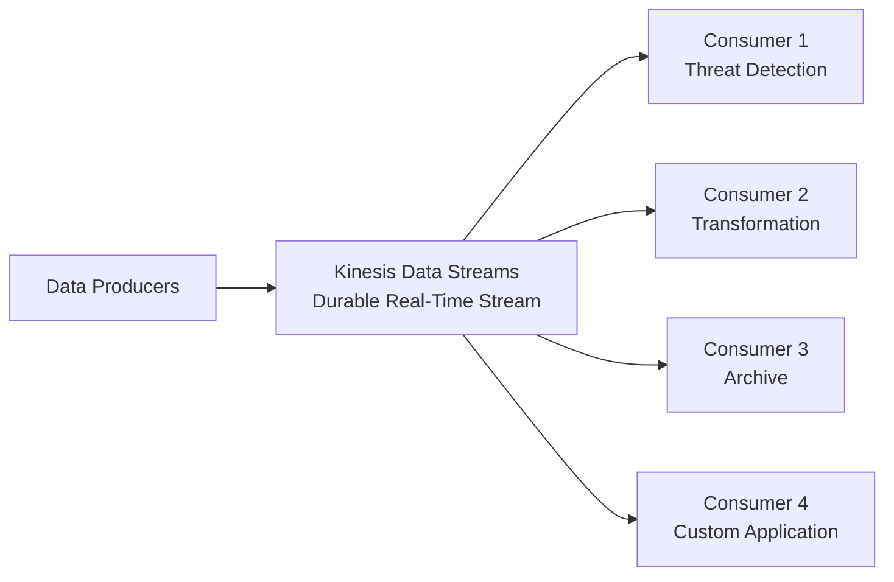

Kinesis Data Streams stores records temporarily and allows multiple applications to read and process those records independently. Records are generally available to consumers in under one second. ([AWS Documentation][2])

By contrast:

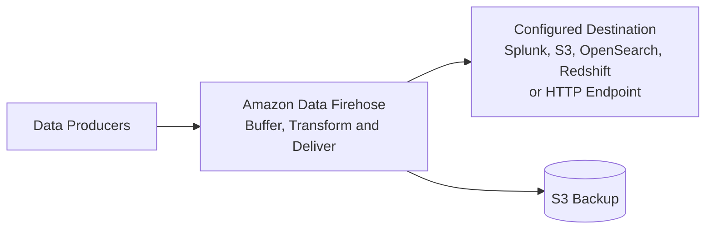

Firehose automatically receives, buffers, optionally transforms, and delivers data to the configured destination. It manages the underlying scaling and delivery infrastructure. ([AWS Documentation][3])

---

# 3. Kinesis Data Streams in detail

## What it is

Kinesis Data Streams is a managed real-time streaming platform.

Applications called **producers** write records into the stream. One or more **consumers** independently read and process those records.

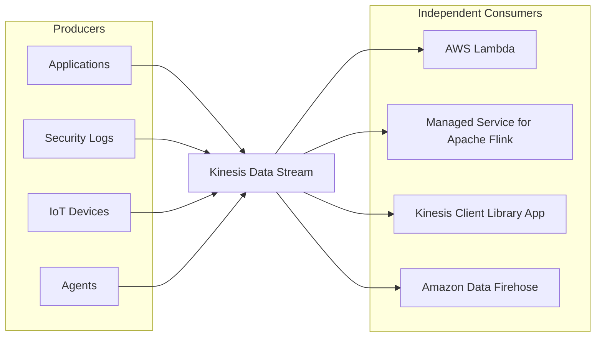

Firehose itself can be one consumer of a Kinesis Data Stream. ([AWS Documentation][4])

---

## Shards

A Kinesis Data Stream is composed of one or more **shards**.

Each shard contains an ordered sequence of records. Kinesis assigns each record a sequence number. ([AWS Documentation][5])

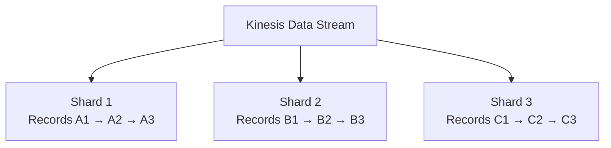

Records are distributed across shards according to the **partition key** supplied by the producer.

For example:

```text
Partition key = firewall-name
Partition key = account-id
Partition key = source-IP
Partition key = device-id
```

Records using the same partition key normally go to the same shard, which preserves ordering for that key.

### Important ordering point

Kinesis does not provide one global order across all shards.

It provides ordering **within an individual shard**.

```text
Shard 1: A1 → A2 → A3
Shard 2: B1 → B2 → B3
```

You cannot assume that `A2` happened before `B1` purely from shard sequence numbers.

---

## Capacity modes

Kinesis Data Streams supports:

* **On-demand mode**
* **Provisioned mode**

In provisioned mode, you configure the shard count. The total stream capacity is the combined capacity of its shards. You can increase or decrease shard count as traffic changes. ([AWS Documentation][6])

### Provisioned mode

You determine:

```text
Number of shards
    ×
Per-shard write/read capacity
    =
Total stream capacity
```

Provisioned mode is appropriate when:

* Traffic is predictable.
* You want direct capacity control.
* You understand expected throughput.
* Stable usage makes provisioned capacity cost-effective.

### On-demand mode

AWS manages capacity based on usage.

It is appropriate when:

* Traffic is unpredictable.
* Workloads spike.
* You do not want to manage shard counts.
* You want a simpler initial deployment.

---

## Retention and replay

Kinesis Data Streams retains records so consumers can:

* Read them shortly after ingestion.
* Process them later.
* Reprocess them after a consumer failure.
* Replay them using a new application.

Retention can be increased up to **365 days**. ([AWS Documentation][7])

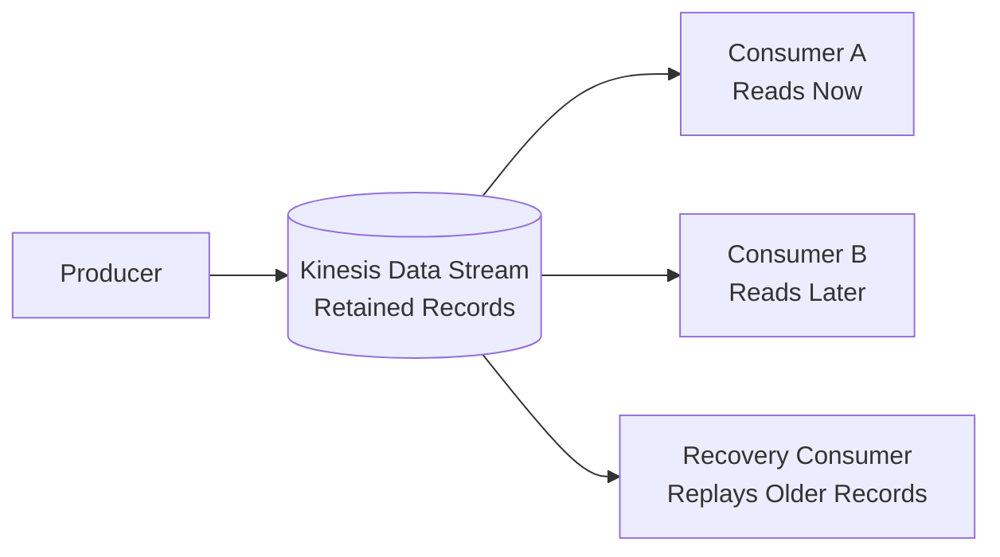

This replay capability is one of the biggest differences between Kinesis Data Streams and Firehose.

---

## Multiple consumers

Several applications can read the same Kinesis stream independently.

For example:

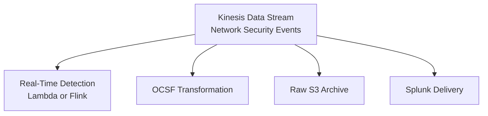

Each consumer can:

* Maintain its own position in the stream.
* Process records at its own speed.
* Apply different business logic.
* Fail independently from other consumers.

---

## Shared throughput versus enhanced fan-out

Traditional consumers generally share the available shard read capacity.

With **enhanced fan-out**, each registered consumer receives dedicated read throughput of up to **2 MB per second per shard**. Kinesis pushes records to enhanced fan-out consumers rather than requiring ordinary polling. ([AWS Documentation][8])

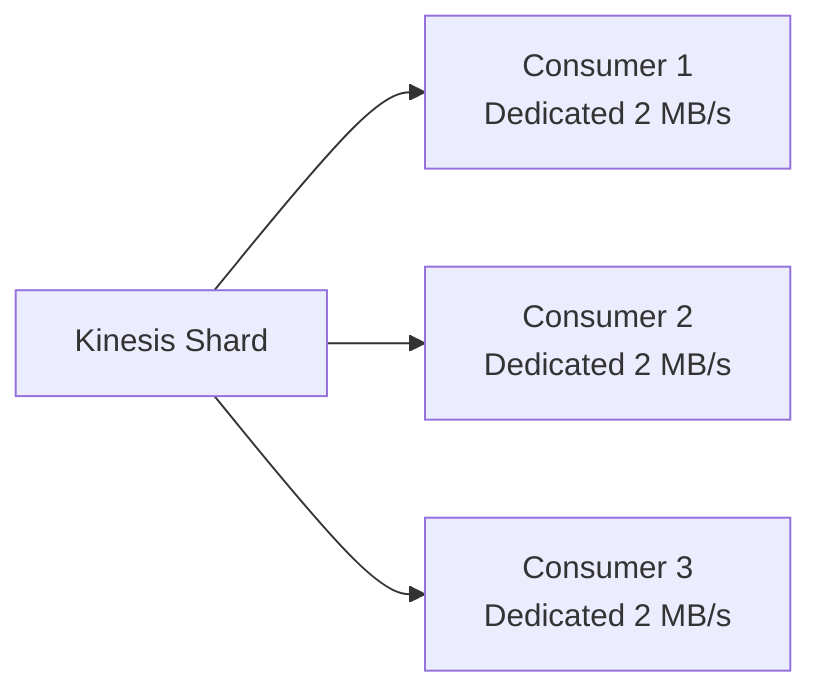

Enhanced fan-out is useful when:

* Multiple consumers need low latency.
* One consumer must not affect another.
* Shared read limits would cause contention.
* High-volume real-time processing is required.

---

## What you must manage with Kinesis Data Streams

AWS operates the stream infrastructure, but you still design and manage:

* Partition keys.
* Capacity mode.
* Shard count if provisioned.
* Consumer applications.
* Checkpointing.
* Error handling.
* Retry logic.
* Duplicate handling.
* Lag monitoring.
* Record transformation.
* Final destinations.

So Kinesis Data Streams gives much more flexibility, but it requires more application engineering.

---

# 4. Amazon Data Firehose in detail

## What it is

Amazon Data Firehose is a fully managed streaming delivery service.

Its job is:

```text
Receive data
   → buffer it
   → optionally transform it
   → deliver it
```

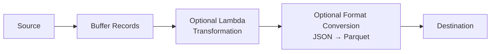

Firehose can invoke Lambda for data transformation before delivering records. ([AWS Documentation][9])

It can also perform record-format conversion for supported destination patterns, such as converting JSON records into analytics-oriented formats. ([AWS Documentation][10])

---

## Firehose source options

Firehose can receive data from sources such as:

* Direct API calls.
* CloudWatch Logs.
* CloudWatch Events/EventBridge integrations.
* AWS IoT.
* CloudWatch Metric Streams.
* Kinesis Data Streams.
* Other supported AWS integrations.

AWS documents Direct PUT and AWS-integrated sources, including CloudWatch Logs and Kinesis Data Streams. ([AWS Documentation][11])

---

## Firehose destination options

Common destinations include:

* Amazon S3.
* Amazon Redshift.
* Amazon OpenSearch Service.
* Splunk.
* Supported third-party HTTP endpoints.
* Custom HTTP endpoints.

Firehose can directly deliver Kinesis stream data to destinations such as S3, OpenSearch, Redshift, Splunk, and supported HTTP endpoints. ([AWS Documentation][12])

---

## Buffering

Firehose normally does not send each individual record immediately.

It buffers records based on:

* **Buffer size**
* **Buffer interval**

The first threshold reached triggers delivery. ([AWS Documentation][3])

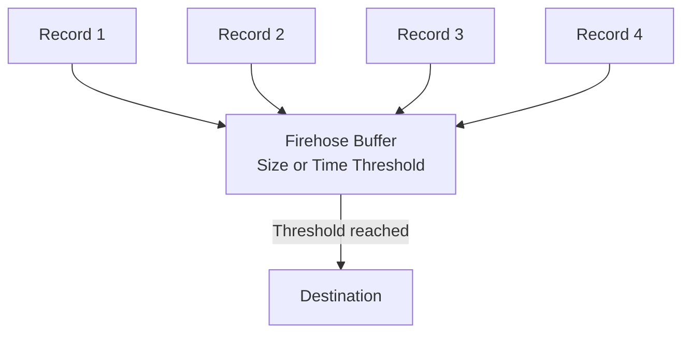

Example:

```text
Buffer size: 5 MB
Buffer interval: 60 seconds
```

Delivery occurs when either:

* The buffer reaches approximately 5 MB, or
* Approximately 60 seconds passes.

The exact available values depend on the destination.

### Consequence

Firehose is often described as “real-time,” but it is usually more accurately **near-real-time** because buffering introduces delay.

---

## Transformations

Firehose can call a Lambda function to:

* Parse incoming data.
* Add fields.
* Remove unwanted fields.
* Convert formats.
* Normalize logs.
* Redact sensitive information.
* Route or partition records.
* Prepare records for the destination.

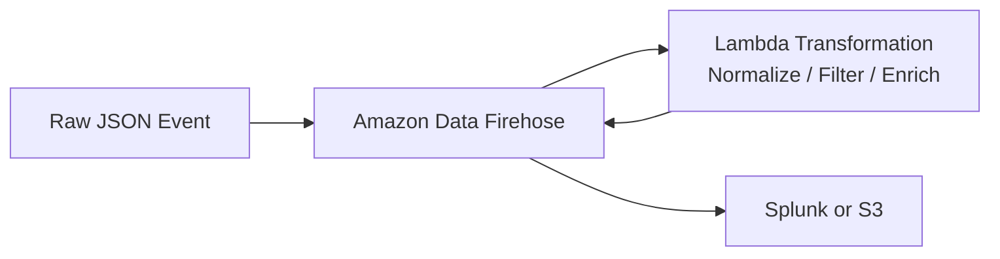

This transformation is convenient, but Lambda transformations are still customer-managed code.

---

## Delivery retries and S3 backup

Firehose manages delivery attempts to the destination.

For supported destinations, you can configure S3 to store:

* All incoming records, or
* Only records that failed delivery.

Firehose supports backing up all or failed delivery records to S3. ([AWS Documentation][13])

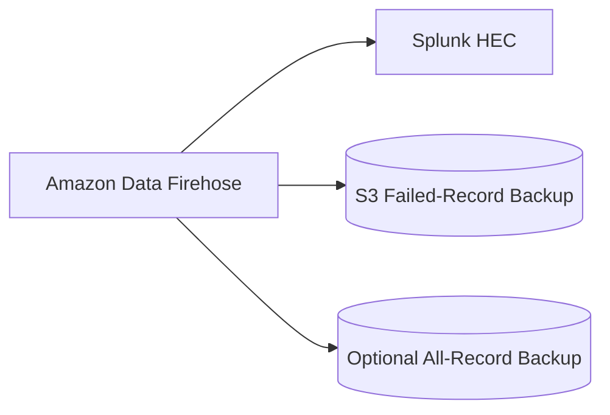

This is especially valuable for Splunk because failed HEC deliveries can be retained for investigation or replay through a separate process.

---

## What Firehose manages for you

Firehose manages much of the delivery pipeline:

* Infrastructure provisioning.
* Scaling.
* Buffering.
* Destination batching.
* Retry behavior.
* Delivery monitoring.
* Optional S3 backup.
* Optional Lambda transformation.
* Optional format conversion.

You do not manage shards or write a normal consumer application.

---

# 5. Fundamental architectural difference

## Kinesis Data Streams: store and expose the stream

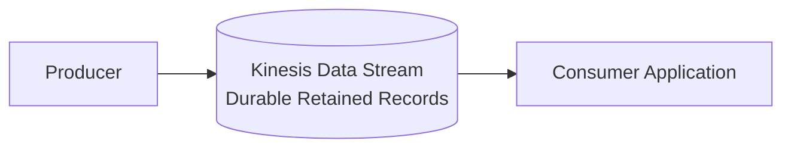

The data stream is the product.

You build consumers around it.

## Firehose: deliver the data

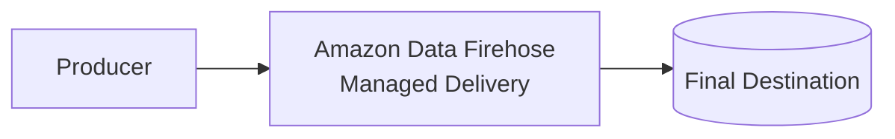

The destination delivery is the product.

Firehose is normally not the final place where applications repeatedly read and replay events.

---

# 6. Detailed feature comparison

| Feature                        | Kinesis Data Streams                        | Amazon Data Firehose                        |
| ------------------------------ | ------------------------------------------- | ------------------------------------------- |
| Primary role                   | Streaming event backbone                    | Managed delivery pipeline                   |
| Record persistence             | Yes, during configured retention            | Temporary internal buffering                |
| Replay                         | Yes                                         | Not as a normal consumer feature            |
| Multiple independent consumers | Yes                                         | Not the primary model                       |
| Consumer control               | Full                                        | Minimal                                     |
| Sub-second access              | Generally yes                               | Usually buffered                            |
| Ordering                       | Per shard                                   | Not designed as an ordered event-stream API |
| Partition key                  | Required for producer writes                | Not central to the delivery model           |
| Shards                         | Yes                                         | No customer-managed shards                  |
| Autoscaling                    | On-demand mode available                    | Managed automatically                       |
| Lambda processing              | Consumer or event-source integration        | Built-in optional transformation            |
| Flink processing               | Yes                                         | Not a stream-processing engine              |
| S3 delivery                    | Build consumer or attach Firehose           | Native                                      |
| Splunk delivery                | Usually through custom consumer or Firehose | Native Splunk destination                   |
| Redshift delivery              | Custom process or Firehose                  | Native                                      |
| OpenSearch delivery            | Custom consumer or Firehose                 | Native                                      |
| Consumer checkpointing         | Required                                    | Not managed by customer                     |
| Operational effort             | Medium to high                              | Low to medium                               |
| Flexibility                    | Very high                                   | Destination-oriented                        |
| Failure recovery               | Consumers replay retained records           | Retry plus S3 backup                        |
| Best use                       | Complex streaming workflows                 | Straight delivery to analytics destination  |

---

# 7. Can they be used together?

Yes. This is a common architecture.

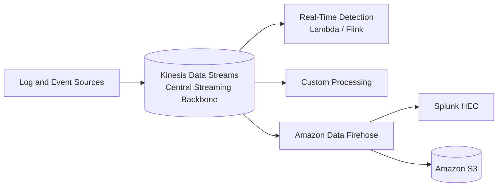

In this model:

* Kinesis Data Streams provides durable retention and multiple consumers.
* A real-time detection application analyzes events.
* Another application performs custom transformation.
* Firehose consumes the same stream and handles final delivery to Splunk or S3.

Firehose is a supported consumer of Kinesis Data Streams. ([AWS Documentation][4])

---

# 8. Network Firewall examples

## Pattern A — Direct Firehose to Splunk

Use this when your goal is simply to deliver Network Firewall logs to Splunk.

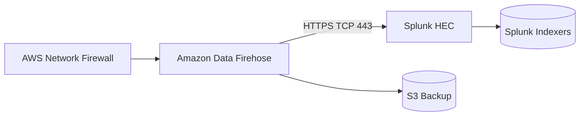

### Best when

* Splunk is the primary consumer.
* You need scalable delivery.
* No advanced real-time processing is required before Splunk.
* You want minimal infrastructure management.
* S3 backup is sufficient for failed deliveries.

---

## Pattern B — Kinesis stream with multiple consumers

Use this when Network Firewall data must support several independent use cases.

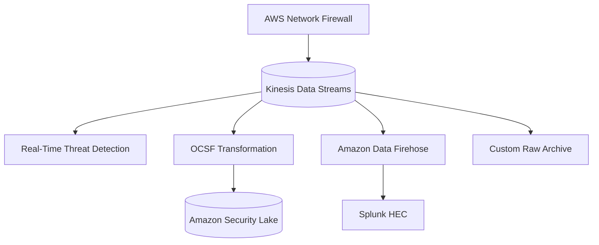

### Best when

* You need real-time custom detections.
* Network Firewall data needs OCSF conversion.
* Several tools must consume the same records.
* Replay is important.
* Processing pipelines must operate independently.

---

# 9. Security Lake transformation example

The Security Lake transformation-library architecture is a strong Kinesis Data Streams use case.

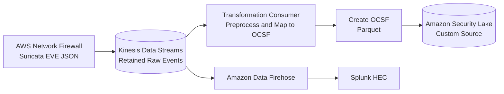

This design lets you:

* Deliver raw logs to Splunk.
* Transform the same records to OCSF.
* Store OCSF Parquet in Security Lake.
* Replay events if the transformer fails.
* Add future consumers without changing the producer.

---

# 10. Firehose is not a stream-processing engine

Firehose can perform lightweight transformation, but it is not a replacement for:

* Kinesis Client Library applications.
* Managed Service for Apache Flink.
* Complex event-processing systems.
* Stateful correlation.
* Multi-stage stream-processing applications.
* Multiple independent consumers.

A Firehose Lambda transformation should generally be used for tasks such as:

```text
Parse
Normalize
Add metadata
Remove fields
Convert records
Partition output
Redact data
```

It is less suitable for:

```text
Correlate events across long windows
Maintain large application state
Perform multi-stream joins
Run advanced anomaly detection
Support many independent consumers
Replay arbitrary portions of history
```

---

# 11. Failure behavior

## Kinesis Data Streams failure model

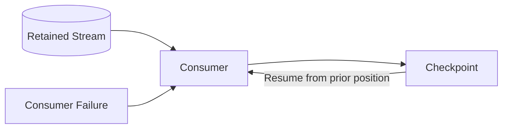

If a consumer fails, it can resume from its last checkpoint or replay earlier records while they remain in the retention window.

However, your consumer code must correctly manage:

* Checkpoints.
* Retries.
* Poison records.
* Duplicate processing.
* Consumer lag.

## Firehose failure model

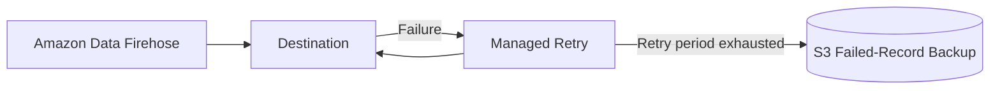

Firehose handles destination retries and can send failed records to S3, depending on destination and configuration. ([AWS Documentation][13])

---

# 12. Delivery semantics and duplicates

Streaming systems should generally be designed to tolerate duplicates.

Firehose can provide at-least-once style delivery behavior in failure and retry scenarios, meaning a destination may occasionally receive duplicate records. ([AWS Documentation][14])

Kinesis consumers may also process the same record more than once when:

* A consumer fails after processing but before checkpointing.
* Processing is retried.
* Records are deliberately replayed.

For security logs, include or derive a stable event identifier such as:

```text
account ID
firewall name
flow ID
timestamp
event type
signature ID
```

Then use that identity for deduplication where necessary.

---

# 13. Cost model at a conceptual level

## Kinesis Data Streams

Costs are generally associated with factors such as:

* On-demand throughput or provisioned shards.
* Data written.
* Data read.
* Extended retention.
* Enhanced fan-out consumers.
* Additional processing applications.

Cost rises when:

* Throughput increases.
* Retention grows.
* Many enhanced consumers are registered.
* Multiple applications repeatedly consume records.

## Amazon Data Firehose

Costs are generally associated with:

* Volume ingested and processed.
* Optional format conversion.
* Optional Lambda transformation.
* Dynamic partitioning or advanced capabilities.
* Destination and S3 costs.

Firehose is often simpler operationally, but cost efficiency depends on:

* Record sizes.
* Buffering configuration.
* Compression.
* Transformation volume.
* Destination request behavior.

Because AWS pricing and quotas change, use current AWS pricing for a production estimate rather than relying on static per-unit numbers.

---

# 14. Which one should you choose?

## Choose Amazon Data Firehose when:

* You mainly need to deliver logs to Splunk.
* You mainly need to store records in S3.
* You want a simple managed pipeline.
* Seconds-to-minutes latency is acceptable.
* You do not need several custom consumers.
* You do not need replayable records.
* Lambda transformation is enough.
* You do not want to manage shard capacity or consumer applications.

```text
Source → Firehose → Destination
```

## Choose Kinesis Data Streams when:

* Multiple applications need the same stream.
* Sub-second processing matters.
* Records must be replayable.
* You need custom stateful processing.
* You need fine control over event ordering.
* You need real-time Lambda/Flink/KCL applications.
* Independent consumers must process at different speeds.
* The event stream is an enterprise integration backbone.

```text
Source → Kinesis Data Streams → Multiple Consumers
```

## Use both when:

* You want real-time custom processing and simple delivery.
* One consumer detects threats.
* Another transforms to OCSF.
* Firehose delivers records to Splunk.
* S3 receives a durable analytical copy.

```text
Source
  → Kinesis Data Streams
      → Detection
      → OCSF transformation
      → Firehose
          → Splunk/S3
```

---

# 15. Recommendation for your Splunk and Security Lake design

For your current AWS Network Firewall use case:

## Simpler production option

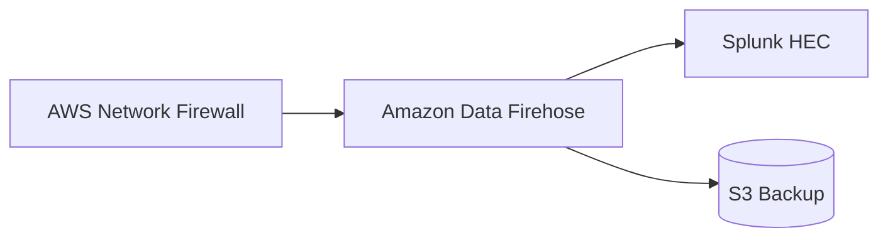

Use this when:

* Splunk is the main destination.
* You need alert and flow delivery.
* You want lower operational complexity.

## More strategic architecture

```mermaid
flowchart TB

NFW["AWS Network Firewall"]

KDS[("Kinesis Data Streams")]

REALTIME["Real-Time Detection"]

TRANSFORM["Network Firewall<br/>to OCSF Transformation"]

FH["Amazon Data Firehose"]

SL[("Amazon Security Lake")]

SPLUNK["Splunk HEC"]

NFW --> KDS

KDS --> REALTIME
KDS --> TRANSFORM
KDS --> FH

TRANSFORM --> SL
FH --> SPLUNK
```

Use this when:

* OCSF is an enterprise standard.
* Security Lake is a strategic data platform.
* Splunk requires low-latency raw events.
* Multiple consumers need the Network Firewall data.
* Replay and independent processing are important.

---

# Final memory shortcut

```text
Kinesis Data Streams
= Store and expose a real-time stream to applications.

Amazon Data Firehose
= Buffer, transform and deliver streaming data to a destination.
```

Or even more simply:

```text
Kinesis Data Streams = build streaming applications
Amazon Data Firehose = deliver streaming data
```

[1]: https://aws.amazon.com/about-aws/whats-new/2024/02/amazon-data-firehose-formerly-kinesis-data-firehose/?utm_source=chatgpt.com "Introducing Amazon Data Firehose, formerly known as ..."
[2]: https://docs.aws.amazon.com/streams/latest/dev/introduction.html?utm_source=chatgpt.com "What is Amazon Kinesis Data Streams?"
[3]: https://docs.aws.amazon.com/firehose/latest/dev/what-is-this-service.html?utm_source=chatgpt.com "What is Amazon Data Firehose? - ..."
[4]: https://docs.aws.amazon.com/firehose/latest/dev/writing-with-kinesis-streams.html?utm_source=chatgpt.com "Configure source settings for Amazon Kinesis Data Streams"
[5]: https://docs.aws.amazon.com/streams/latest/dev/key-concepts.html?utm_source=chatgpt.com "Amazon Kinesis Data Streams Terminology and concepts"
[6]: https://docs.aws.amazon.com/streams/latest/dev/how-do-i-size-a-stream.html?utm_source=chatgpt.com "Choose the right mode to stream in - Amazon Kinesis Data ..."
[7]: https://docs.aws.amazon.com/streams/latest/dev/kinesis-extended-retention.html?utm_source=chatgpt.com "Change the data retention period"
[8]: https://docs.aws.amazon.com/streams/latest/dev/enhanced-consumers.html?utm_source=chatgpt.com "Develop enhanced fan-out consumers with dedicated ..."
[9]: https://docs.aws.amazon.com/firehose/latest/dev/data-transformation.html?utm_source=chatgpt.com "Transform source data in Amazon Data Firehose"
[10]: https://docs.aws.amazon.com/firehose/latest/dev/record-format-conversion.html?utm_source=chatgpt.com "Convert input data format in Amazon Data Firehose"
[11]: https://docs.aws.amazon.com/firehose/latest/dev/create-name.html?utm_source=chatgpt.com "Choose source and destination for your Firehose stream"
[12]: https://docs.aws.amazon.com/streams/latest/dev/kdf-consumer.html?utm_source=chatgpt.com "Develop consumers using Amazon Data Firehose"
[13]: https://docs.aws.amazon.com/firehose/latest/dev/create-configure-backup.html?utm_source=chatgpt.com "Configure backup settings - Amazon Data Firehose"
[14]: https://docs.aws.amazon.com/firehose/latest/dev/data-transformation-failure-handling.html?utm_source=chatgpt.com "Handle failure in data transformation - Amazon Data Firehose"
