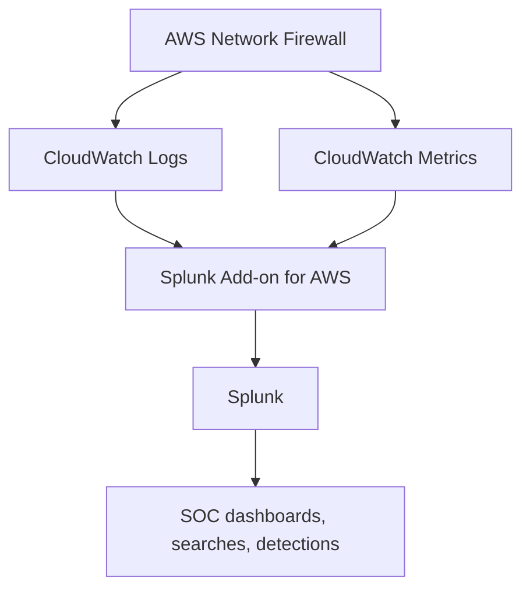
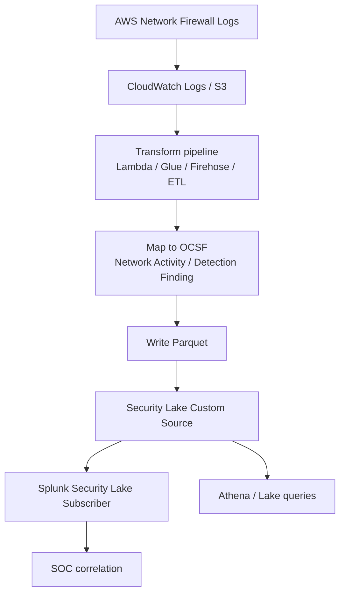
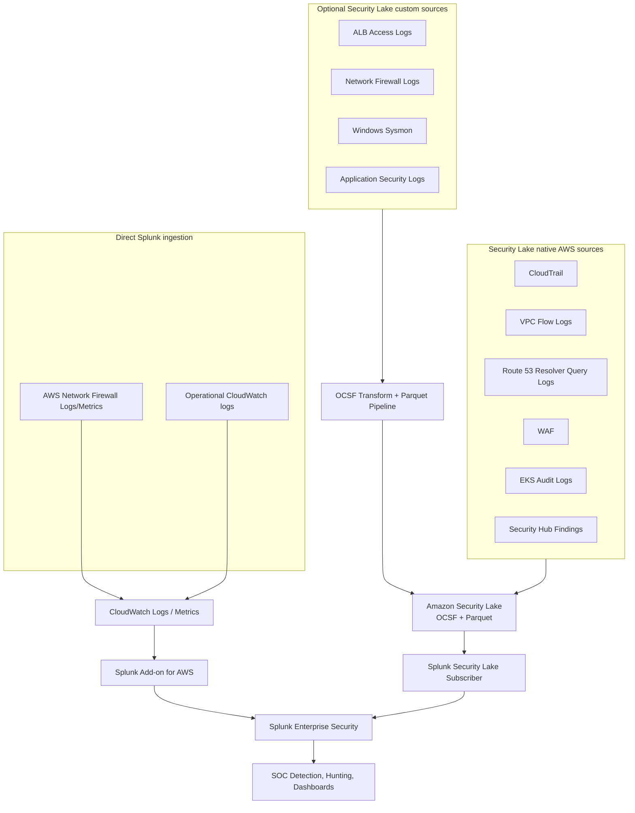

## 1. Do you need Route 53 Resolver Query Logs in each account?

**For Security Lake native Route 53 Resolver Query Logs: generally no, you do not need to manually create traditional Route 53 Resolver query logging configurations in every account just for Security Lake.**

When you add **Route 53 Resolver query logs as a Security Lake source**, Security Lake starts collecting the resolver query logs directly from Route 53 through an **independent duplicated stream of events**. AWS also states that Security Lake does not manage your existing Route 53 query logging configurations; if you already have regular Route 53 query logging to CloudWatch Logs, S3, or Firehose, that is a separate configuration. ([AWS Documentation][1])

So the distinction is:

| Scenario                                                                        | Need manual Route 53 Resolver query logging config in each account? |
| ------------------------------------------------------------------------------- | ------------------------------------------------------------------: |
| Security Lake native Route 53 source                                            |                             **No, enable the Security Lake source** |
| You want Route 53 logs directly to CloudWatch/S3/Firehose outside Security Lake |               **Yes, create Route 53 query logging configurations** |
| You want both Security Lake and separate CloudWatch/S3 copies                   |                             **Yes, but expect duplicate data/cost** |

The cleaner architecture is:

```text id="48oxhm"
Route 53 Resolver Query Logs
   → Security Lake native source
   → OCSF + Parquet in S3
   → Splunk Security Lake subscriber
```

Not:

```text id="njquxj"
Route 53 Resolver Query Logs
   → CloudWatch Logs in every account
   → Splunk

AND

Route 53 Resolver Query Logs
   → Security Lake
   → Splunk
```

That second model creates duplicate ingestion unless you have a compliance or operational reason.

---

# 2. Two approaches for Network Firewall, ALB, firewall, Windows Sysmon logs

You have two valid patterns:

```text id="89advm"
Approach 1:
Service log → CloudWatch Logs / S3 / Firehose → Splunk Add-on

Approach 2:
Service log → Transform to OCSF + Parquet → Security Lake custom source → Splunk subscriber
```

They are not the same. One is **direct Splunk ingestion**. The other is **data lake normalization first, then SIEM consumption**.

---

## Approach 1 — Direct ingestion using Splunk Add-on for AWS

Example:

```text id="r3uqsd"
AWS Network Firewall
   → CloudWatch Logs
   → Splunk Add-on for AWS
   → Splunk index / CIM / dashboards
```

AWS Prescriptive Guidance describes this exact pattern for Network Firewall: Network Firewall publishes logs to CloudWatch Logs, and Splunk Enterprise retrieves the logs and metrics from CloudWatch using the Splunk Add-on for AWS. ([AWS Documentation][2])

Splunk’s AWS add-on supports push-based ingestion using Firehose and pull-based ingestion using AWS APIs. It can collect AWS infrastructure, metrics, billing, raw JSON-formatted data, and security-related data, and provides CIM-compatible knowledge for several AWS sources. ([splunk.github.io][3])

### Good for

| Use case                            | Why this approach fits                             |
| ----------------------------------- | -------------------------------------------------- |
| Near-real-time Splunk monitoring    | Direct path into Splunk                            |
| Network Firewall dashboards         | AWS pattern already supports it                    |
| CloudWatch metrics + logs together  | Splunk add-on can pull CloudWatch metrics and logs |
| Quick implementation                | Less transformation engineering                    |
| Splunk is the primary SOC tool      | Data lands directly in Splunk                      |
| You need raw vendor-specific fields | Splunk can keep raw source format                  |

### Limitations

| Limitation                                    | Explanation                                                       |
| --------------------------------------------- | ----------------------------------------------------------------- |
| Not OCSF-normalized by default                | Logs arrive as AWS/CloudWatch source data, not Security Lake OCSF |
| Splunk-centric                                | Other consumers do not automatically benefit                      |
| Per-source/per-account configuration can grow | You may need to manage inputs, roles, log groups, indexes         |
| Duplicate risk                                | If same data also goes through Security Lake into Splunk          |
| Less data lake benefit                        | You are not building a central OCSF/Parquet lake for that source  |

---

## Approach 2 — Security Lake custom source

Example:

```text id="gq9gf0"
AWS Network Firewall / ALB / Windows Sysmon
   → collection pipeline
   → transform to OCSF schema
   → write as Apache Parquet to Security Lake custom source prefix
   → Glue/Lake Formation table
   → Splunk Security Lake subscriber
```

Security Lake custom sources require the source to convert logs/events to **OCSF**, write them as **Apache Parquet**, and meet Security Lake requirements for partitioning, object size, and delivery rate. ([AWS Documentation][4]) Security Lake also creates a unique S3 prefix, IAM role, Lake Formation table, and Glue crawler for custom sources. ([AWS Documentation][4]) When adding a custom source, you choose the OCSF event class, such as `NETWORK_ACTIVITY`, `HTTP_ACTIVITY`, `AUTHENTICATION`, `DNS_ACTIVITY`, or `DETECTION_FINDING`. ([AWS Documentation][5])

Splunk supports ingestion from Security Lake as a subscriber and can consume OCSF data from Security Lake. ([AWS Documentation][6])

### Good for

| Use case                           | Why this approach fits                                          |
| ---------------------------------- | --------------------------------------------------------------- |
| Central security data lake         | All security data lands in one OCSF/Parquet lake                |
| Multi-consumer model               | Splunk, Athena, OpenSearch, other subscribers can use same data |
| Long-term retention                | S3/Parquet is better for cost-efficient historical storage      |
| Standardized schema                | OCSF makes cross-source queries easier                          |
| Avoid SIEM lock-in                 | Data is not only formatted for Splunk                           |
| Threat hunting over AWS-scale data | Athena/Security Lake subscribers can query normalized data      |

### Limitations

| Limitation               | Explanation                                                                                                                           |
| ------------------------ | ------------------------------------------------------------------------------------------------------------------------------------- |
| More engineering         | You must build/operate transformation pipeline                                                                                        |
| Must map to OCSF         | ALB, Network Firewall, Sysmon fields need correct event-class mapping                                                                 |
| Must write Parquet       | Cannot just drop raw JSON/syslog/XML directly                                                                                         |
| Latency may be higher    | Better for data lake analytics than ultra-fast alerting                                                                               |
| Not all logs map cleanly | Some source-specific fields may need custom extensions                                                                                |
| Custom source limits     | Security Lake has custom source limits per account; AWS docs note up to 50 custom log sources in an account. ([AWS Documentation][4]) |

---

# 3. Which approach should you use for each source?

## Recommended decision table

| Source                           | Best default path                                                                          | Reason                                                                              |
| -------------------------------- | ------------------------------------------------------------------------------------------ | ----------------------------------------------------------------------------------- |
| **CloudTrail**                   | Security Lake native source                                                                | Already supported and OCSF-normalized                                               |
| **VPC Flow Logs**                | Security Lake native source                                                                | Already supported and useful in OCSF                                                |
| **Route 53 Resolver Query Logs** | Security Lake native source                                                                | Do not duplicate with manual per-account configs unless needed                      |
| **WAF logs**                     | Security Lake native source                                                                | Already supported                                                                   |
| **EKS Audit Logs**               | Security Lake native source                                                                | Already supported                                                                   |
| **Security Hub findings**        | Security Lake native source + direct SIEM alerting                                         | Good for data lake and findings correlation                                         |
| **AWS Network Firewall logs**    | Depends                                                                                    | Direct Splunk for faster SOC dashboards; custom Security Lake if you want OCSF lake |
| **AWS Network Firewall metrics** | Splunk Add-on / CloudWatch metrics                                                         | Metrics do not naturally belong in OCSF Security Lake                               |
| **ALB access logs**              | Usually custom source only if security use case exists                                     | Useful for HTTP activity, but requires OCSF mapping                                 |
| **Windows Sysmon**               | Usually MDE/Sentinel/Splunk direct; Security Lake custom only for central lake requirement | Sysmon is high-volume and requires careful mapping                                  |
| **EC2 Linux auth/audit logs**    | MDE/Splunk/Sentinel direct or selective custom source                                      | Avoid duplicating if MDE already covers endpoint telemetry                          |
| **RDS audit logs**               | CloudWatch → Splunk/Sentinel, or custom Security Lake if normalized DB activity required   | Depends on detection and retention requirement                                      |

---

# 4. Network Firewall: direct Splunk vs Security Lake custom source

## Option A — direct Splunk Add-on



Use this when:

```text id="n6jtpd"
Splunk is the main SOC console.
You need Network Firewall metrics and logs together.
You want quick implementation.
You need dashboards and operational visibility.
You do not need OCSF normalization first.
```

## Option B — Security Lake custom source



Use this when:

```text id="3uzy8y"
You want Network Firewall logs in the same Security Lake as CloudTrail, VPC Flow, DNS, WAF, and EKS audit.
You want OCSF-normalized long-term storage.
You want more than Splunk to consume the data.
You want data lake hunting and compliance retention.
```

---

# 5. ALB and Windows Sysmon as Security Lake custom sources

## ALB logs

ALB access logs can be useful for:

```text id="ncaf0w"
HTTP request investigation
Source IP / URI / user-agent analysis
WAF correlation
OAuth/OIDC troubleshooting
mTLS troubleshooting
Backend target errors
Suspicious URL/path activity
```

Possible OCSF mapping:

| ALB field/use case                     | OCSF class                                                             |
| -------------------------------------- | ---------------------------------------------------------------------- |
| HTTP request activity                  | `HTTP_ACTIVITY`                                                        |
| Network session-style fields           | `NETWORK_ACTIVITY`                                                     |
| Authentication-related ALB/OIDC events | Possibly `AUTHENTICATION`, but only if the event is truly auth-related |

But for ALB logs, do not send everything to Splunk/Security Lake blindly. ALB access logs can be high volume. Send only if you need web-layer investigation beyond WAF logs.

## Windows Sysmon

Windows Sysmon can be very valuable, but it is high-volume.

Possible OCSF mapping:

| Sysmon event       | OCSF class                           |
| ------------------ | ------------------------------------ |
| Process creation   | Process/activity-related event class |
| Network connection | `NETWORK_ACTIVITY`                   |
| File create/delete | File activity class                  |
| Driver/image load  | System/activity class                |
| Registry events    | Registry/activity class              |
| DNS query          | `DNS_ACTIVITY`                       |

However, if you already have **MDE**, Sysmon may be partly redundant. MDE already provides endpoint telemetry such as process, network, logon, file, and device events in Defender XDR advanced hunting tables. In that case:

```text id="ejyw23"
MDE → Sentinel/Defender/Splunk = primary endpoint security path
Sysmon → Splunk/Security Lake = only for special forensic/compliance/high-value hosts
```

---

# 6. Best recommended architecture for your case

Since you already have **Security Lake integrated with Splunk**, I would use this model:



## My practical recommendation

Use **Security Lake native sources** for:

```text id="gtsyw8"
CloudTrail
VPC Flow Logs
Route 53 Resolver Query Logs
WAF
EKS Audit Logs
Security Hub findings
```

Use **direct Splunk Add-on** for:

```text id="h5w5rw"
AWS Network Firewall logs and metrics
CloudWatch operational logs
Any log source where Splunk needs fast direct dashboards
```

Use **Security Lake custom source** only for:

```text id="410c07"
Logs that must be normalized to OCSF
Logs needed for long-term data lake retention
Logs consumed by multiple tools, not only Splunk
Logs you are willing to transform to OCSF + Parquet correctly
```

---

# 7. The biggest design warning: avoid double ingestion

Do not do this unless you intentionally want duplicate copies:

```text id="ur4y73"
Network Firewall → CloudWatch → Splunk Add-on

AND

Network Firewall → OCSF transform → Security Lake → Splunk
```

That means:

```text id="8n6akg"
Same event
Same SOC
Two indexes
Two schemas
More cost
Possible duplicate alerts
```

If both paths are needed, separate their purpose:

| Path                            | Purpose                                         |
| ------------------------------- | ----------------------------------------------- |
| **Direct Splunk Add-on**        | Near-real-time SOC dashboards and alerting      |
| **Security Lake custom source** | Long-term OCSF-normalized data lake and hunting |

---

# 8. Final answer

For **Route 53 Resolver Query Logs**, enable the **Security Lake native source** across the required accounts and Regions. You do not need to create separate Route 53 Resolver query logging configurations in every account just for Security Lake because Security Lake collects from Route 53 through an independent stream. Keep separate Route 53 logging only if you need non-Security-Lake destinations.

For **Network Firewall**, the **Splunk Add-on approach** is simpler and better for fast Splunk dashboards, metrics, and direct SOC monitoring.

For **Network Firewall, ALB, Sysmon, or other custom logs into Security Lake**, the **custom source approach** is better when your goal is OCSF normalization, long-term data lake storage, and multi-tool consumption — but it requires transformation to OCSF + Parquet and more engineering.

My recommended operating model:

```text id="lr3ic2"
Security Lake native sources = AWS security data lake foundation
Splunk Add-on direct ingestion = fast operational/SOC monitoring for unsupported or metric-heavy sources
Security Lake custom sources = selective, high-value normalized sources only
Avoid duplicate ingestion unless the two paths serve clearly different purposes
```

[1]: https://docs.aws.amazon.com/security-lake/latest/userguide/route-53-logs.html "Route 53 resolver query logs in Security Lake - Amazon Security Lake"
[2]: https://docs.aws.amazon.com/prescriptive-guidance/latest/patterns/view-aws-network-firewall-logs-and-metrics-by-using-splunk.html "View AWS Network Firewall logs and metrics by using Splunk - AWS Prescriptive Guidance"
[3]: https://splunk.github.io/splunk-add-on-for-amazon-web-services/ "About the Add-on - Splunk Add-on for Amazon Web Services"
[4]: https://docs.aws.amazon.com/security-lake/latest/userguide/custom-sources.html "Collecting data from custom sources in Security Lake - Amazon Security Lake"
[5]: https://docs.aws.amazon.com/security-lake/latest/userguide/adding-custom-sources.html "Adding a custom source in Security Lake - Amazon Security Lake"
[6]: https://docs.aws.amazon.com/security-lake/latest/userguide/integrations-third-party.html?utm_source=chatgpt.com "Third-party integrations with Security Lake"
