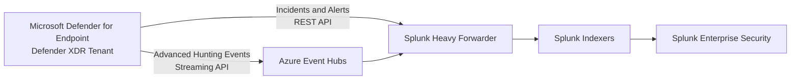
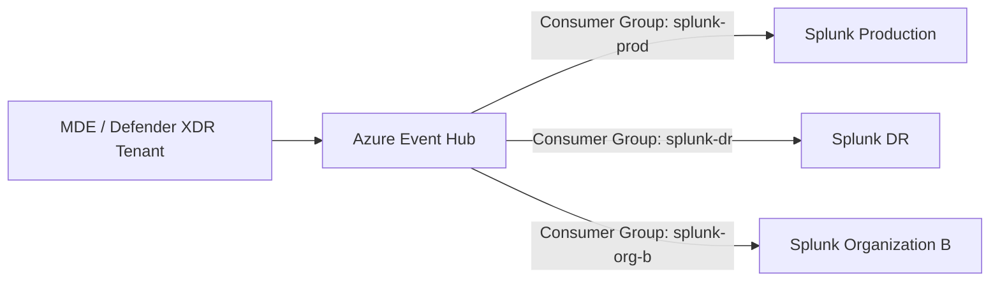
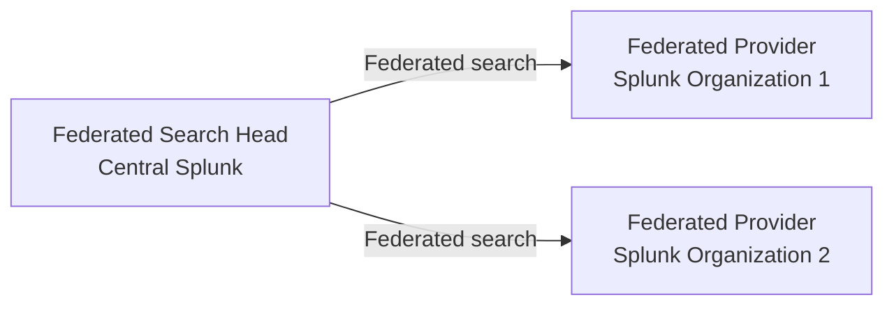

## MDE integration with Splunk

Microsoft Defender for Endpoint data reaches Splunk through two main paths:

* **Incidents and alerts:** The Splunk Add-on for Microsoft Security periodically pulls Defender XDR incidents and MDE alerts through Microsoft APIs.
* **Detailed endpoint telemetry:** Defender XDR streams Advanced Hunting events—processes, network connections, files, registry changes and device events—to Azure Event Hubs. Splunk consumes Event Hubs through the Microsoft add-on, normally running on a Heavy Forwarder. ([Splunk Docs][1])

## Can one MDE tenant send data to multiple Splunk deployments?

**Yes. The recommended design is one Event Hub with a separate consumer group for each Splunk deployment.**

Each consumer group maintains an independent position in the event stream, allowing every Splunk deployment to receive the complete data independently. Do **not** configure independent Splunk deployments with the same consumer group; consumers in the same group can divide the partitions and each Splunk deployment may receive only part of the events. ([Microsoft Learn][2])

Multiple Splunk deployments can also independently call the Defender APIs, but that creates duplicate collection, additional API traffic and separate checkpoints. Event Hubs with dedicated consumer groups is generally cleaner for high-volume MDE telemetry.

## Splunk federated-search terminology

| Role                             | Splunk name                                       | Function                                                               |
| -------------------------------- | ------------------------------------------------- | ---------------------------------------------------------------------- |
| Splunk that initiates the search | **Federated search head** or **local deployment** | Sends the search to remote Splunk deployments and combines the results |
| Remote Splunk being searched     | **Federated provider**                            | Executes the search against its own indexers and returns results       |
| Remote dataset mapping           | **Federated index**                               | Local logical name representing a remote index or dataset              |

The remote data remains in the federated provider; normally only search results are returned to the federated search head. ([Splunk Docs][3])

**In one sentence:** MDE sends alerts through APIs and detailed telemetry through Event Hubs; multiple Splunk deployments should use separate Event Hub consumer groups, while the Splunk initiating cross-deployment searches is called the **federated search head**.

[1]: https://help.splunk.com/en/splunk-cloud-platform/get-data-in/splunk-supported-add-ons/splunk-supported-add-ons/microsoft-security?utm_source=chatgpt.com "Microsoft Security | Platform (last updated 2025-05-28T21 ..."
[2]: https://learn.microsoft.com/en-us/azure/event-hubs/event-hubs-features?utm_source=chatgpt.com "Event Hubs features and terminology - Azure Event Hubs"
[3]: https://help.splunk.com/en/splunk-enterprise/search/search-manual/9.0/run-federated-searches-across-multiple-splunk-deployments/define-a-federated-provider?utm_source=chatgpt.com "Define a federated provider"
