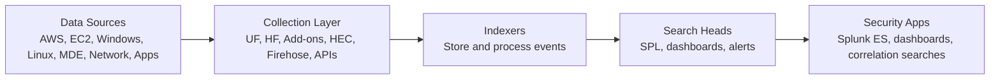
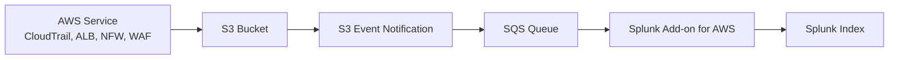
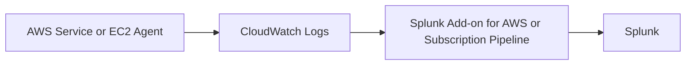
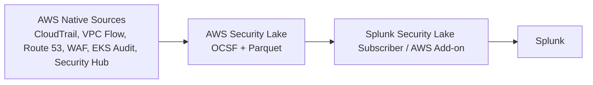
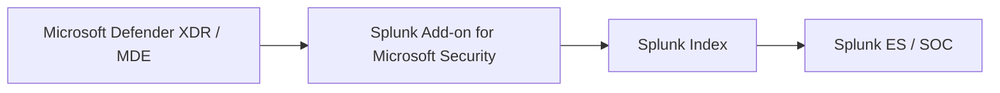
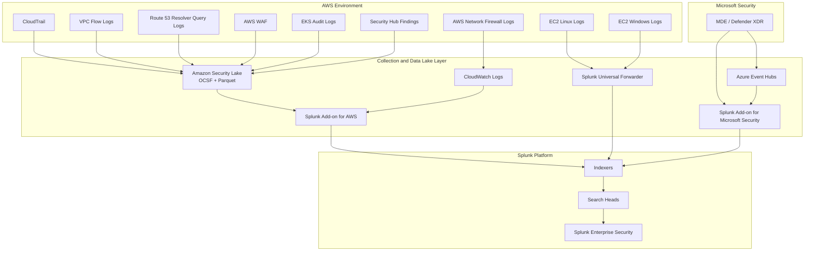

# Splunk Admin Guide for AWS Cloud Security Operations

## 1. Purpose

This guide explains the core Splunk architecture, common AWS ingestion patterns, Microsoft Defender for Endpoint ingestion into Splunk, licensing considerations, dashboards, SPL query basics, and federated search concepts.

The target audience is a new Splunk administrator or cloud security engineer supporting AWS, Microsoft Defender, Security Lake, and enterprise SOC use cases.

---

# 2. Big Picture

Splunk is a platform for collecting, indexing, searching, analyzing, alerting, and visualizing machine data.

In a security environment, Splunk is commonly used as a SIEM/SOC analytics platform. It can ingest logs and events from AWS, Microsoft Defender, Windows, Linux, firewalls, proxies, DNS, identity systems, endpoint tools, and applications.

The basic data flow is:



At a high level:

```text
Collect data → assign source/sourcetype/index → store events → search with SPL → alert/dashboard/investigate
```

---

# 3. Core Splunk Architecture Components

## 3.1 Universal Forwarder

The Universal Forwarder, or UF, is the lightweight Splunk agent installed on servers.

Typical use cases:

* Collect Windows Event Logs.
* Collect Linux logs such as `/var/log/secure`, `/var/log/messages`, `/var/log/audit/audit.log`.
* Collect application logs.
* Forward logs to indexers or heavy forwarders.
* Keep agent footprint small on production systems.

The UF is normally the default choice for operating system and application log collection.

Important point:

```text
Universal Forwarder = lightweight collection and forwarding
Universal Forwarder ≠ full parsing, indexing, dashboarding, or searching
```

---

## 3.2 Heavy Forwarder

A Heavy Forwarder is a full Splunk Enterprise instance used as a collection, parsing, transformation, or routing tier.

Typical use cases:

* Run Splunk technology add-ons that require API-based collection.
* Collect AWS, Microsoft, SaaS, or cloud API data.
* Parse and route data before it reaches indexers.
* Filter or transform events.
* Send data to multiple destinations.

Important point:

```text
Heavy Forwarder = full Splunk instance used for collection, parsing, routing, and add-on execution
```

In AWS environments, Heavy Forwarders are often used to run the Splunk Add-on for AWS or other cloud/SaaS add-ons, especially in Splunk Enterprise deployments. In Splunk Cloud, ingestion architecture may use customer-managed forwarders, Splunk-managed inputs, HEC, or cloud-supported add-on patterns depending on the service model.

---

## 3.3 Indexers

Indexers store and process data.

They perform functions such as:

* Receive data from forwarders or inputs.
* Break raw data into events.
* Extract timestamps.
* Assign events to indexes.
* Store compressed raw data and searchable index files.
* Execute searches against local data.

An index is a logical storage location, such as:

```text
aws
security
wineventlog
linux
mde
network
cloud
```

Important point:

```text
Index = where events are stored
Sourcetype = how Splunk understands the format of the data
Source = where the data came from
Host = the system or entity that produced the data
```

---

## 3.4 Search Heads

Search heads are where users interact with Splunk.

They provide:

* SPL search interface.
* Dashboards.
* Reports.
* Alerts.
* Knowledge objects.
* Field aliases.
* Lookups.
* Data models.
* Correlation searches.

The search head distributes searches to indexers, receives results, and presents them to users.

Important point:

```text
Search Head = user interface and search coordination layer
Indexer = storage and search execution layer
```

---

## 3.5 Deployment Server

The Deployment Server manages configurations for Splunk forwarders.

Typical use cases:

* Push input configurations to Universal Forwarders.
* Manage forwarder apps.
* Standardize Windows, Linux, and application log collection.
* Group hosts by server class, such as Windows servers, Linux servers, domain controllers, web servers, or database servers.

---

## 3.6 Cluster Manager

In an indexer cluster, the Cluster Manager manages indexer clustering.

Typical use cases:

* Manage replication factor.
* Manage search factor.
* Coordinate indexer peer nodes.
* Maintain data availability and searchability.

---

## 3.7 Search Head Cluster Deployer

In a search head cluster, the deployer distributes apps and configurations to search head cluster members.

Typical use cases:

* Deploy dashboards.
* Deploy correlation searches.
* Deploy knowledge objects.
* Deploy Splunk Enterprise Security content.

---

## 3.8 License Manager

The License Manager controls Splunk license usage.

Typical use cases:

* Manage license pools.
* Track daily indexing volume.
* Monitor license violations.
* Allocate license capacity across indexers or indexer clusters.

---

## 3.9 Monitoring Console

The Monitoring Console provides health and performance visibility for the Splunk deployment.

Typical use cases:

* Indexing volume monitoring.
* Search performance.
* Forwarder health.
* Indexer health.
* License usage.
* Queues and ingestion bottlenecks.

---

# 4. Key Splunk Terms

| Term              | Meaning                                                                |
| ----------------- | ---------------------------------------------------------------------- |
| Index             | Logical storage location for events                                    |
| Source            | Specific file, stream, bucket, log group, or API source                |
| Sourcetype        | Format/parser category for the event                                   |
| Host              | System or entity that produced the event                               |
| App               | User-facing package with dashboards, workflows, and views              |
| Add-on / TA       | Technical package for inputs, parsing, field extraction, CIM mapping   |
| CIM               | Splunk Common Information Model used for normalized security analytics |
| SPL               | Search Processing Language used to query data                          |
| Knowledge objects | Saved searches, lookups, field aliases, tags, event types, data models |

---

# 5. AWS-Focused Ingestion Architecture

AWS data can enter Splunk through multiple patterns.

## 5.1 Common AWS Data Sources

| AWS source                   | Common destination before Splunk             | Notes                             |
| ---------------------------- | -------------------------------------------- | --------------------------------- |
| CloudTrail                   | S3, Security Lake, CloudWatch Logs           | API activity and account activity |
| VPC Flow Logs                | S3, CloudWatch Logs, Security Lake           | Network flow metadata             |
| AWS WAF logs                 | S3, Firehose, CloudWatch Logs, Security Lake | Web request visibility            |
| Route 53 Resolver Query Logs | Security Lake, CloudWatch Logs, S3           | DNS query visibility              |
| EKS Audit Logs               | CloudWatch Logs, Security Lake               | Kubernetes API audit activity     |
| Security Hub findings        | Security Hub, EventBridge, Security Lake     | Cloud security findings           |
| GuardDuty findings           | GuardDuty, Security Hub, EventBridge         | Threat detection findings         |
| AWS Network Firewall logs    | S3, CloudWatch Logs, Firehose                | Alert, flow, and TLS logs         |
| ALB access logs              | S3                                           | HTTP access logs                  |
| RDS logs                     | CloudWatch Logs                              | Database engine logs              |
| EC2 OS logs                  | CloudWatch Agent, Splunk UF, Fluent Bit      | Windows/Linux OS and app logs     |

---

# 6. Splunk Add-on for AWS

The Splunk Add-on for AWS is a technology add-on used to collect and parse AWS data.

It can support different ingestion models depending on the AWS source:

```text
AWS API pull
SQS-based S3 pull
CloudWatch Logs collection
CloudWatch metrics collection
Kinesis Firehose push to Splunk HEC
Security Lake subscriber ingestion
```

## 6.1 SQS-Based S3 Pattern

This is common for logs delivered to S3.

Example:



Why this pattern is useful:

* Splunk does not need to list the entire S3 bucket repeatedly.
* S3 event notifications identify new objects.
* SQS buffers notifications.
* Splunk pulls the new objects and indexes them.

Good fit for:

* CloudTrail logs in S3.
* AWS Network Firewall logs in S3.
* ALB access logs in S3.
* Other AWS service logs delivered to S3.

---

## 6.2 CloudWatch Logs Pattern

Some AWS services publish logs to CloudWatch Logs.

Example:



Good fit for:

* RDS logs.
* EKS control plane logs.
* EC2 application logs.
* CloudWatch log groups.
* Some Network Firewall configurations.

---

## 6.3 Kinesis Firehose / HEC Push Pattern

Some AWS logs can be sent through Kinesis Data Firehose to Splunk HTTP Event Collector.

Example:


Good fit for:

* High-throughput push-based ingestion.
* Centralized AWS log routing.
* Environments that prefer AWS-managed delivery to Splunk HEC.

---

## 6.4 AWS Security Lake Pattern

If AWS Security Lake is enabled, AWS-native security logs can be centralized in S3 using OCSF and Apache Parquet.

Example:



Security Lake is useful when the goal is:

* Central AWS security data lake.
* OCSF-normalized security data.
* Long-term S3-based retention.
* Multi-tool consumption.
* Splunk ingestion from curated Security Lake sources.

Important design point:

```text
Security Lake is not the same as CloudWatch Logs.
Security Lake is a security data lake using OCSF and Parquet.
CloudWatch Logs is an AWS operational log service that stores timestamped log messages.
```

---

# 7. Direct AWS Add-on vs Security Lake Approach

## 7.1 Direct Splunk Add-on Ingestion

Example:

```text
AWS Network Firewall → S3/CloudWatch Logs → Splunk Add-on for AWS → Splunk
```

Best for:

* Fast Splunk dashboards.
* Direct SOC monitoring.
* AWS Network Firewall logs and metrics.
* Operational troubleshooting.
* Use cases where Splunk is the main consumer.

Limitations:

* Not always OCSF-normalized.
* More Splunk-specific.
* Can create duplicate ingestion if the same source also goes through Security Lake.

---

## 7.2 Security Lake Ingestion

Example:

```text
AWS supported source → Security Lake → OCSF + Parquet → Splunk subscriber
```

Best for:

* Central AWS security data lake.
* OCSF standardization.
* Long-term retention.
* Multi-tool access.
* Reduced need to configure every AWS source directly in Splunk.

Limitations:

* Not every AWS service log is native to Security Lake.
* Custom sources require OCSF mapping and Parquet formatting.
* May not be the best path for operational metrics.
* Latency and workflow may differ from direct Splunk ingestion.

---

# 8. Microsoft Defender for Endpoint Ingestion into Splunk

Microsoft Defender for Endpoint, or MDE, can be integrated with Splunk in two main ways.

## 8.1 Ingest Defender Alerts and Incidents

This is the recommended starting point for most SOCs.

Example:



This approach collects high-value security objects such as:

* Defender incidents.
* MDE alerts.
* Alert evidence.
* Severity.
* Impacted device.
* Impacted user.
* Detection source.
* Investigation status.

Best for:

* SOC alerting.
* Incident triage.
* Lower ingestion volume.
* Enterprise correlation.
* Avoiding unnecessary raw endpoint telemetry duplication.

---

## 8.2 Stream Advanced Hunting Events through Azure Event Hubs

This is used when Splunk needs raw or near-raw endpoint telemetry.

Example:


Possible event categories include:

* DeviceProcessEvents.
* DeviceNetworkEvents.
* DeviceFileEvents.
* DeviceLogonEvents.
* DeviceRegistryEvents.
* DeviceEvents.
* DeviceInfo.
* Email events, if using broader Defender XDR tables.

Best for:

* Endpoint hunting in Splunk.
* Process/network/file activity correlation.
* Splunk as the primary SOC hunting platform.
* Use cases where Defender portal retention or query access is not sufficient.

Design warning:

```text
Do not stream every MDE table into Splunk by default.
Start with incidents and alerts.
Add raw Advanced Hunting tables only when there is a documented detection or hunting use case.
```

---

## 8.3 Recommended MDE-to-Splunk Strategy

| Requirement                                   | Recommended approach                                   |
| --------------------------------------------- | ------------------------------------------------------ |
| SOC wants Defender incidents in Splunk        | Ingest Defender XDR incidents                          |
| SOC wants MDE alerts in Splunk                | Ingest MDE alerts                                      |
| SOC wants endpoint process telemetry          | Stream selected Advanced Hunting tables                |
| SOC wants all endpoint telemetry              | Use Event Hub streaming, but validate cost and volume  |
| Splunk is central SIEM                        | Send incidents, alerts, and selected high-value events |
| Sentinel/Defender is primary endpoint console | Send only summarized incidents/alerts to Splunk        |

Recommended default:

```text
MDE/Defender XDR → incidents and alerts → Splunk
MDE Advanced Hunting tables → Splunk only by exception
```

---

# 9. Splunk CIM and Enterprise Security

Splunk’s Common Information Model, or CIM, is the normalization model used by many Splunk security apps and Splunk Enterprise Security.

CIM helps map different vendors’ logs into common data models such as:

* Authentication.
* Network Traffic.
* Web.
* Endpoint.
* Change.
* Malware.
* Intrusion Detection.
* Vulnerabilities.
* Data Loss Prevention.

Example:

```text
Windows failed login
Linux failed SSH login
VPN failed login
Entra failed sign-in
```

All can be normalized into an Authentication data model so the SOC can search common fields instead of learning every vendor’s format.

---

# 10. SPL Query Basics

Every Splunk search should start by narrowing the dataset.

Good pattern:

```spl
index=aws sourcetype=aws:cloudtrail eventName=ConsoleLogin
| stats count by userIdentity.userName, sourceIPAddress
| sort - count
```

Common examples:

```spl
index=wineventlog EventCode=4625
| stats count by host, Account_Name, src_ip
```

```spl
index=aws sourcetype=aws:cloudtrail errorCode=AccessDenied
| stats count by userIdentity.arn, eventName, sourceIPAddress
```

```spl
index=aws sourcetype=aws:cloudwatchlogs:vpcflow action=REJECT
| stats count by src_ip, dest_ip, dest_port
| sort - count
```

```spl
index=mde sourcetype=*DeviceProcessEvents* FileName=powershell.exe
| table _time, DeviceName, InitiatingProcessFileName, FileName, ProcessCommandLine
```

Important SPL commands:

| Command     | Purpose                                  |
| ----------- | ---------------------------------------- |
| `stats`     | Aggregate results                        |
| `timechart` | Trend over time                          |
| `table`     | Display selected fields                  |
| `top`       | Show most common values                  |
| `dedup`     | Remove duplicates                        |
| `lookup`    | Enrich data using lookup tables          |
| `eval`      | Create or modify fields                  |
| `where`     | Filter using expressions                 |
| `rex`       | Extract fields using regex               |
| `spath`     | Parse JSON fields                        |
| `tstats`    | Fast search over accelerated data models |

---

# 11. Dashboards and Alerts

Splunk dashboards are usually built from saved SPL searches.

Typical process:

```text
Run SPL search → validate results → Save As → Dashboard Panel or Alert
```

Splunk supports modern Dashboard Studio and older Simple XML dashboards.

Common security dashboards:

* AWS API activity.
* GuardDuty findings.
* CloudTrail access denied events.
* Console logins.
* VPC rejected flows.
* WAF blocked requests.
* Network Firewall alerts.
* Windows failed logins.
* Linux sudo/SSH activity.
* MDE endpoint alerts.
* MDE process execution.
* Security Hub findings.

---

# 12. Apps and Add-ons

## 12.1 Apps

Apps usually provide dashboards, workflows, searches, and user-facing content.

Examples:

* Splunk App for AWS.
* Splunk Enterprise Security.
* Splunk Security Essentials.
* Splunk App for Windows Infrastructure.

## 12.2 Add-ons / Technology Add-ons

Add-ons usually provide:

* Data inputs.
* Sourcetypes.
* Field extractions.
* Event types.
* Tags.
* CIM mappings.

Examples:

* Splunk Add-on for AWS.
* Splunk Add-on for Microsoft Security.
* Splunk Add-on for Windows.
* Splunk Add-on for Unix and Linux.

Important point:

```text
Apps are usually for users.
Add-ons are usually for data onboarding and normalization.
```

---

# 13. Licensing Considerations

Splunk licensing depends on the product and deployment model.

## 13.1 Splunk Enterprise or Splunk Cloud Platform License

Required for:

* Indexing data.
* Searching data.
* Dashboards.
* Alerts.
* Core Splunk platform functionality.

Traditional Splunk licensing is commonly based on daily indexing volume, though Splunk commercial terms can vary by product, cloud, workload, or contract.

---

## 13.2 Splunk Enterprise Security License

Splunk Enterprise Security, or ES, is a premium SIEM app on top of the Splunk platform.

ES provides:

* Notable events.
* Correlation searches.
* Risk-based alerting.
* Incident Review.
* Security dashboards.
* Asset and identity framework.
* Threat intelligence framework.
* CIM-driven security analytics.
* MITRE ATT&CK-aligned security content.

Splunk ES generally requires:

```text
Splunk Enterprise or Splunk Cloud Platform
+
Splunk Enterprise Security license
+
CIM-normalized data sources
```

---

## 13.3 Splunk SOAR License

Splunk SOAR is separate from core Splunk and Splunk ES.

It provides:

* Playbook automation.
* Case management.
* Automated containment actions.
* Integration with firewalls, EDR, IAM, cloud APIs, ticketing, and messaging tools.

Use Splunk SOAR when alerts need automated or semi-automated response.

---

## 13.4 Add-ons and Apps

Many Splunk add-ons are free to download from Splunkbase, but they do not eliminate the need for Splunk platform ingestion licensing.

Important point:

```text
An add-on may be free, but the data it sends into Splunk can consume license.
```

---

## 13.5 Security Lake and Federated Analytics Licensing

When using Amazon Security Lake with Splunk, there are two broad models:

1. Ingest Security Lake data into Splunk indexes.
2. Federate/search remote Security Lake data where it lives, depending on Splunk Cloud Federated Analytics capability.

The licensing and commercial model depends on your Splunk Cloud or Splunk Enterprise contract, data volume, storage, search workload, and enabled features. Confirm with your Splunk account team before assuming Security Lake data is free to search or ingest.

---

# 14. Federated Search

Federated Search allows a Splunk search head to search data outside the local Splunk deployment.

Common use cases:

* Search across separate Splunk deployments.
* Search Splunk Cloud and Splunk Enterprise environments.
* Search remote datasets without fully ingesting all data locally.
* Support migration or hybrid architectures.
* Search long-term data lake sources while keeping high-value data indexed locally.

## 14.1 Standard Mode

Standard mode uses federated indexes that map to specific remote datasets.

Use standard mode when:

* You want explicit control over which remote datasets are searchable.
* You want to expose only selected indexes, saved searches, data models, or datasets.
* You are not trying to preserve old hybrid-search syntax.

Conceptually:

```text
local search head → federated index → remote Splunk dataset
```

## 14.2 Transparent Mode

Transparent mode is designed to make remote searching feel more like searching local data.

Use transparent mode when:

* You are migrating from hybrid search.
* You want existing searches to work with minimal syntax changes.
* You need a more seamless experience across local and remote Splunk deployments.

Conceptually:

```text
User runs search as if local → Splunk transparently reaches remote provider
```

## 14.3 Federated Analytics with Amazon Security Lake

Splunk Cloud Federated Analytics for Amazon Security Lake can support two patterns:

```text
1. Ingest recent curated Security Lake data into Splunk data lake indexes for frequent detection searches.
2. Run ad hoc federated searches over long-range Security Lake data stored in Amazon S3.
```

This gives a useful split:

| Use case                    | Best pattern                                                 |
| --------------------------- | ------------------------------------------------------------ |
| Frequent detection searches | Ingest recent Security Lake data into Splunk-managed indexes |
| Long-range threat hunting   | Federated search over Security Lake data in S3               |
| Cost control                | Keep older/high-volume data in S3                            |
| Fast alerting               | Keep high-value recent data indexed locally                  |

---

# 15. Recommended AWS + MDE + Splunk Architecture



---

# 16. Recommended Data Strategy

## 16.1 AWS Native Security Sources

Use Security Lake where supported:

```text
CloudTrail
VPC Flow Logs
Route 53 Resolver Query Logs
AWS WAF
EKS Audit Logs
Security Hub findings
```

Send Security Lake data to Splunk for SOC correlation.

## 16.2 AWS Logs Not Native to Security Lake

Use direct Splunk Add-on, CloudWatch, S3, Firehose, or custom pipeline:

```text
AWS Network Firewall
ALB access logs
RDS logs
EC2 OS logs
Custom application logs
```

## 16.3 Microsoft Defender Endpoint

Use Defender XDR/MDE as the primary endpoint security telemetry source.

Recommended Splunk ingestion:

```text
Defender incidents and alerts first
Selected Advanced Hunting tables second
Full raw endpoint streaming only by exception
```

## 16.4 Windows and Linux Logs

Do not automatically duplicate all OS security logs if MDE already covers endpoint telemetry.

Collect OS logs directly into Splunk only when required for:

* Compliance.
* Forensics.
* MDE coverage gaps.
* High-value systems.
* Operational troubleshooting.
* Specific detection use cases.

---

# 17. Common Admin Tasks

## 17.1 Onboard a New AWS Source

1. Identify the AWS service log source.
2. Decide destination: Security Lake, S3, CloudWatch Logs, Firehose, or direct API.
3. Confirm IAM role and permissions.
4. Configure SQS notification if using S3-based ingestion.
5. Configure Splunk Add-on input.
6. Assign correct index and sourcetype.
7. Validate data ingestion.
8. Confirm field extraction.
9. Confirm CIM mapping if used by Splunk ES.
10. Build dashboard or alert.

---

## 17.2 Onboard a New EC2 Host

1. Install Universal Forwarder or approved collector.
2. Configure deployment server.
3. Assign server class.
4. Define monitored logs.
5. Route to correct index.
6. Validate host, source, and sourcetype.
7. Confirm events are searchable.
8. Confirm dashboards or detections use the data.

---

## 17.3 Onboard MDE Data

1. Register Splunk integration with Microsoft Entra ID as needed.
2. Install Splunk Add-on for Microsoft Security.
3. Configure API permissions for incidents and alerts.
4. If raw events are required, configure Defender XDR streaming to Azure Event Hubs.
5. Configure Splunk input for Event Hubs.
6. Select only required Advanced Hunting tables.
7. Validate ingestion volume.
8. Map fields to Splunk CIM where required.
9. Build or enable detections and dashboards.
10. Monitor ingestion health.

---

# 18. Starter SPL Queries

## AWS Console Logins

```spl
index=aws sourcetype=aws:cloudtrail eventName=ConsoleLogin
| stats count by userIdentity.userName, sourceIPAddress, responseElements.ConsoleLogin
| sort - count
```

## AWS Access Denied Events

```spl
index=aws sourcetype=aws:cloudtrail errorCode=AccessDenied
| stats count by userIdentity.arn, eventSource, eventName, sourceIPAddress
| sort - count
```

## VPC Rejected Traffic

```spl
index=aws sourcetype=*vpcflow* action=REJECT
| stats count by src_ip, dest_ip, dest_port, protocol
| sort - count
```

## WAF Blocked Requests

```spl
index=aws sourcetype=*waf* action=BLOCK
| stats count by httpRequest.clientIp, httpRequest.country, terminatingRuleId
| sort - count
```

## Windows Failed Logons

```spl
index=wineventlog EventCode=4625
| stats count by host, Account_Name, IpAddress
| sort - count
```

## Linux SSH Failures

```spl
index=linux ("Failed password" OR "authentication failure")
| stats count by host, user, src_ip
| sort - count
```

## MDE PowerShell Process Activity

```spl
index=mde sourcetype=*DeviceProcessEvents* FileName=powershell.exe
| table _time, DeviceName, InitiatingProcessFileName, FileName, ProcessCommandLine, AccountName
```

---

# 19. Accuracy Notes and Best Practices

1. Do not assume every AWS log must go directly to Splunk.
2. Use AWS Security Lake for supported AWS security sources when OCSF-normalized data lake architecture is desired.
3. Use direct Splunk Add-on ingestion for sources requiring fast operational dashboards, CloudWatch metrics, or unsupported Security Lake sources.
4. Do not duplicate the same log source through both Security Lake and direct Splunk ingestion unless each path has a documented purpose.
5. Use MDE as the primary endpoint security telemetry source when it is fully deployed and healthy.
6. Send MDE incidents and alerts to Splunk first; stream raw Advanced Hunting events only when needed.
7. Normalize security data to Splunk CIM when using Splunk Enterprise Security.
8. Use federated search for hybrid, migration, or data lake search use cases.
9. Confirm licensing before ingesting high-volume logs such as VPC Flow Logs, ALB access logs, Sysmon, MDE process events, or Network Firewall flow logs.
10. Treat Splunk onboarding as both a data-engineering task and a SOC-detection task.

## License and federated search accuracy notes

Splunk says any Splunk Enterprise instance that performs indexing must be licensed, and deployments can use a license manager with license peers. ([Splunk Docs][6]) Splunk Enterprise Security licensing is separate from simply running Splunk Enterprise/Cloud; Splunk documents ES license usage around daily indexing volume, vCPU, and SVC depending on offering. ([Splunk Docs][7])

Federated Search has **standard** and **transparent** modes. Standard mode is used when you want to restrict access to specific remote datasets, while transparent mode supports searches across remote Splunk deployments with minimal/no syntax changes in hybrid or migration scenarios. ([Splunk Docs][8]) Splunk Cloud Federated Analytics for Amazon Security Lake supports a useful split: ingest recent Security Lake data into Splunk data lake indexes for detection, and run ad hoc federated searches over longer-range Security Lake datasets in S3. ([Splunk Docs][9])

## Suggested correction to your original mental model

Your original phrase:

> “install the add-on → it handles inputs + sourcetype + CIM → prebuilt dashboards/searches just work”

I would revise it to:

```text
Install the right add-on → configure the right input and IAM/API permissions → validate sourcetype and parsing → validate CIM mapping → then dashboards, detections, and Splunk ES content can work correctly.
```

The important difference is that add-ons help, but they do not guarantee perfect dashboards or detections until **IAM, source type, index, field extraction, timestamping, and CIM mapping** are validated.

[1]: https://help.splunk.com/en/splunk-enterprise/administer/distributed-deployment-manual?utm_source=chatgpt.com "Scale your deployment with Splunk Enterprise components"
[2]: https://help.splunk.com/splunk-enterprise/forward-and-process-data/forwarding-and-receiving-data/9.3/introduction-to-forwarding/types-of-forwarders?utm_source=chatgpt.com "Types of forwarders | Splunk Enterprise (last updated 2025 ..."
[3]: https://splunk.github.io/splunk-add-on-for-amazon-web-services/?utm_source=chatgpt.com "About the Splunk Add-on for Amazon Web Services"
[4]: https://splunk.github.io/splunk-add-on-for-amazon-web-services/SQS-basedS3/?utm_source=chatgpt.com "Configure SQS-Based S3 inputs for the Splunk Add-on for AWS"
[5]: https://help.splunk.com/en/supported-add-ons/splunk-supported-add-ons/microsoft-security?utm_source=chatgpt.com "Microsoft Security | Platform (last updated 2025-05-28T21 ..."
[6]: https://help.splunk.com/en/splunk-enterprise/administer/inherit-a-splunk-deployment/9.4/inherited-deployment-tasks/learn-about-licensing?utm_source=chatgpt.com "Learn about licensing | Splunk Enterprise (last updated ..."
[7]: https://help.splunk.com/en/splunk-enterprise-security-8/user-guide/8.4/introduction/licensing-for-splunk-enterprise-security?utm_source=chatgpt.com "Licensing for Splunk Enterprise Security"
[8]: https://help.splunk.com/en/splunk-enterprise/search/federated-search/9.4/run-federated-searches-across-other-splunk-deployments/about-federated-search-for-splunk?utm_source=chatgpt.com "About Federated Search for Splunk"
[9]: https://help.splunk.com/en/splunk-cloud-platform/search/federated-search/9.3.2411/ingest-and-search-amazon-security-lake-datasets/about-federated-analytics?utm_source=chatgpt.com "About Federated Analytics - Splunk Cloud Platform"
