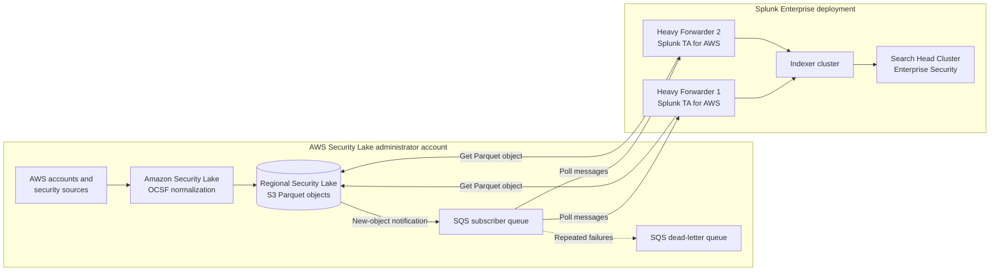
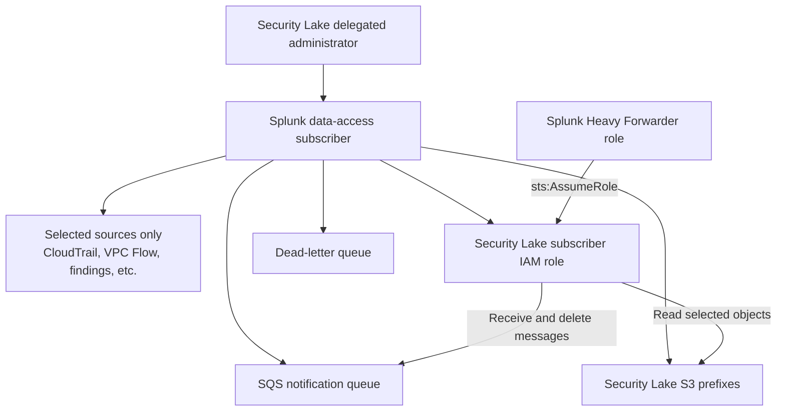
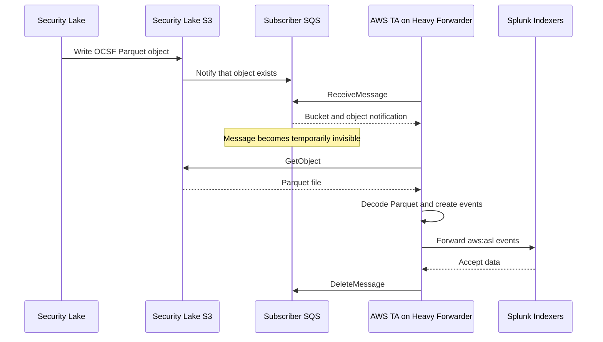
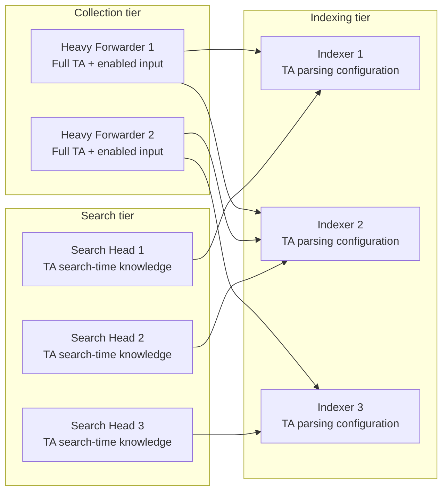
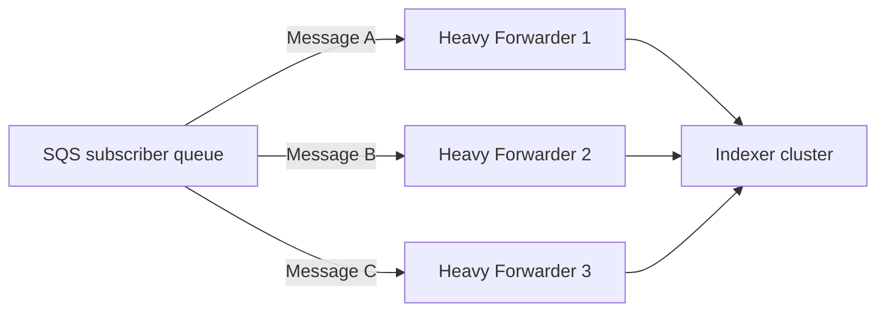
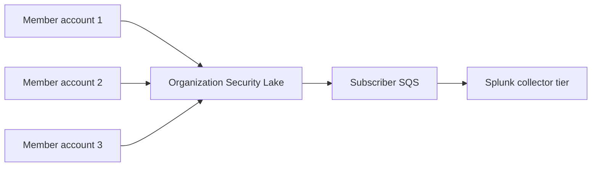
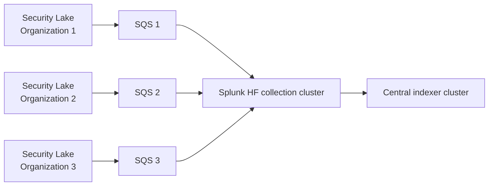

[](https://aws.amazon.com/blogs/apn/strengthen-security-posture-with-ai-enabled-insights-using-amazon-security-lake-splunk-and-recorded-future/?utm_source=chatgpt.com)

# Splunk integration with Amazon Security Lake

The standard **Splunk Enterprise integration is pull-based**:

> Amazon Security Lake writes OCSF-formatted Apache Parquet files to S3. An SQS queue notifies Splunk that new files exist. The Splunk Add-on for AWS, running on a Heavy Forwarder, reads the SQS messages, downloads the Parquet files, converts the records into Splunk events, and forwards them to the indexer cluster.

Security Lake automatically normalizes its native AWS sources into the Open Cybersecurity Schema Framework, or OCSF, and stores them as Parquet objects in a regional S3 bucket. ([AWS Documentation][1])



## 1. What is created in AWS?

You first create a **Security Lake data-access subscriber** for Splunk and select:

* The AWS log and event sources Splunk is allowed to consume.
* The subscriber AWS account.
* `S3` as the data-access method.
* `SQS queue` as the notification method.
* The AWS Region or Security Lake rollup Region.

Security Lake creates the subscriber access resources, including an IAM role that permits access to the selected data and, when chosen, the SQS notification queue. The role is protected by the `AmazonSecurityLakePermissionsBoundary` managed permissions boundary. ([AWS Documentation][2])



The subscriber receives notifications only for the sources and Region selected in the subscriber configuration. A rollup Region can provide access to data consolidated from contributing Regions. ([AWS Documentation][3])

---

# 2. Detailed event flow

## Step 1: An AWS event is generated

For example, an account generates:

* A CloudTrail API event.
* A VPC network-flow event.
* A Route 53 Resolver query.
* A Security Hub finding.
* A custom OCSF security event.

Security Lake collects the source, converts supported native AWS data into OCSF and creates Parquet files in its S3 data lake. ([AWS Documentation][1])

## Step 2: Security Lake writes a Parquet object to S3

Conceptually, the object path identifies information such as:

```text
AWS account
AWS Region
source
OCSF event class
date and time partition
```

The event is not immediately pushed into Splunk. The authoritative data remains in the Security Lake S3 bucket.

## Step 3: An object notification enters SQS

Security Lake places a notification in the subscriber SQS queue indicating that a new S3 object is available. Splunk therefore does not need to repeatedly list the entire S3 bucket looking for new files. ([AWS Documentation][2])

The SQS message is primarily a **work notification**. The actual security records are in the referenced S3 Parquet object.

## Step 4: The Splunk TA polls SQS

The AWS TA runs an SQS-based S3 modular input on the Heavy Forwarder.

It performs operations equivalent to:

```text
ReceiveMessage from SQS
        ↓
Read bucket and object information
        ↓
Assume Security Lake subscriber role
        ↓
GetObject from S3
        ↓
Decrypt object when required
        ↓
Decode Apache Parquet
```

The Security Lake input supports Parquet, uses the `AmazonSecurityLake` file decoder and normally assigns the `aws:asl` sourcetype. ([splunk.github.io][4])

## Step 5: TA converts Parquet records into Splunk events

Splunk indexes event-oriented records, not a Parquet file as one large opaque event. The decoder reads the Parquet data and presents its OCSF records to the Splunk ingestion pipeline.

Conceptually:

```text
S3 object:
    5,000 OCSF Parquet records

Splunk TA:
    decode Parquet
    preserve OCSF fields
    identify event timestamps
    assign metadata

Splunk:
    searchable events with sourcetype=aws:asl
```

## Step 6: Heavy Forwarder forwards events

The Heavy Forwarder sends the decoded events through its configured Splunk forwarding pipeline to the indexer cluster.

The indexer:

* Creates raw-data and index files.
* Adds the events to the configured index.
* Replicates index buckets when using an indexer cluster.
* Makes the events searchable by the search tier.

## Step 7: The SQS message is deleted

After successful processing, the collector deletes the corresponding SQS message.



If the Heavy Forwarder crashes before deleting the message, the SQS visibility timeout expires and the message becomes available for retry. Repeatedly unprocessable messages can be moved into a dead-letter queue. ([AWS Documentation][5])

---

# 3. What exactly is the Splunk TA?

**TA means Technology Add-on.**

The current integration uses the **Splunk Add-on for Amazon Web Services**, whose application directory is generally:

```text
$SPLUNK_HOME/etc/apps/Splunk_TA_aws
```

Support for Security Lake was incorporated into the Splunk Add-on for AWS starting with version 7.0.0. The older standalone Security Lake add-on should not be installed alongside the newer AWS add-on because the objects can conflict and cause duplication or inconsistent behavior. ([splunk.github.io][6])

The TA is not:

* An agent installed in Security Lake.
* An AWS Lambda function.
* A separate Splunk server.
* A dashboard-only application.

It is a software package that runs **inside the Splunk platform**.

## TA functions

| TA capability                | What it does                                                            |
| ---------------------------- | ----------------------------------------------------------------------- |
| Modular input                | Runs the SQS/S3 collection process                                      |
| AWS authentication           | Uses an EC2 role, configured AWS credentials and/or STS role assumption |
| SQS consumer                 | Retrieves and manages object notifications                              |
| S3 client                    | Downloads the referenced Security Lake objects                          |
| Parquet decoder              | Reads Security Lake’s Parquet format                                    |
| Metadata assignment          | Sets index, source, host and sourcetype                                 |
| Parsing configuration        | Controls timestamp and event processing                                 |
| Search-time knowledge        | Provides field extractions and other knowledge objects                  |
| Configuration UI             | Lets administrators configure accounts, roles, queues and inputs        |
| Credential vault integration | Protects stored AWS credentials                                         |
| Internal logging             | Records collection, authentication and parsing errors                   |

The add-on provides modular inputs and knowledge objects for AWS data and supports both API-based collection and push-based AWS collection patterns. ([splunk.github.io][7])

---

# 4. How the TA runs inside Splunk

The Security Lake configuration creates a modular-input stanza similar to:

```ini
[aws_sqs_based_s3://security_lake_main]
aws_account = aws_collection_account
aws_iam_role = security_lake_subscriber_role
sqs_queue_region = us-gov-west-1
sqs_queue_url = https://sqs.us-gov-west-1.amazonaws.com/111111111111/queue-name

s3_file_decoder = AmazonSecurityLake
sourcetype = aws:asl
index = aws_security_lake

interval = 300
sqs_batch_size = 10
using_dlq = 1
private_endpoint_enabled = 1
```

This configuration means:

| Setting                    | Function                                                           |
| -------------------------- | ------------------------------------------------------------------ |
| `aws_account`              | Credential or EC2 IAM-role definition used as the initial identity |
| `aws_iam_role`             | Security Lake subscriber role the TA assumes                       |
| `sqs_queue_url`            | Queue containing new-object notifications                          |
| `sqs_queue_region`         | Region containing the queue                                        |
| `s3_file_decoder`          | Tells the TA to use its Security Lake Parquet decoder              |
| `sourcetype`               | Identifies events as Security Lake data                            |
| `index`                    | Splunk destination index                                           |
| `interval`                 | How often the modular input performs collection work               |
| `sqs_batch_size`           | Number of SQS messages retrieved per request, from 1 through 10    |
| `using_dlq`                | Enables the recommended DLQ-aware processing                       |
| `private_endpoint_enabled` | Uses configured private AWS service endpoints                      |

Splunk documents a default polling interval of 300 seconds and an SQS batch size of up to 10 messages. ([splunk.github.io][4])

---

# 5. Where should the TA be installed?



### Heavy Forwarders

Install the complete TA and enable the Security Lake modular input here.

This tier performs:

* AWS authentication.
* SQS polling.
* S3 downloads.
* Parquet decoding.
* Forwarding.

A Universal Forwarder cannot run this input because the AWS add-on requires Heavy Forwarder functionality. ([splunk.github.io][8])

### Indexers

Install the TA when its index-time parsing configuration is needed on the indexers. Splunk states that this can be conditional when parsing has already occurred on the Heavy Forwarder; it is required for certain ingestion models such as HEC-based processing. ([splunk.github.io][9])

### Search heads

Install the TA on search heads for search-time knowledge and field behavior, but do not enable collection inputs there. For a search-head cluster, distribute the search-time package through the SHC deployer and remove or disable input configuration to prevent accidental duplicate collection. ([splunk.github.io][8])

---

# 6. Can multiple Heavy Forwarders read the same queue?

**Yes. This is a supported scaling pattern for Security Lake SQS-based collection.**



This is different from the MDE REST API integration:

* With MDE REST polling, two active HFs may independently retrieve the same incidents.
* With Security Lake, multiple HFs consume work from the **same SQS queue**.
* When one HF receives a message, that message becomes temporarily invisible to the other HFs.
* The queue therefore distributes S3 objects among the collectors.

Splunk specifically supports multiple Security Lake SQS-based inputs against the same queue to scale collection and recommends monitoring queue depth and oldest-message age for autoscaling decisions. ([splunk.github.io][4])

However, standard SQS provides **at-least-once delivery**, not strict exactly-once delivery. A rare duplicate notification can occur during failure or retry conditions, so downstream detections should tolerate occasional duplicates. ([AWS Documentation][10])

No load balancer is needed between SQS and the Heavy Forwarders.

---

# 7. IAM permissions and network flow

A production pattern should use:

```text
Heavy Forwarder EC2 instance role
           ↓ sts:AssumeRole
Security Lake subscriber role
           ↓
SQS + Security Lake S3 + KMS
```

The subscriber access policy generally requires operations such as:

```text
sqs:ReceiveMessage
sqs:DeleteMessage
sqs:ChangeMessageVisibility
sqs:GetQueueAttributes

s3:GetObject
s3:GetObjectVersion
s3:ListBucket

kms:Decrypt        when customer-managed KMS encryption applies
```

Splunk’s documented subscriber-role example includes S3 read permissions, SQS receive/delete/change-visibility permissions and KMS decryption. ([splunk.github.io][4])

The Heavy Forwarder needs HTTPS connectivity to:

* AWS STS.
* Amazon SQS.
* Amazon S3.
* Any required AWS authentication endpoints.

The TA supports private endpoint configuration for SQS, S3 and STS. ([splunk.github.io][4])

### GovCloud consideration

For GovCloud configurations, the TA documentation notes that the S3 hostname might need to be entered manually if the UI cannot automatically load the available buckets. ([splunk.github.io][4])

---

# 8. Important OCSF versus Splunk CIM distinction

Security Lake data is already normalized to **OCSF**, but Splunk Enterprise Security traditionally uses the **Splunk Common Information Model — CIM**.

The AWS TA’s source-type matrix currently lists:

```text
sourcetype = aws:asl
CIM mapping = None
```

Therefore:

> The AWS TA solves collection, Parquet decoding and ingestion, but you should not assume that every `aws:asl` event is automatically mapped to the traditional Splunk CIM data models.

([splunk.github.io][11])

For Enterprise Security, you need one of these approaches:

1. Write OCSF-aware detections directly against fields such as:

```text
class_uid
category_uid
activity_id
severity_id
src_endpoint.ip
dst_endpoint.ip
actor.user.name
cloud.account.uid
```

2. Use supported OCSF-to-CIM knowledge mappings.

3. Create custom field aliases, tags and event types for your required ES data models.

Splunk provides an OCSF-CIM add-on that maps supported OCSF events to Splunk CIM, but its supported sourcetypes and versions must be checked carefully; do not assume that installing it automatically maps every `aws:asl` source. ([Splunk Docs][12])

---

# 9. Multi-account and multi-organization design

## One AWS Organization

Security Lake collects member-account data centrally. One subscriber in a rollup Region can provide Splunk access to the consolidated regional data.



## Multiple AWS Organizations

Each AWS Organization normally has its own:

* Security Lake delegated administrator.
* Security Lake data lake.
* Splunk subscriber.
* Subscriber IAM role.
* SQS queue.
* Splunk Security Lake input.



Use a separate input stanza for each queue and preserve fields such as:

```text
cloud.account.uid
cloud.region
aws_org_id
mission_owner
environment
data_classification
```

---

# 10. Operational monitoring

Monitor these key points:

| Component        | What to monitor                                          |
| ---------------- | -------------------------------------------------------- |
| SQS main queue   | `ApproximateNumberOfMessagesVisible`                     |
| SQS latency      | `ApproximateAgeOfOldestMessage`                          |
| DLQ              | Any visible message                                      |
| Heavy Forwarder  | CPU, memory and disk queues                              |
| TA internal logs | Authentication, SQS, S3, KMS and Parquet errors          |
| Splunk index     | Event count by account, source and OCSF class            |
| Indexer tier     | Indexing queues and forwarding acknowledgement           |
| Data freshness   | Difference between OCSF event time and Splunk index time |

Growing queue depth means Splunk is collecting slower than Security Lake is producing objects. Splunk recommends the queue-message count and oldest-message age as scale-out indicators for additional Heavy Forwarders. ([splunk.github.io][4])

---

## Final architecture recommendation

For your AWS Splunk Enterprise environment:

```text
Security Lake rollup Region
        ↓
One Splunk subscriber per AWS Organization
        ↓
Dedicated SQS queue + DLQ
        ↓
Two or more Heavy Forwarders with Splunk_TA_aws
        ↓
Splunk indexer cluster
        ↓
Search Head Cluster + Enterprise Security
```

The most important distinction is:

* **Security Lake** stores and normalizes the security data.
* **SQS** tells Splunk which new S3 objects are ready.
* **Splunk TA for AWS** authenticates, retrieves, decodes and labels the data.
* **Heavy Forwarders** run the TA’s collection process.
* **Indexers** store the decoded events.
* **Search heads and Enterprise Security** search, correlate and detect threats.
* **OCSF-to-CIM mapping is a separate normalization concern**, not automatically solved merely by ingesting the data.

[1]: https://docs.aws.amazon.com/security-lake/latest/userguide/open-cybersecurity-schema-framework.html "Open Cybersecurity Schema Framework (OCSF) in Security Lake - Amazon Security Lake"
[2]: https://docs.aws.amazon.com/security-lake/latest/userguide/subscriber-data-access.html "Managing data access for Security Lake subscribers - Amazon Security Lake"
[3]: https://docs.aws.amazon.com/security-lake/latest/userguide/add-rollup-region.html?utm_source=chatgpt.com "Configuring rollup Regions in Security Lake"
[4]: https://splunk.github.io/splunk-add-on-for-amazon-web-services/SecurityLake/ "Security Lake - Splunk Add-on for Amazon Web Services"
[5]: https://docs.aws.amazon.com/AWSSimpleQueueService/latest/SQSDeveloperGuide/sqs-visibility-timeout.html?utm_source=chatgpt.com "Amazon SQS visibility timeout"
[6]: https://splunk.github.io/splunk-add-on-for-amazon-web-services/HardwareAndSoftwareRequirements/ "Hardware and software requirements - Splunk Add-on for Amazon Web Services"
[7]: https://splunk.github.io/splunk-add-on-for-amazon-web-services/ "About the Add-on - Splunk Add-on for Amazon Web Services"
[8]: https://splunk.github.io/splunk-add-on-for-amazon-web-services/DistributedSplunk/?utm_source=chatgpt.com "Install in a distributed Splunk Enterprise deployment"
[9]: https://splunk.github.io/splunk-add-on-for-amazon-web-services/DistributedDeployment/?utm_source=chatgpt.com "Installation overview - Splunk Add-on for Amazon Web Services"
[10]: https://docs.aws.amazon.com/AWSSimpleQueueService/latest/SQSDeveloperGuide/standard-queues-at-least-once-delivery.html?utm_source=chatgpt.com "Amazon SQS at-least-once delivery"
[11]: https://splunk.github.io/splunk-add-on-for-amazon-web-services/DataTypes/ "Source types - Splunk Add-on for Amazon Web Services"
[12]: https://help.splunk.com/en/data-management/process-data-at-the-edge/use-edge-processors-for-splunk-cloud-platform/process-data-using-pipelines/convert-data-to-ocsf-format-using-an-edge-processor/working-with-ocsf-formatted-data-in-the-splunk-platform-and-splunk-enterprise-security?utm_source=chatgpt.com "Working with OCSF-formatted data in the Splunk platform ..."
