# Splunk AWS push vs. pull collection

The easiest way to understand the distinction is:

* **Pull:** Splunk initiates the connection and retrieves data from AWS.
* **Push:** AWS initiates the connection and sends data to a Splunk HTTP Event Collector endpoint.

The terminology is from the **Splunk point of view**, not necessarily from the AWS source’s point of view.

## 1. Pull-based collection

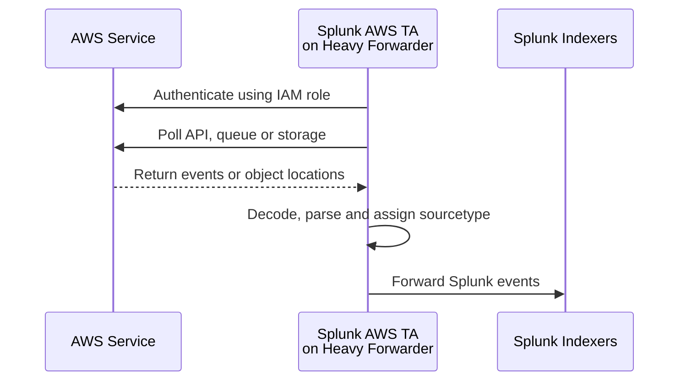

The **Splunk Add-on for AWS**, normally running on a Heavy Forwarder or collection node, periodically calls AWS APIs or polls AWS queues. It retrieves data, applies the appropriate parsing rules and forwards the events to Splunk indexers. Splunk calls these “pull-based API inputs.” ([splunk.github.io][1])

Examples include:

* CloudWatch API polling
* CloudWatch Logs API polling
* Inspector API polling
* Config Rules API polling
* Kinesis stream consumption
* SQS polling
* S3 object collection
* Security Lake SQS/S3 collection

### Security Lake is classified as pull-based

Although Security Lake sends an object notification to SQS, Splunk still initiates the actual collection:

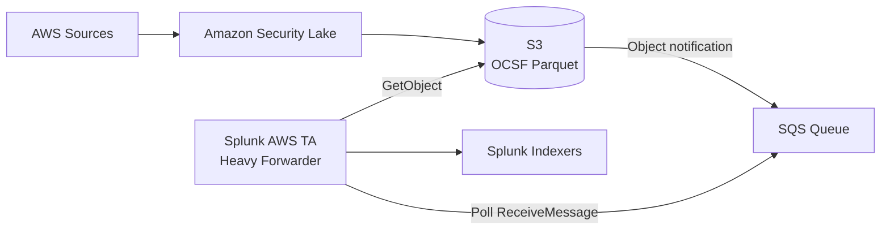

The workflow is:

1. Security Lake writes a Parquet file to S3.
2. Security Lake/S3 places a notification in SQS.
3. The Splunk TA polls SQS.
4. The TA reads the S3 object location from the message.
5. The TA downloads and decodes the Parquet file.
6. The TA creates events with `sourcetype=aws:asl`.
7. The events are forwarded to the indexer cluster.

It is therefore an **event-notified pull mechanism** rather than a direct push to Splunk. ([splunk.github.io][2])

---

## 2. Push-based collection

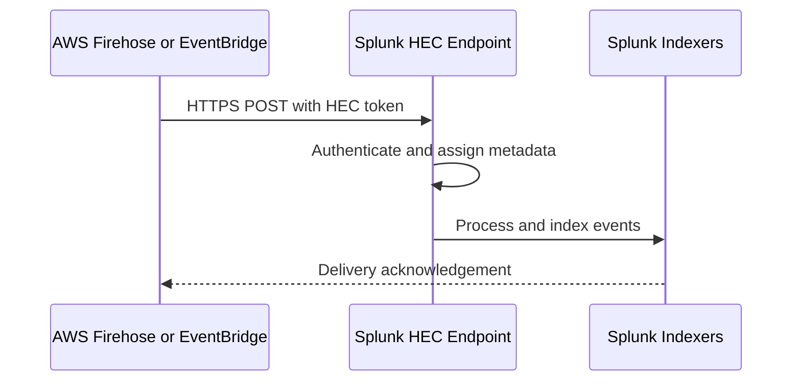

AWS sends events directly to Splunk’s **HTTP Event Collector**, or HEC. Splunk does not poll AWS for these events.

The Splunk AWS Add-on supports two primary push mechanisms:

* **Amazon Data Firehose**
* **Amazon EventBridge API destinations** ([splunk.github.io][3])

### Firehose push

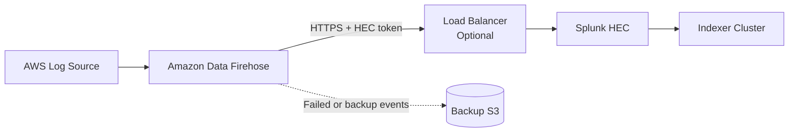

Firehose buffers events and sends them to a Splunk HEC endpoint. In Splunk Enterprise, that endpoint may be exposed directly on HEC port `8088` or through a load balancer on TCP 443. Firehose supports an S3 backup destination for failed or all events. ([splunk.github.io][4])

### EventBridge push

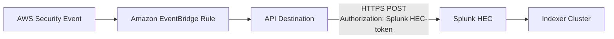

EventBridge uses an API destination to issue an HTTPS `POST` to the Splunk HEC raw endpoint. The HEC token is carried in the authorization header. ([splunk.github.io][5])

---

# 3. Pull versus push comparison

| Area                    | Pull-based                                             | Push-based                                          |
| ----------------------- | ------------------------------------------------------ | --------------------------------------------------- |
| Connection initiated by | Splunk TA                                              | AWS                                                 |
| Splunk receiver         | Heavy Forwarder or collection node                     | HEC receiver                                        |
| Authentication          | AWS IAM role/credentials                               | Splunk HEC token                                    |
| Typical protocol        | AWS API over HTTPS                                     | HTTPS POST to HEC                                   |
| Examples                | SQS, S3, CloudWatch, Inspector, Kinesis, Security Lake | Data Firehose, EventBridge                          |
| Network direction       | Splunk → AWS endpoints                                 | AWS → Splunk endpoint                               |
| Public/private endpoint | AWS APIs or VPC endpoints                              | Public HEC or private connectivity                  |
| Scaling                 | Add collection inputs/HFs                              | Scale HEC receivers and load balancer               |
| Replay mechanism        | Checkpoints, SQS visibility timeout, stream position   | Firehose retry and S3 backup; EventBridge retry/DLQ |
| Add-on function         | Collects and understands data                          | Primarily understands and normalizes received data  |

## Important distinction: Kinesis versus Firehose

These are easily confused:

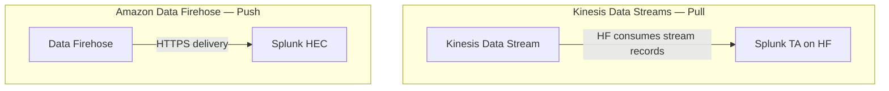

* The **Kinesis input** in the Splunk AWS TA is pull-based because Splunk consumes stream records.
* **Data Firehose** is push-based because Firehose delivers records to Splunk HEC.

Splunk also warns that multiple independent Kinesis inputs reading the same stream can generate duplicate events. ([splunk.github.io][1])

---

# 4. Understanding the columns in the Data Types document

The document lists five important concepts:

| Column                    | Meaning                                                                        |
| ------------------------- | ------------------------------------------------------------------------------ |
| **Data Type**             | Human-readable AWS dataset, such as CloudTrail, VPC Flow Logs or Security Lake |
| **Source Type**           | Splunk metadata identifying the event format and parsing rules                 |
| **Description**           | What information the event represents                                          |
| **Supported Input Types** | Collection mechanisms that can retrieve that data                              |
| **Data Models**           | Normalized Splunk models to which the fields are mapped                        |

The AWS Add-on provides both **index-time knowledge**, such as event breaking and timestamp processing, and **search-time knowledge**, such as field extractions, aliases, event types and CIM mappings. ([splunk.github.io][3])

---

## 5. Data Type

A **data type** describes the kind of AWS information being collected.

Examples:

* CloudTrail API activity
* CloudWatch metrics
* VPC Flow Logs
* Inspector findings
* S3 access logs
* Security Lake OCSF events

It is mainly a documentation and architecture label. You normally search Splunk using the index and source type rather than a `data_type` field.

Example:

```spl
index=aws sourcetype=aws:cloudtrail
```

---

## 6. Source Type

A **source type**, written as `sourcetype` in Splunk, tells Splunk:

* What format the event uses
* How events should be separated
* Where the timestamp is located
* Which fields should be extracted
* Which event types and tags should apply
* Whether the data maps to a CIM data model

Example:

```text
Data Type:  CloudTrail
Sourcetype: aws:cloudtrail
```

Conceptually:

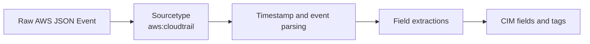

A source type is **not** the same thing as an index:

```text
index=aws_security
sourcetype=aws:cloudtrail
source=s3://central-cloudtrail/AWSLogs/...
```

* `index` controls the Splunk storage location.
* `sourcetype` identifies the data structure.
* `source` identifies where the event originated.

---

## 7. Supported Input Types

An **input type** is the collection method used to obtain the data.

For example, CloudTrail data can be collected through:

* SQS-Based S3
* Dedicated CloudTrail input
* Generic S3
* Incremental S3

All of those methods can produce the same `aws:cloudtrail` source type. ([splunk.github.io][1])

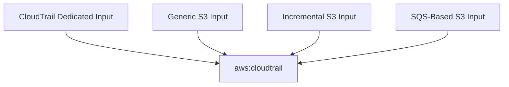

The input type answers:

> **How did Splunk collect it?**

The source type answers:

> **What kind of event is it?**

---

# 8. Dedicated versus multipurpose pull inputs

## Dedicated input

A dedicated input is designed for one particular AWS service.

Examples:

| Dedicated input      | Collects                             |
| -------------------- | ------------------------------------ |
| CloudWatch           | AWS metrics                          |
| CloudWatch Logs      | Log groups and log streams           |
| Config Rules         | Compliance evaluations               |
| Inspector            | Findings and assessments             |
| CloudTrail Lake      | CloudTrail Lake query results        |
| Metadata/Description | EC2, EBS and other resource metadata |

## Multipurpose input

A multipurpose input can collect several types of data from a common transport such as S3.

### SQS-Based S3 — recommended

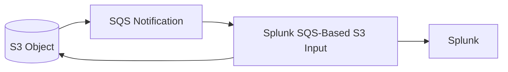

Splunk recommends SQS-Based S3 because it is scalable, event-driven and fault tolerant. Multiple collection inputs can consume work from the same queue using SQS visibility timeout behavior. ([splunk.github.io][1])

### Generic S3

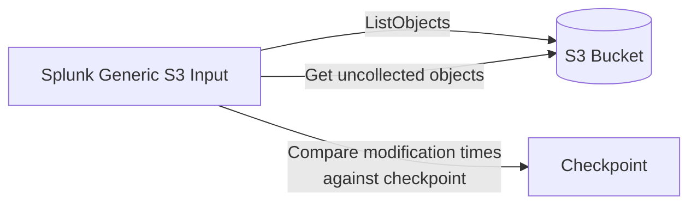

Generic S3 repeatedly lists objects and checks modification dates. It supports arbitrary and historical files, but performance degrades for buckets with large numbers of objects. ([splunk.github.io][1])

### Incremental S3

Incremental S3 uses timestamps embedded in known AWS log filenames and a checkpoint to identify new files. It performs better than Generic S3 but supports only specific AWS log layouts. ([splunk.github.io][1])

| Capability            | Generic S3 | Incremental S3 |                   SQS-Based S3 |
| --------------------- | ---------: | -------------: | -----------------------------: |
| Historical logs       |        Yes |            Yes |                    Normally no |
| Arbitrary file format |        Yes |        Limited | Supported decoders/custom data |
| Horizontal scaling    |         No |             No |                            Yes |
| Fault tolerance       |    Limited |        Limited |                            Yes |
| Performance           |        Low |           High |                           High |
| Best general choice   |         No |  Special cases |                            Yes |

---

# 9. Pull-based data types from the document

The following summarizes the mappings listed by the Splunk AWS Add-on documentation. ([splunk.github.io][3])

| Data type                 | Source type                             | Supported inputs                                     | Data-model mapping                              |
| ------------------------- | --------------------------------------- | ---------------------------------------------------- | ----------------------------------------------- |
| Billing                   | `aws:billing`, `aws:billing:cur`        | Billing/Cost and Usage Report                        | None                                            |
| CloudFront access logs    | `aws:cloudfront:accesslogs`             | SQS-Based S3, Generic S3, Incremental S3             | None                                            |
| CloudTrail                | `aws:cloudtrail`                        | SQS-Based S3, CloudTrail, Generic S3, Incremental S3 | CIM Authentication, Change                      |
| CloudWatch metrics        | `aws:cloudwatch`                        | CloudWatch                                           | CIM Performance, Databases; ITSI Virtualization |
| CloudWatch Logs           | `aws:cloudwatchlogs`                    | Kinesis, CloudWatch Logs                             | None for generic logs                           |
| CloudWatch VPC Flow Logs  | `aws:cloudwatchlogs:vpcflow`            | Kinesis, CloudWatch Logs, SQS-Based S3               | CIM Network Traffic                             |
| VPC Flow metrics          | `aws:cloudwatchlogs:vpcflow:metric`     | Kinesis, CloudWatch Logs, SQS-Based S3               | Network-related metric usage                    |
| AWS Config                | `aws:config`, `aws:config:notification` | AWS Config/SQS-Based S3                              | CIM Change Analysis                             |
| Config Rules              | `aws:config:rule`                       | Config Rules                                         | CIM Inventory                                   |
| Delimited files           | `aws:s3:csv`                            | SQS-Based S3, Generic S3                             | None                                            |
| ELB access logs           | `aws:elb:accesslogs`                    | SQS-Based S3, Generic S3, Incremental S3             | None                                            |
| Inspector                 | `aws:inspector`                         | Inspector                                            | CIM Inventory, Alerts, Vulnerabilities          |
| Inspector v2              | `aws:inspector:v2:findings`             | Inspector v2                                         | CIM Inventory, Alerts, Vulnerabilities          |
| AWS metadata              | `aws:metadata`                          | Metadata                                             | ES Assets and Identities; ITSI Virtualization   |
| Generic S3                | `aws:s3`                                | Generic S3, Incremental S3, SQS-Based S3             | None                                            |
| S3 access logs            | `aws:s3:accesslogs`                     | SQS-Based S3, Generic S3, Incremental S3             | CIM Web                                         |
| Security Lake             | `aws:asl`                               | SQS-Based S3                                         | None                                            |
| Generic SQS               | `aws:sqs`                               | SQS                                                  | None                                            |
| CloudTrail Lake           | `aws:cloudtrail:lake`                   | CloudTrail Lake                                      | None                                            |
| GuardDuty events          | `aws:cloudwatchlogs:guardduty`          | CloudWatch Logs                                      | CIM Alerts, Intrusion Detection                 |
| Transit Gateway Flow Logs | `aws:transitgateway:flowlogs`           | SQS-Based S3                                         | CIM Network Traffic                             |

---

# 10. Push-based data types

## Data Firehose

The AWS Add-on recognizes the following Firehose-delivered source types. ([splunk.github.io][3])

| AWS data                  | Source type                     | CIM mapping                 |
| ------------------------- | ------------------------------- | --------------------------- |
| CloudTrail                | `aws:cloudtrail`                | Authentication, Change      |
| CloudWatch events         | `aws:firehose:cloudwatchevents` | None                        |
| GuardDuty                 | `aws:cloudwatch:guardduty`      | Alerts, Intrusion Detection |
| IAM Access Analyzer       | `aws:accessanalyzer:finding`    | None                        |
| Generic JSON              | `aws:firehose:json`             | None                        |
| Generic text              | `aws:firehose:text`             | None                        |
| Security Hub ASFF         | `aws:securityhub:finding`       | Alerts                      |
| VPC Flow Logs             | `aws:cloudwatchlogs:vpcflow`    | Network Traffic             |
| Transit Gateway Flow Logs | `aws:transitgateway:flowlogs`   | Network Traffic             |

## EventBridge

The page specifically lists this EventBridge source:

| AWS data          | Source type                    | Data model |
| ----------------- | ------------------------------ | ---------- |
| Security Hub OCSF | `ocsf:aws:securityhub:finding` | None       |

EventBridge delivers this data to the Splunk HEC endpoint through an API destination. ([splunk.github.io][3])

---

# 11. What “Data Models” means

A Splunk data model is a normalized representation of related security or operational events.

For example, CloudTrail may report:

```json
{
  "sourceIPAddress": "10.10.10.25",
  "userIdentity": {
    "arn": "arn:aws:iam::111122223333:user/admin"
  },
  "eventName": "ConsoleLogin"
}
```

The AWS TA can map the AWS fields to CIM-standard fields:

```text
src        = 10.10.10.25
user       = arn:aws:iam::111122223333:user/admin
action     = success
signature  = ConsoleLogin
```

A CIM-compatible search can then work across AWS, Windows, Linux, MDE and other products:

```spl
| tstats count
  from datamodel=Authentication.Authentication
  by Authentication.user Authentication.src
```

## Data-model categories shown in the table

### CIM

The **Common Information Model** standardizes fields and tags across vendors.

Examples:

* Authentication
* Change
* Network Traffic
* Web
* Alerts
* Vulnerabilities
* Inventory
* Performance

### ES Custom

Special mappings used by Splunk Enterprise Security that may not be standard CIM data models.

The page lists AWS Metadata as supporting the ES **Assets and Identities** functionality.

### ITSI

Mappings intended for Splunk IT Service Intelligence.

The page lists CloudWatch and AWS metadata as supporting ITSI Virtualization-related use cases.

## “None” does not mean unusable

When the table says:

```text
CIM: None
ES Custom: None
ITSI: None
```

it means the AWS Add-on does not provide a built-in mapping for that data type. The events are still:

* Collected
* Indexed
* Searchable
* Available for dashboards and custom detections

You must search the original fields or create your own aliases, tags and CIM mappings.

---

# 12. Security Lake-specific issue: OCSF versus CIM

Security Lake normalizes its source data into OCSF, but the table lists the generic Security Lake source type `aws:asl` with no built-in CIM mapping. ([splunk.github.io][3])

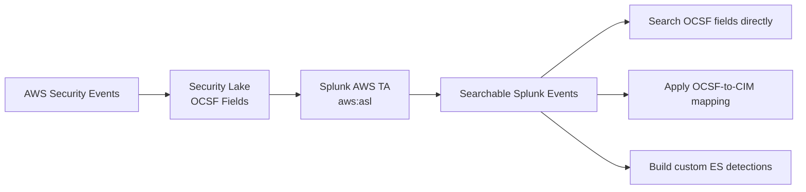

Therefore:

* The TA handles SQS/S3 collection and Parquet decoding.
* The events retain OCSF-style structure.
* The TA does not automatically guarantee CIM compatibility for `aws:asl`.
* Enterprise Security detections that expect CIM may require additional mapping.

---

# 13. Practical selection guide

| Requirement                         | Recommended input                      |
| ----------------------------------- | -------------------------------------- |
| Amazon Security Lake                | SQS-Based S3 pull                      |
| CloudTrail stored in S3             | SQS-Based S3 pull                      |
| Existing historical S3 files        | Generic or Incremental S3 pull         |
| CloudWatch metrics                  | CloudWatch API pull                    |
| High-volume near-real-time AWS logs | Data Firehose push                     |
| Security Hub event routing          | EventBridge push or Security Lake pull |
| VPC Flow Logs already stored in S3  | SQS-Based S3 pull                      |
| VPC Flow Logs streaming directly    | Firehose push                          |
| GuardDuty through CloudWatch Logs   | CloudWatch Logs pull                   |
| Centralized resilient S3 collection | SQS-Based S3 pull                      |

The main takeaway is:

> **Data type describes the AWS information, source type tells Splunk how to understand it, input type tells Splunk how it arrived, and the data model tells Splunk whether it has been normalized for CIM, Enterprise Security or ITSI.**

[1]: https://splunk.github.io/splunk-add-on-for-amazon-web-services/ConfigureInputs/ "General overview - Splunk Add-on for Amazon Web Services"
[2]: https://splunk.github.io/splunk-add-on-for-amazon-web-services/SecurityLake/ "Security Lake - Splunk Add-on for Amazon Web Services"
[3]: https://splunk.github.io/splunk-add-on-for-amazon-web-services/DataTypes/ "Source types - Splunk Add-on for Amazon Web Services"
[4]: https://splunk.github.io/splunk-add-on-for-amazon-web-services/ConfigureFirehose/ "Configure Amazon Data Firehose to send data to the Splunk Platform - Splunk Add-on for Amazon Web Services"
[5]: https://splunk.github.io/splunk-add-on-for-amazon-web-services/ConfigureEventBridge/ "Configure Amazon EventBridge to send data to the Splunk Platform - Splunk Add-on for Amazon Web Services"
