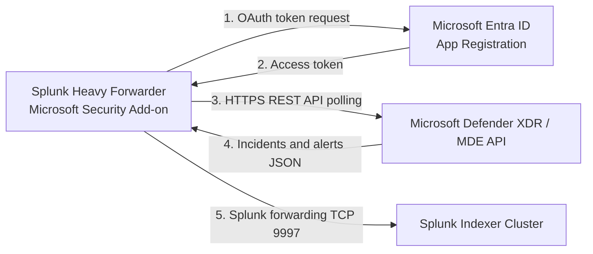
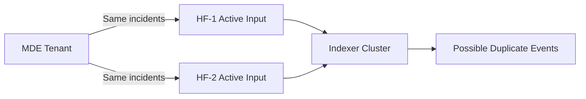
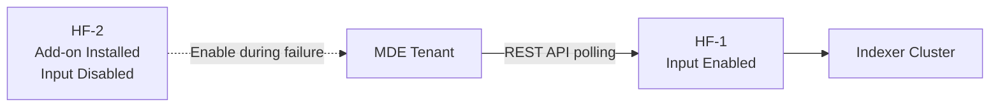
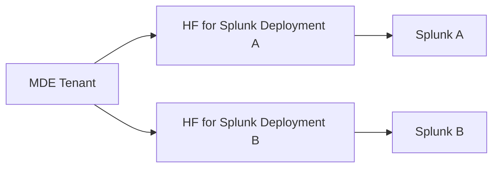

## Key point: MDE does not “send” incidents to Splunk

For REST API integration, the flow is **pull-based**:

The Heavy Forwarder periodically calls Microsoft according to the configured collection interval.

## Can multiple Heavy Forwarders collect from the same MDE tenant?

### Technically yes, but not active-active for the same input

You could install and configure the add-on on `HF-1` and `HF-2`, and both could authenticate to the same Microsoft tenant. However, if the same incidents or alerts input is enabled on both:

* Both Heavy Forwarders independently call the Microsoft API.
* Both can retrieve the same incidents and alerts.
* Both forward those records to Splunk.
* Duplicate events can be indexed.
* API usage and throttling increase.

Splunk explicitly recommends configuring Microsoft Security data collection in **one location** to avoid duplicate data. ([splunk.github.io][1])

## Recommended high-availability model

Use:

* **HF-1:** Active collector.
* **HF-2:** Standby with the add-on installed and configuration prepared, but the input disabled.
* Enable the standby input if HF-1 fails.
* Expect possible overlap or replay around failover, depending on the configured start date and collection state.

Another safe distribution is:

* HF-1 collects **Defender XDR incidents**.
* HF-2 collects **MDE alerts**.

Do not configure both Heavy Forwarders to collect the same input simultaneously.

## Multiple independent Splunk deployments

Two separate Splunk environments can each collect a full copy:

This is valid because each Splunk deployment requires its own copy. You can use either:

* The same Entra application credentials, or
* Preferably separate Entra app registrations for independent auditing and secret rotation.

Microsoft applies tenant/API quotas. The Defender XDR incidents API permits up to 50 calls per minute or 1,500 per hour, while the MDE alerts API documents 100 calls per minute or 1,500 per hour. ([Microsoft Learn][2])

# What is a Splunk add-on?

A **Splunk add-on**, sometimes called a **Technology Add-on or TA**, is a software package installed inside Splunk that teaches Splunk how to communicate with and understand another product.

The **Splunk Add-on for Microsoft Security** contains:

1. **API collection code**

   * Python-based modular inputs.
   * OAuth authentication.
   * REST API request logic.
   * Pagination and scheduled polling.

2. **Configuration interface**

   * Tenant ID.
   * Client ID.
   * Client secret.
   * Input type.
   * Collection interval.
   * Start date.
   * Destination index.

3. **Data definitions**

   * Sourcetypes.
   * Timestamp handling.
   * JSON field extraction.
   * Field normalization and search-time knowledge.

4. **Operational functions**

   * Logging.
   * Error handling.
   * Input status.
   * Collection dashboards.

It is **not an agent installed on MDE endpoints**. It is installed inside Splunk, normally on the Heavy Forwarder for collection and on search heads for search-time field definitions. Universal Forwarders cannot run this add-on’s collection inputs because those inputs require Python and Splunk REST functionality. ([splunk.github.io][1])

## Configuration process

1. Create an **Entra ID app registration**.
2. Grant read-only permissions:

   * `Incident.Read.All` for incidents.
   * `Alert.Read.All` for MDE alerts.
   * Or the corresponding Microsoft Graph permissions.
3. Grant admin consent.
4. Install the **Splunk Add-on for Microsoft Security** on the Heavy Forwarder.
5. Configure:

   * Tenant ID
   * Client ID
   * Client secret
6. Create an input:

   * Microsoft 365 Defender Incidents, or
   * Microsoft Defender for Endpoint Alerts
7. Select the interval, start date and Splunk index.
8. The Heavy Forwarder polls Microsoft and forwards the results to the indexer cluster. ([splunk.github.io][3])

## Recommended design

| Requirement                        | Recommended approach                                                  |
| ---------------------------------- | --------------------------------------------------------------------- |
| One Splunk deployment              | One active MDE API collector                                          |
| Heavy Forwarder resilience         | Active/standby inputs                                                 |
| Scale collection                   | Split incidents, alerts or tenants across HFs                         |
| Two independent Splunk deployments | One collector per deployment                                          |
| Avoid duplicates                   | Never enable the identical input on two HFs feeding the same indexers |
| Better credential control          | Separate Entra app registration per Splunk deployment                 |

[1]: https://splunk.github.io/splunk-add-on-for-microsoft-365-defender/Install/ "Install - Splunk Add-on for Microsoft Security"
[2]: https://learn.microsoft.com/en-us/defender-xdr/api-incident "Microsoft Defender XDR incidents APIs and the incidents resource type - Microsoft Defender XDR | Microsoft Learn"
[3]: https://splunk.github.io/splunk-add-on-for-microsoft-365-defender/Configure/ "Configure inputs - Splunk Add-on for Microsoft Security"
