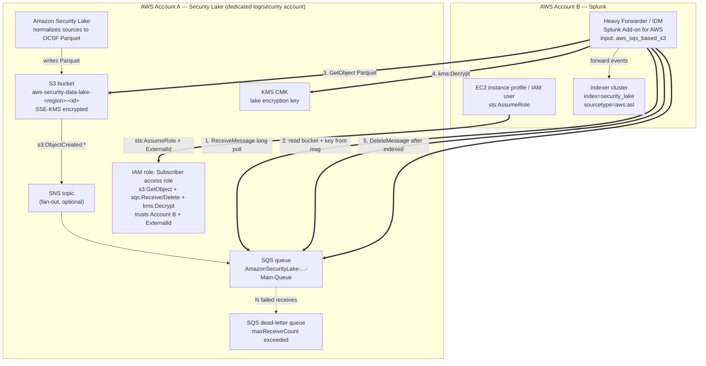

# Amazon Security Lake → Splunk (Multi-Account) — Architecture & Configuration Reference

Two AWS accounts:

- **Account A — Security Lake** (dedicated log/security account, usually the Security Lake *delegated administrator*). Owns the data, the S3 bucket, the KMS key, and the notification queue.
- **Account B — Splunk** (heavy forwarder / IDM running the Splunk Add-on for AWS). Owns the consumer that polls and reads.

Nothing is pushed to Splunk. Splunk pulls from SQS (notification) and S3 (data) across the account boundary using a cross-account IAM role.

---

## Architecture diagram



---

## Who creates what

Most of Account A's resources are **created automatically by Security Lake when you add a subscriber** — you do not hand-build the SQS queue or bucket notifications. You supply the subscriber's account ID and external ID; Security Lake provisions the queue, the notifications, and an access role, then hands you back an **SQS queue URL** and a **role ARN**. Those two values are what you plug into Splunk.

| Resource | Account | Created by | Purpose |
|---|---|---|---|
| Security Lake (OCSF normalization) | A | You (enable) | Produces Parquet data |
| S3 data lake bucket | A | Security Lake | Stores Parquet objects |
| KMS CMK | A | Security Lake / you | Encrypts lake data at rest |
| SQS main queue + DLQ | A | Security Lake (per subscriber) | Event notifications |
| S3 → (SNS) → SQS notifications | A | Security Lake | Announces new objects |
| Subscriber access IAM role | A | Security Lake | Cross-account read grant |
| SQS queue policy / S3 bucket policy | A | Security Lake | Authorize the role |
| Consumer IAM role (instance profile) | B | You | Lets the forwarder call STS |
| Splunk Add-on for AWS + inputs.conf | B | You | Polls SQS, reads S3, indexes |

---

## Account A configuration pieces

### 1. S3 data lake bucket
Name follows `aws-security-data-lake-<region>-<random>`. Objects are partitioned by source, region, and date, e.g.
`ext/CLOUD_TRAIL_MGMT/region=us-east-1/accountId=.../eventDay=20260707/<file>.parquet`.
Encrypted with SSE-KMS. The consumer therefore needs both `s3:GetObject` **and** `kms:Decrypt`.

### 2. KMS customer-managed key
Encrypts the lake. The subscriber role must be a grantee (`kms:Decrypt`) or the key policy must allow it. This is the single most common failure point in cross-account setups — S3 access alone is not enough if `kms:Decrypt` is missing.

### 3. SQS queue (+ dead-letter queue)
One queue per subscriber, e.g. `AmazonSecurityLake-<subscriber>-Main-Queue`. S3 `ObjectCreated` events are delivered here (directly, or via an SNS topic that fans out). Key attributes:

- **Visibility timeout** — set longer than the worst-case download+decode+index time (e.g. 300–600s). Too short → duplicate events.
- **Message retention** — default 4 days; the backlog survives a Splunk outage.
- **Redrive policy → DLQ** with `maxReceiveCount` (e.g. 5). Poison messages move to the DLQ instead of blocking the queue.

### 4. SQS queue policy
Grants the Account B subscriber role `sqs:ReceiveMessage`, `sqs:DeleteMessage`, `sqs:GetQueueAttributes`, `sqs:GetQueueUrl`.

### 5. Subscriber access IAM role (the cross-account role)
Created by Security Lake in Account A. **Trust policy** allows Account B to assume it, pinned with an **external ID** (confused-deputy protection):

```json
{
  "Version": "2012-10-17",
  "Statement": [{
    "Effect": "Allow",
    "Principal": { "AWS": "arn:aws:iam::222222222222:root" },
    "Action": "sts:AssumeRole",
    "Condition": { "StringEquals": { "sts:ExternalId": "<external-id>" } }
  }]
}
```

**Permission policy** (what the assumed role can do):

```json
{
  "Version": "2012-10-17",
  "Statement": [
    { "Effect": "Allow",
      "Action": ["s3:GetObject", "s3:ListBucket"],
      "Resource": [
        "arn:aws:s3:::aws-security-data-lake-us-east-1-xxxx",
        "arn:aws:s3:::aws-security-data-lake-us-east-1-xxxx/*"
      ] },
    { "Effect": "Allow",
      "Action": ["sqs:ReceiveMessage","sqs:DeleteMessage","sqs:GetQueueAttributes","sqs:GetQueueUrl"],
      "Resource": "arn:aws:sqs:us-east-1:111111111111:AmazonSecurityLake-...-Main-Queue" },
    { "Effect": "Allow",
      "Action": ["kms:Decrypt"],
      "Resource": "arn:aws:kms:us-east-1:111111111111:key/<key-id>" }
  ]
}
```

---

## Account B configuration pieces

### 6. Consumer IAM role (instance profile on the forwarder)
The EC2 heavy forwarder runs with an instance profile whose only real job is to assume the Account A role:

```json
{
  "Version": "2012-10-17",
  "Statement": [{
    "Effect": "Allow",
    "Action": "sts:AssumeRole",
    "Resource": "arn:aws:iam::111111111111:role/AmazonSecurityLake-<subscriber>-role"
  }]
}
```

If you are not on EC2 you can instead configure a long-lived access key in the add-on, but an instance-profile + assume-role chain is preferred.

### 7. Splunk Add-on for AWS — account & role config
In the add-on UI (stored in `aws_account.conf` and `aws_iam_role.conf`):

- **Account**: either the instance-profile ("EC2 IAM role") or an access key/secret for Account B.
- **IAM Role**: a friendly name mapped to the Account A role ARN plus the external ID. The add-on will `AssumeRole` into it for every S3/SQS call.

`aws_iam_role.conf` example:

```ini
[securitylake-cross-account]
arn = arn:aws:iam::111111111111:role/AmazonSecurityLake-<subscriber>-role
```

### 8. inputs.conf — the SQS-based S3 input
Use the **SQS-based S3** input (`aws_sqs_based_s3`), *not* the generic S3 input. This is the one designed for the S3→SQS notification pattern and OCSF Parquet.

```ini
[aws_sqs_based_s3://security-lake-asl]
aws_account = ec2-instance-profile
aws_iam_role = securitylake-cross-account
sqs_queue_region = us-east-1
sqs_queue_url = https://sqs.us-east-1.amazonaws.com/111111111111/AmazonSecurityLake-<subscriber>-Main-Queue
sqs_batch_size = 10
s3_file_decoder = Parquet
sourcetype = aws:asl
index = security_lake
interval = 300
using_dlq = 1
disabled = 0
```

Field notes:

- `aws_iam_role` — the cross-account role; this is what makes it multi-account.
- `s3_file_decoder = Parquet` — decodes the columnar OCSF file (do **not** use the CloudTrail/JSON decoders here).
- `sourcetype = aws:asl` — ASL = Amazon Security Lake; drives the OCSF field extractions in the add-on.
- `sqs_batch_size` — up to 10 messages per `ReceiveMessage` call.
- `using_dlq = 1` — enables DLQ handling for repeatedly failing messages.
- `interval` — polling cadence in seconds; the input itself uses SQS long polling within each run.

### 9. Indexer cluster
Define the `security_lake` index (ideally on its own indexes.conf with retention suited to log volume). The heavy forwarder outputs to the indexer cluster via `outputs.conf` as normal.

---

## End-to-end runtime flow (multi-account)

1. Forwarder's instance profile calls **STS AssumeRole** into Account A's subscriber role (with external ID). Gets temporary credentials.
2. With those creds, **ReceiveMessage** (long poll) on Account A's SQS queue. SQS hides the message for the visibility timeout.
3. Parse the S3 **bucket + key** from the message body.
4. **GetObject** the Parquet file from Account A's S3 bucket; **kms:Decrypt** via the lake CMK.
5. Decode Parquet → map OCSF records to events with `sourcetype=aws:asl`.
6. Forward events to the indexer cluster (`index=security_lake`).
7. Only after successful indexing, **DeleteMessage**. Failures let the message reappear after the visibility timeout; repeated failures land it in the DLQ.

---

## Common cross-account gotchas

- **Missing `kms:Decrypt`** on the subscriber role → `GetObject` returns AccessDenied even though S3 permissions look correct.
- **External ID mismatch** between the add-on role config and the role's trust policy → AssumeRole fails.
- **Visibility timeout too short** → same Parquet file indexed twice (duplicate events).
- **Region mismatch** — the SQS queue URL region must match `sqs_queue_region`; the S3 bucket and KMS key are in Account A's region.
- **Wrong input type** — using generic `aws_s3` instead of `aws_sqs_based_s3`, or the wrong decoder, yields no/garbled events.
