# Splunk Enterprise Architecture for AWS Security Operations

## 1. The simplest mental model

Splunk Enterprise has four major jobs:

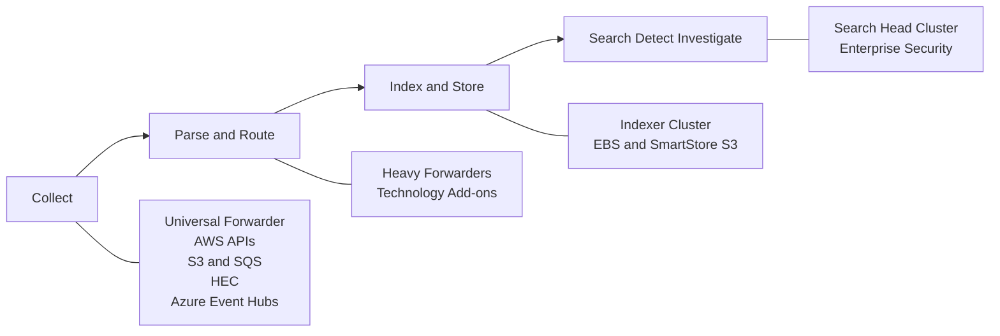

1. **Collect:** Retrieve logs from AWS, MDE, servers, network devices and applications.
2. **Parse and route:** Identify event boundaries, timestamps, source types and destinations.
3. **Index and store:** Convert raw events into searchable Splunk indexes.
4. **Search and analyze:** Run searches, dashboards, alerts, threat detections and investigations.

A distributed Splunk deployment separates these functions so that collection, storage and search can scale independently. Splunk forwarders send data, indexers store and search data, and search heads coordinate user searches across the indexers. ([Splunk Docs][1])

---

# 2. Core Splunk Enterprise components

| Component                           | Primary function                                                                                             | Recommended enterprise use                                                   |
| ----------------------------------- | ------------------------------------------------------------------------------------------------------------ | ---------------------------------------------------------------------------- |
| **Universal Forwarder — UF**        | Lightweight agent that collects local files, Linux logs, Windows Event Logs and application logs             | Install on EC2 instances when host-level log collection is required          |
| **Heavy Forwarder — HF**            | Full Splunk processing tier that runs modular inputs, add-ons, parsing, filtering and routing                | Use for AWS API inputs, S3/SQS, CloudWatch, Azure Event Hubs, syslog and HEC |
| **Indexer**                         | Parses incoming events when needed, creates index buckets, stores raw data and serves searches               | Deploy as an indexer cluster across Availability Zones                       |
| **Indexer cluster manager**         | Coordinates peer replication, distributes indexer configuration and tells search heads where data is located | Exactly one active manager per indexer cluster                               |
| **Search head**                     | Accepts SPL searches, distributes work to indexers and merges results                                        | Use a cluster for production                                                 |
| **Search head cluster — SHC**       | Provides search availability and replicates dashboards, knowledge objects and scheduled searches             | Minimum three members for high availability                                  |
| **SHC captain**                     | Coordinates scheduled searches and cluster activity                                                          | Dynamically elected from the SHC members                                     |
| **SHC deployer**                    | Distributes apps and configuration bundles to the SHC                                                        | Separate instance; one deployer per SHC                                      |
| **Deployment server**               | Distributes applications and configuration to Universal Forwarders and other deployment clients              | Manage forwarders by server class                                            |
| **License manager**                 | Tracks Splunk Enterprise license allocation and ingestion volume                                             | Dedicated management instance or approved management-tier placement          |
| **Monitoring Console**              | Monitors indexing, searches, resource usage, forwarders, license consumption and cluster health              | Dedicated instance in large deployments                                      |
| **Splunk Enterprise Security — ES** | SIEM application providing security detections, risk, findings, investigations and security dashboards       | Install on the search head cluster                                           |
| **HTTP Event Collector — HEC**      | Token-authenticated HTTPS endpoint for applications and AWS Firehose                                         | Put behind an internal NLB or supported load-balancing tier                  |
| **SmartStore**                      | Uses object storage such as S3 for index bucket storage while indexers retain local cache                    | Useful for large AWS deployments and longer retention                        |

The indexer cluster manager coordinates replication and recovery but does not index external data. Peer nodes index incoming events, replicate buckets and execute search work. Splunk requires at least as many indexers as the configured replication factor. ([Splunk Docs][2])

A search head cluster normally uses a dynamically elected captain. At least three SHC members are required to retain functionality when one member fails. ([Splunk Docs][3])

---

## 3. Splunk indexing and search flow

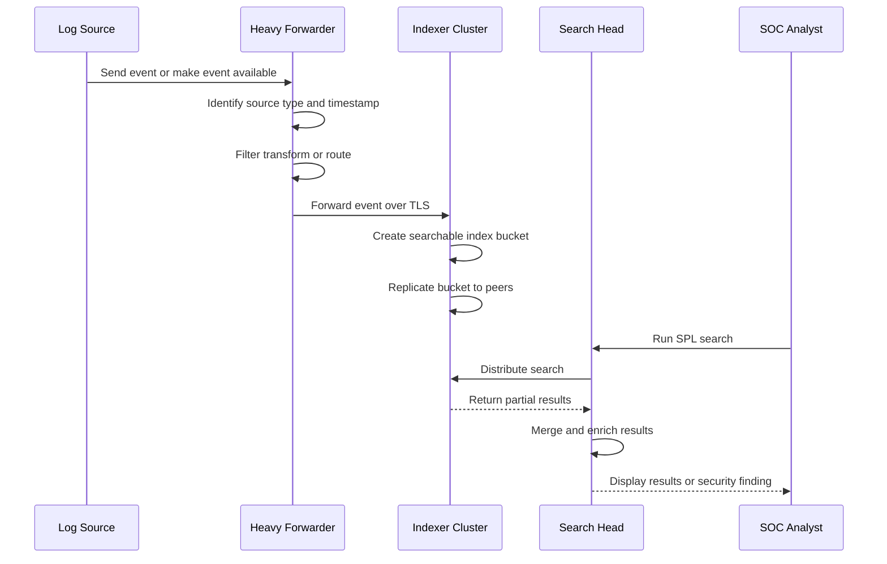

The search head generally does not retrieve all raw data and process it centrally. It distributes search work to indexers, which search their local buckets and return matching or aggregated results.

---

# 4. How the AWS and Microsoft data sources fit

## Recommended collection methods

| Source                                 | Preferred path                                                                         | Comments                                                                  |
| -------------------------------------- | -------------------------------------------------------------------------------------- | ------------------------------------------------------------------------- |
| Security Lake AWS-native sources       | Security Lake S3 → SQS subscriber → Splunk AWS Add-on/HF                               | OCSF and Parquet source                                                   |
| AWS Network Firewall logs              | CloudWatch Logs → Splunk AWS Add-on, or Firehose/S3 → SQS → HF                         | Network Firewall is not currently a native Security Lake source           |
| AWS Network Firewall metrics           | CloudWatch metrics API → Splunk AWS Add-on                                             | Useful for dropped packets and firewall health                            |
| MDE/XDR incidents and alerts           | Splunk Add-on for Microsoft Security/API                                               | Lower-volume security records                                             |
| MDE Advanced Hunting events            | Defender XDR Streaming API → Azure Event Hubs → Splunk Microsoft Cloud Services Add-on | High-volume endpoint telemetry                                            |
| EC2 Linux/Windows logs                 | Universal Forwarder → indexer cluster                                                  | Direct and near real-time                                                 |
| Application logs                       | UF, HEC or CloudWatch/Firehose                                                         | Choose based on application architecture                                  |
| Security Hub findings                  | Security Lake or direct EventBridge/API input                                          | Avoid duplicate ingestion                                                 |
| GuardDuty findings                     | Security Hub/Security Lake, EventBridge or AWS Add-on                                  | Choose one authoritative path                                             |
| CloudTrail, VPC Flow and Route 53 logs | Prefer Security Lake when enabled                                                      | Avoid simultaneously ingesting the same events through multiple pipelines |

Security Lake currently provides native collection for CloudTrail management and selected data events, EKS audit logs, Route 53 Resolver queries, Security Hub CSPM findings, VPC Flow Logs and WAFv2 logs. It transforms these into OCSF and Apache Parquet. AWS Network Firewall is not on that native-source list. ([AWS Documentation][4])

AWS documents a direct Network Firewall integration in which Network Firewall writes to CloudWatch Logs and the Splunk Add-on for AWS retrieves the logs and metrics. Network Firewall can also publish logs through Data Firehose. ([AWS Documentation][5])

---

## 5. Combined AWS, Security Lake, Network Firewall and MDE flow

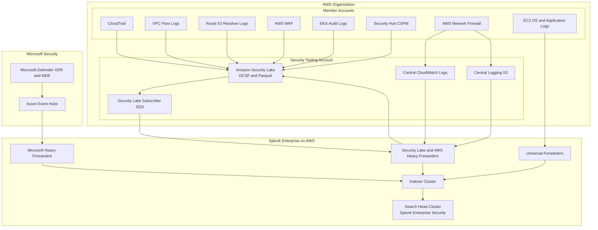

The arrow from the Splunk collector back to Security Lake represents the collector assuming the subscriber role and reading the S3 objects identified by SQS notifications; Splunk is not writing those events back to Security Lake.

Microsoft recommends using the Defender XDR Streaming API to send event data to Azure Event Hubs and the Splunk Add-on for Microsoft Cloud Services to consume those events. The Splunk Add-on for Microsoft Security can also collect Defender incidents and alerts. ([Microsoft Learn][6])

---

# 6. Proof-of-concept deployment

A POC should prove:

* AWS authentication and cross-account access
* Security Lake S3/SQS ingestion
* Network Firewall log parsing
* MDE Event Hub ingestion
* OCSF and CIM field mappings
* Basic cross-source correlation
* Expected ingest volume and storage requirements

It should not be presented as highly available.

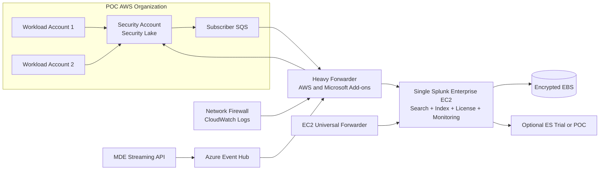

## Suggested POC components

| Component                    |                      Quantity | Purpose                                    |
| ---------------------------- | ----------------------------: | ------------------------------------------ |
| Splunk Enterprise standalone |                             1 | Search, indexing, licensing and monitoring |
| Heavy Forwarder              |                             1 | AWS, Security Lake and Microsoft inputs    |
| Security Lake subscriber     | 1 per Region or rollup Region | S3/SQS access                              |
| Universal Forwarder          |              2–5 test servers | Host log validation                        |
| Encrypted EBS                |           Based on POC volume | Hot/warm storage                           |
| Enterprise Security          |                      Optional | Validate SIEM use cases                    |

### POC limitations

* No search-head availability.
* No indexer replication.
* Collector failure stops cloud ingestion temporarily.
* Local storage is a single-node risk.
* Maintenance causes outages.
* It does not accurately validate large-scale search concurrency.

---

# 7. Enterprise-grade Splunk deployment in AWS

A strong enterprise design separates the platform into four tiers:

1. **Access and search tier**
2. **Collection and input tier**
3. **Indexing and storage tier**
4. **Management tier**

Splunk’s validated AWS high-availability architecture places indexers and search-head-cluster members across three Availability Zones and places a load balancer in front of the search heads. SmartStore can use S3 as remote bucket storage. ([Splunk Docs][7])

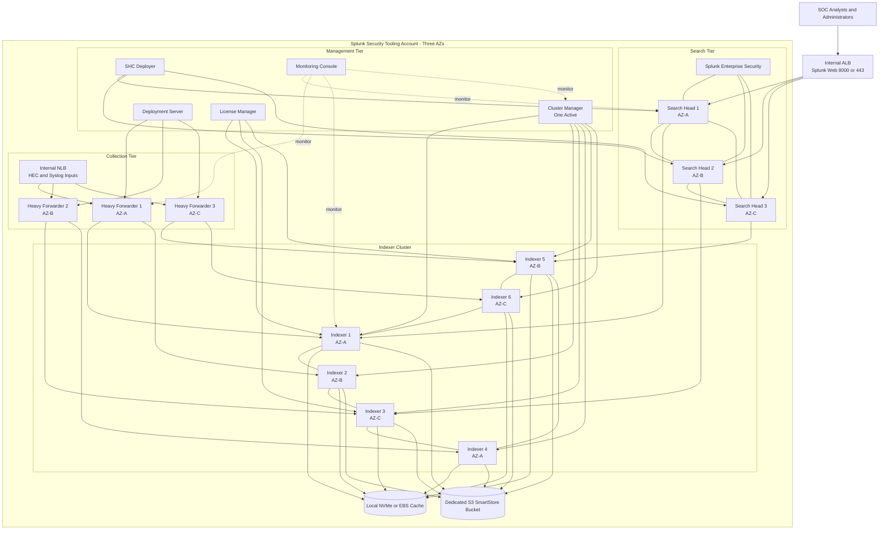

## Important indexer settings

### Replication factor

The **replication factor**, or RF, determines the number of copies of raw index data.

For example:

* RF=3 means three copies of each bucket.
* The cluster can generally tolerate up to RF minus one peer failures without losing all copies of a bucket.
* At least three indexer peers are required for RF=3. ([Splunk Docs][8])

### Search factor

The **search factor**, or SF, determines how many bucket copies have complete searchable index files.

A common starting point is:

```text
Replication Factor = 3
Search Factor      = 2
```

The correct values should come from the required failure model, ingest rate, search workload and storage architecture. Splunk documents SF=2 as the default for an indexer cluster. ([Splunk Docs][9])

---

# 8. SmartStore and Security Lake are different

These two S3 storage systems should not be combined.

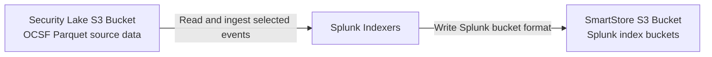

## Security Lake S3

* Owned and managed as the AWS security data lake.
* Contains OCSF-normalized Parquet.
* Accessed through Security Lake subscriber permissions.
* Can provide long-term source retention.

## SmartStore S3

* Owned by the Splunk platform.
* Contains Splunk index buckets and metadata.
* Used by Splunk indexers as remote index storage.
* Must not be modified or queried as though it were ordinary log files.

SmartStore supports AWS S3 remote storage when the indexers are hosted on AWS. All indexer peers must use consistent SmartStore index configurations. ([Splunk Docs][10])

---

# 9. Security Lake across multiple AWS accounts

Within one AWS Organization, the management account designates a **Security Lake delegated administrator**. That administrator can enable sources for member accounts, automatically onboard new accounts and grant subscribers access to the organization’s data. ([AWS Documentation][11])

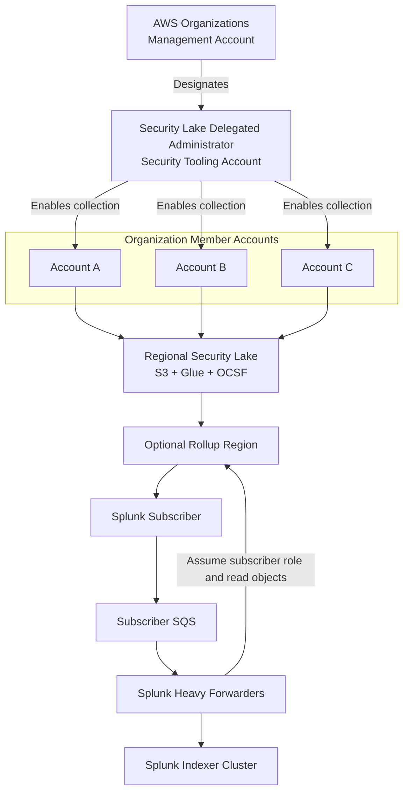

A subscriber receives access only to the selected sources and Region. A rollup Region can aggregate contributing Regions so that Splunk does not need a completely independent subscriber for every contributing Region. Security Lake can notify a data-access subscriber through SQS as new S3 objects are created. ([AWS Documentation][12])

---

# 10. Multiple Security Lakes across different AWS Organizations

An important boundary is:

> A Security Lake delegated administrator manages one AWS Organization, not every AWS Organization in the enterprise.

Therefore, with three separate AWS Organizations, there will normally be three independent Security Lake environments.

## Pattern A: One central Splunk deployment ingests all organizations

This is usually the best design when one SOC is authorized to hold and analyze all organizations’ logs.

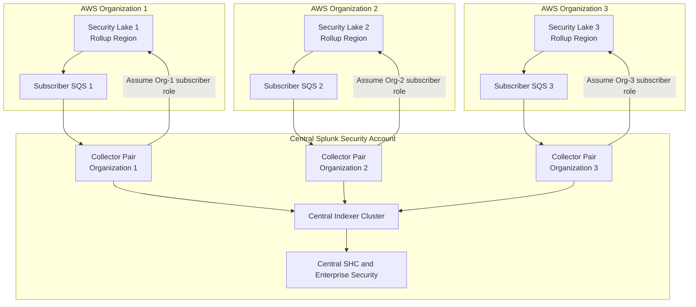

Each organization creates its own:

* Splunk subscriber.
* External ID.
* Subscriber IAM role or Security Lake-managed access.
* SQS subscription endpoint.
* Source selection.
* Regional or rollup-region configuration.

The Splunk collector maintains separate AWS account definitions and credentials for each organization.

### Add organizational context at ingestion

Every event should retain or receive fields such as:

```text
aws_account_id
aws_region
aws_org_id
security_lake_id
mission_owner
environment
data_classification
source_category
```

This permits:

* Role-based index access.
* Organization-specific dashboards.
* Mission-owner reporting.
* Cost allocation.
* Separate retention.
* Investigation across organizations.

A useful index strategy could be:

```text
aws_security_org1
aws_security_org2
aws_security_org3
mde
network_firewall
splunk_internal
```

For very large deployments, separate indexes by data type and enforce organization boundaries through metadata and Splunk roles rather than creating hundreds of small indexes.

---

## Pattern B: Independent Splunk deployment per organization

Use this when organizations require data sovereignty, independent administration or limited cross-boundary connectivity.

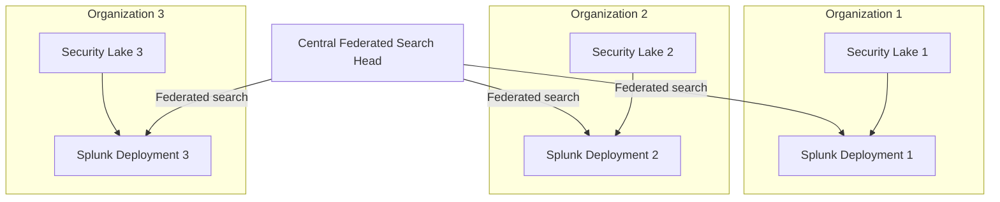

This reduces central duplication and preserves organizational control, but cross-organization searches are slower and depend on every remote provider being reachable and healthy.

---

# 11. How Splunk Federated Search works

Splunk-to-Splunk Federated Search allows one Splunk deployment to query another Splunk deployment without ingesting the remote data into the local indexer cluster.

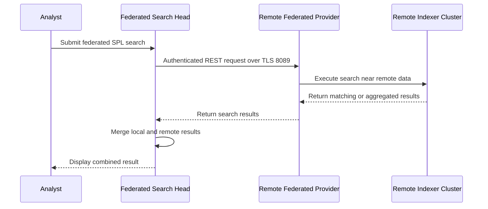

Communication between the local search head and remote provider uses an internal Splunk REST API. TCP 8089 is the standard Splunk management port used for this connection. A dedicated service account and appropriately limited Splunk role should be used on each remote provider. ([Splunk Docs][13])

## What federation does

* Leaves remote index data at the remote deployment.
* Sends search instructions to the remote search head.
* Executes the search against the remote indexers.
* Returns results to the initiating search head.
* Allows central analysts to search multiple Splunk deployments.

## What federation does not do

* It does not replicate remote indexes.
* It does not provide disaster recovery for the remote deployment.
* It does not make remote data locally available when the provider is unreachable.
* It does not eliminate remote search compute requirements.
* It does not automatically make every ES detection federation-compatible.

---

## Standard mode versus transparent mode

### Standard mode

The user explicitly searches a federated index associated with a remote provider.

Best when:

* The remote environment should be clearly identified.
* Different permissions apply to different providers.
* Index names overlap across organizations.
* Administrators want controlled, explicit federation.

Conceptually:

```text
Central search
    local AWS index
    + Org-1 federated index
    + Org-2 federated index
```

### Transparent mode

Existing searches can reference indexes with less awareness of whether the data is local or remote.

Best when:

* Moving data or searches between deployments.
* Local and remote deployments have carefully aligned knowledge objects.
* Existing dashboards should require fewer changes.

Transparent mode is not supported for every combination of Splunk Enterprise and Splunk Cloud, so compatibility must be validated before selecting it. ([Splunk Docs][14])

---

## Recommended private federation network

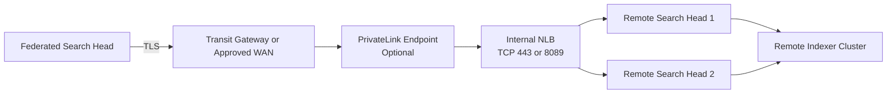

For a private cross-account or cross-organization design, an NLB with PrivateLink is preferable when the goal is simple TCP/TLS pass-through to the Splunk management service. Limit the service account’s indexes and search capabilities to the data the central SOC is authorized to search.

---

# 12. Two different meanings of “federated” with Security Lake

Do not confuse these technologies.

## Splunk-to-Splunk Federated Search

```text
Splunk search head
        ↓ TCP 8089
Remote Splunk search head
        ↓
Remote Splunk indexers
```

This is relevant to self-managed Splunk Enterprise deployments.

## Federated Search for Amazon S3 / Security Lake

```text
Splunk Cloud
      ↓
Glue Data Catalog and Security Lake
      ↓
Parquet data in S3
```

This searches S3 data without first fully indexing it into Splunk. Splunk documents the Security Lake “Federated Analytics” capability as a Splunk Cloud Platform feature. It can retain recent Security Lake data in local “data lake indexes” for frequent detections while searching older data remotely for threat hunting. ([Splunk Docs][15])

For your AWS GovCloud/DoD-oriented environment, this distinction is particularly important: Splunk currently documents Federated Analytics as unavailable for FedRAMP Moderate, FedRAMP High and DoD IL5 Splunk Cloud deployments. A self-managed Splunk Enterprise design should therefore plan to consume Security Lake through its S3/SQS subscriber pipeline unless Splunk confirms another supported offering for the target environment. ([Splunk Docs][15])

---

# 13. Main Splunk ports

|                   Port | Purpose                                                       |
| ---------------------: | ------------------------------------------------------------- |
|                TCP 443 | Recommended user-facing HTTPS/load-balancer entry point       |
|               TCP 8000 | Splunk Web default                                            |
|               TCP 8089 | Splunk management API and Splunk federated search             |
|               TCP 8088 | HTTP Event Collector                                          |
|               TCP 9997 | Splunk-to-Splunk event forwarding                             |
|        TCP 8080 / 9887 | Indexer cluster replication-related communication             |
| TCP 8081 / 9887 / 8181 | Search head cluster communication, depending on configuration |

Splunk documents 8089 as the management and REST port, 8000 for Splunk Web, 9997 for forwarder ingestion and 8088 for HEC. Cluster communication requires additional internal ports. ([Splunk Docs][16])

---

# 14. Recommended enterprise design for your environment

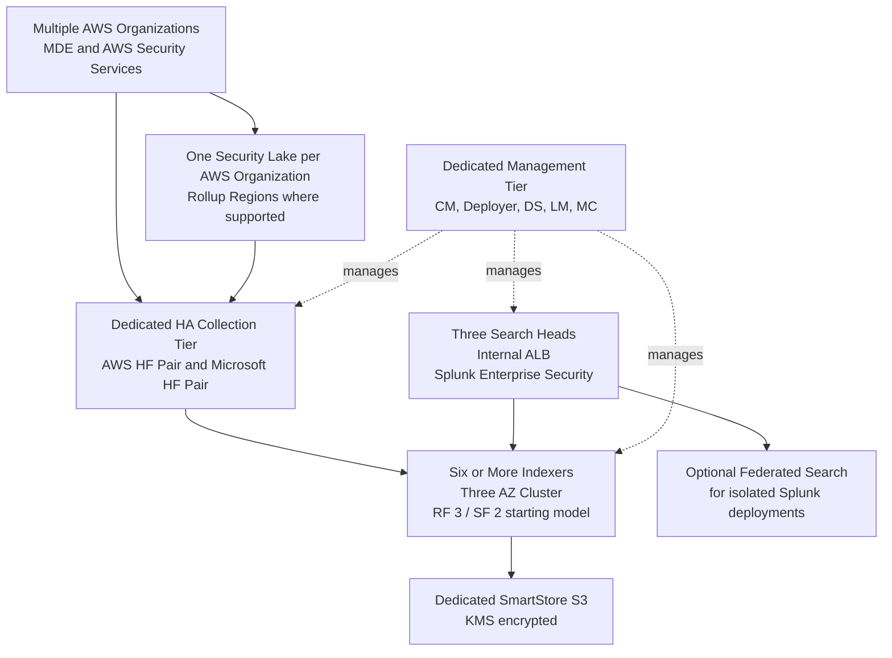

## Final recommendations

1. **Use Security Lake as the normalized AWS security source**, but continue direct pipelines for Network Firewall, MDE, operating-system logs and unsupported sources.

2. **Use SQS-driven collection rather than broad periodic S3 polling.** SQS tells the collector which new Security Lake objects are ready, reducing repeated listing and polling. Security Lake supports SQS notification for data-access subscribers. ([AWS Documentation][12])

3. **Avoid duplicate ingestion.** Do not ingest CloudTrail, VPC Flow, WAF or Security Hub through Security Lake and an independent direct pipeline unless the duplicate has a documented latency or operational requirement.

4. **Keep collection add-ons off the production SHC.** Run AWS and Microsoft modular inputs on dedicated heavy forwarders so that collection failures do not consume search-head resources.

5. **Use three Availability Zones for the indexer and search tiers.** Deploy at least three search heads and enough indexers to satisfy the replication factor plus indexing and search capacity.

6. **Use separate S3 buckets for Security Lake, centralized raw-log archives and SmartStore.** Each has a different format, lifecycle and access model.

7. **For multiple AWS Organizations, create a separate Security Lake subscriber per organization and rollup Region.** Centralize in one Splunk deployment only when data-sharing policy permits it.

8. **Use Splunk-to-Splunk federation when an organization must retain its own Splunk deployment.** Do not use federation as a substitute for central ingestion when frequent ES detections must run against all events.

9. **Normalize both schemas.** Security Lake uses OCSF while Splunk Enterprise Security typically depends heavily on Splunk CIM data models. Splunk recommends the OCSF-CIM Add-on or equivalent mappings when using OCSF data with Splunk and Enterprise Security. ([Splunk Docs][17])

10. **Treat Splunk as a security workload.** Use private subnets, VPC endpoints, KMS encryption, IAM instance roles, Secrets Manager, TLS for forwarding, restricted management ports, SSM administration and centralized monitoring of Splunk’s own `_internal` and audit indexes.

[1]: https://help.splunk.com/en/splunk-enterprise/administer/distributed-deployment-manual/9.3/overview-of-splunk-enterprise-distributed-deployments/components-and-the-data-pipeline?utm_source=chatgpt.com "Components and the data pipeline - Splunk Enterprise"
[2]: https://help.splunk.com/en/splunk-enterprise/administer/manage-indexers-and-indexer-clusters/10.4/overview-of-indexer-clusters-and-index-replication/the-basics-of-indexer-cluster-architecture "The basics of indexer cluster architecture | Splunk Enterprise (last updated 2026-05-14T15:26:02.958Z)"
[3]: https://help.splunk.com/en/splunk-enterprise/administer/distributed-search/9.3/overview-of-search-head-clustering/search-head-clustering-architecture?utm_source=chatgpt.com "Search head clustering architecture - Splunk Enterprise"
[4]: https://docs.aws.amazon.com/security-lake/latest/userguide/internal-sources.html "Collecting data from AWS services in Security Lake - Amazon Security Lake"
[5]: https://docs.aws.amazon.com/prescriptive-guidance/latest/patterns/view-aws-network-firewall-logs-and-metrics-by-using-splunk.html "View AWS Network Firewall logs and metrics by using Splunk - AWS Prescriptive Guidance"
[6]: https://learn.microsoft.com/en-us/defender-xdr/configure-siem-defender "Integrate your SIEM tools with Microsoft Defender XDR - Microsoft Defender XDR | Microsoft Learn"
[7]: https://help.splunk.com/en/splunk-enterprise/splunk-validated-architectures/splunk-platform-indexing-and-search/aws-byol-high-availability "AWS BYOL high availability | Splunk Enterprise, Splunk Cloud Platform (last updated 2026-02-12T16:51:32.124Z)"
[8]: https://help.splunk.com/en/splunk-enterprise/administer/manage-indexers-and-indexer-clusters/10.4/how-indexer-clusters-work/replication-factor?utm_source=chatgpt.com "Replication factor | Splunk Enterprise (last updated 2026- ..."
[9]: https://help.splunk.com/en/splunk-enterprise/administer/manage-indexers-and-indexer-clusters/10.4/how-indexer-clusters-work/search-factor?utm_source=chatgpt.com "Search factor | Splunk Enterprise (last updated 2026-05-14T15: ..."
[10]: https://help.splunk.com/en/splunk-enterprise/administer/manage-indexers-and-indexer-clusters/10.2/deploy-smartstore/smartstore-system-requirements?utm_source=chatgpt.com "SmartStore system requirements - Splunk Enterprise"
[11]: https://docs.aws.amazon.com/security-lake/latest/userguide/multi-account-management.html "Managing multiple accounts with AWS Organizations in Security Lake - Amazon Security Lake"
[12]: https://docs.aws.amazon.com/security-lake/latest/userguide/subscriber-data-access.html?utm_source=chatgpt.com "Managing data access for Security Lake subscribers"
[13]: https://help.splunk.com/en/splunk-enterprise/search/federated-search/10.4/run-federated-searches-across-other-splunk-deployments/define-a-splunk-platform-federated-provider/steps?utm_source=chatgpt.com "Steps | Splunk Cloud Platform (last updated 2026-05- ..."
[14]: https://help.splunk.com/en/splunk-enterprise-security-8/user-guide/8.5/introduction/use-federated-searches-in-transparent-mode-with-splunk-enterprise-security?utm_source=chatgpt.com "Use federated searches in transparent mode with Splunk ..."
[15]: https://help.splunk.com/en/splunk-cloud-platform/search/federated-search/9.3.2408/ingest-and-search-amazon-security-lake-datasets/about-federated-analytics?utm_source=chatgpt.com "About Federated Analytics - Splunk Cloud Platform"
[16]: https://help.splunk.com/en/splunk-enterprise/administer/inherit-a-splunk-deployment/9.3/inherited-deployment-tasks/components-and-their-relationship-with-the-network?utm_source=chatgpt.com "Components and their relationship with the network"
[17]: https://help.splunk.com/en/data-management/process-data-at-the-edge/use-edge-processors-for-splunk-cloud-platform/process-data-using-pipelines/convert-data-to-ocsf-format-using-an-edge-processor/working-with-ocsf-formatted-data-in-the-splunk-platform-and-splunk-enterprise-security?utm_source=chatgpt.com "Working with OCSF-formatted data in the Splunk platform ..."
