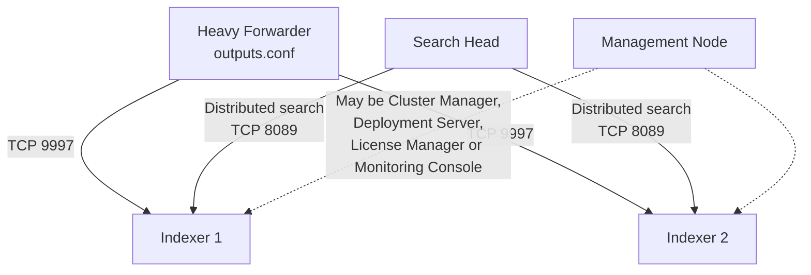
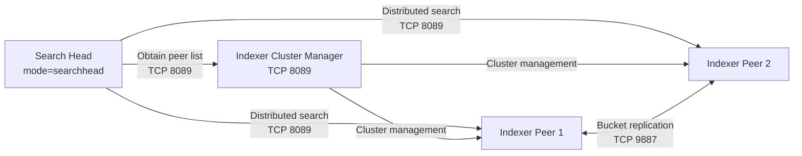
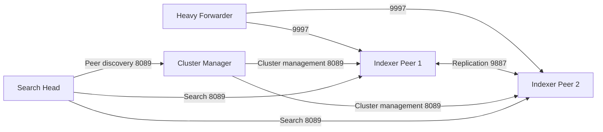
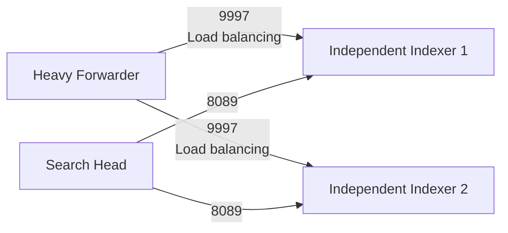

Your deployment could be either:

1. **Two independent indexers** receiving data from the forwarder, or
2. **A two-peer indexer cluster** managed by the management node.

The forwarder’s `outputs.conf` pointing to both indexers **does not prove that they are clustered**. It only proves that the forwarder is load-balancing data between two receiving indexers.



# 1. Verify whether the indexers are clustered

## Best check: run on the management node

From `$SPLUNK_HOME/bin`:

```bash
./splunk show cluster-status --verbose
```

If the management node is an **indexer cluster manager**, the output should show:

* Replication factor
* Search factor
* Peer/indexer members
* Searchable status
* Replication status
* Bucket status
* Indexer 1 and Indexer 2

You can also check Splunk Web:

```text
Settings
  → Indexer clustering
```

If it opens a **Manager Node dashboard** showing the two peers, they are an indexer cluster. The cluster manager coordinates replication and tells cluster-aware search heads which peers to search. ([Splunk Docs][1])

If you see an option to enable clustering rather than cluster status, that node is probably not configured as the cluster manager.

---

# 2. Check `server.conf` on every node

The effective clustering configuration is under:

```text
$SPLUNK_HOME/etc/.../server.conf
```

Do not inspect only `$SPLUNK_HOME/etc/system/local/server.conf`, because configurations can also come from apps. Use `btool` to see the merged effective configuration.

## On the management node

```bash
./splunk btool server list clustering --debug
```

A cluster manager should have something similar to:

```ini
[clustering]
mode = manager
replication_factor = 2
search_factor = 2
pass4SymmKey = $7$...
```

Older Splunk releases might display:

```ini
mode = master
```

instead of `manager`.

## On Indexer 1 and Indexer 2

Run:

```bash
./splunk btool server list clustering --debug
```

A clustered indexer peer should show something similar to:

```ini
[clustering]
mode = peer
manager_uri = https://management-node.example.com:8089
replication_port = 9887
pass4SymmKey = $7$...
```

A peer node is configured with `mode=peer`, the manager URI, and a replication port. ([Splunk Docs][2])

## Strong evidence of a cluster

You have an indexer cluster when all these are true:

| Node             | Expected effective setting                                    |
| ---------------- | ------------------------------------------------------------- |
| Management node  | `[clustering] mode = manager`                                 |
| Indexer 1        | `[clustering] mode = peer` and same `manager_uri`             |
| Indexer 2        | `[clustering] mode = peer` and same `manager_uri`             |
| Search head      | `[clustering] mode = searchhead` and same `manager_uri`       |
| Peer replication | Indexers communicate over replication port, normally TCP 9887 |

---

# 3. Determine how the search head knows about the indexers

There are two different configurations depending on whether the indexers are clustered.

## Pattern A: clustered indexers

A cluster-aware search head normally points to the **cluster manager**, not separately to Indexer 1 and Indexer 2.

Check on the search head:

```bash
./splunk btool server list clustering --debug
```

Expected output:

```ini
[clustering]
mode = searchhead
manager_uri = https://management-node.example.com:8089
pass4SymmKey = $7$...
```

The search head gets the current list of indexer peers from the cluster manager. Therefore, you may not find Indexer 1 and Indexer 2 explicitly listed in a search-head configuration file. Splunk documents that cluster-aware search heads obtain the list of search peers from the indexer cluster manager. ([Splunk Docs][3])



### Important distinction

The search head communicates with:

* **Cluster manager on TCP 8089** for cluster membership and coordination.
* **Indexer peers on TCP 8089** for distributed searches.
* It does not send normal searches through the cluster manager.

---

## Pattern B: two independent indexers

If there is no indexer cluster, the search head usually has Indexer 1 and Indexer 2 configured as explicit **search peers**.

The primary configuration is:

```text
distsearch.conf
```

Check it with:

```bash
./splunk btool distsearch list --debug
```

You may find something similar to:

```ini
[distributedSearch]
servers = https://indexer-1.example.com:8089,https://indexer-2.example.com:8089
```

Depending on how the peers were added, individual peer information and encrypted credentials may also be represented through Splunk-managed configuration and REST endpoints. The effective `btool` output and distributed-search REST endpoint are more reliable than manually inspecting one file.


---

# 4. List the search peers visible to the search head

## Splunk Web

On the search head:

```text
Settings
  → Distributed search
  → Search peers
```

You should see:

* Indexer 1
* Indexer 2
* Connection status
* Authentication status
* Replication status for knowledge bundles

## REST search from Splunk Web

Run this SPL on the search head:

```spl
| rest /services/search/distributed/peers
| table peerName host port status server_roles
```

Depending on Splunk version and returned fields, this broader query is useful:

```spl
| rest /services/search/distributed/peers
| table title peerName host uri status disabled server_roles
```

To see every available field first:

```spl
| rest /services/search/distributed/peers
| transpose 0
```

This is usually the quickest way to confirm which indexers the search head is actually using.

## CLI

Try on the search head:

```bash
./splunk list search-server
```

You can also inspect the effective distributed-search configuration:

```bash
./splunk btool distsearch list --debug
```

The REST query is generally clearer because it shows the currently recognized search peers rather than only static configuration.

---

# 5. Verify cluster members through REST

Run on the cluster manager in Search & Reporting:

```spl
| rest /services/cluster/manager/peers
| table label server_name host_port status searchable
```

A broader version:

```spl
| rest /services/cluster/manager/peers
| table title label server_name host_port status
        searchable site guid
```

If the node uses older terminology, the endpoint can appear as:

```spl
| rest /services/cluster/master/peers
```

If this returns Indexer 1 and Indexer 2 as peers, you have an indexer cluster.

You can also inspect the cluster configuration:

```spl
| rest /services/cluster/config
| table mode manager_uri replication_factor
        search_factor replication_port
```

Field availability can vary by Splunk version.

---

# 6. Verify the forwarder’s destinations

On the Heavy Forwarder:

```bash
./splunk btool outputs list --debug
```

You may see:

```ini
[tcpout]
defaultGroup = indexer_group

[tcpout:indexer_group]
server = 10.10.1.10:9997,10.10.1.11:9997
autoLBFrequency = 30
```

Check live connectivity:

```bash
./splunk list forward-server
```

Typical output distinguishes:

```text
Active forwards:
    10.10.1.10:9997
    10.10.1.11:9997

Configured but inactive forwards:
    None
```

This proves that the Heavy Forwarder can send to the indexers. It does not prove index replication.

## Why `outputs.conf` is unrelated to clustering

```text
outputs.conf
    = Where a forwarder sends newly ingested events

server.conf [clustering]
    = Whether indexers replicate buckets as cluster peers

distsearch.conf
    = Which indexers an independent search head searches
```

A forwarder can load-balance between two independent indexers without any indexer clustering.

---

# 7. Commands to identify each Splunk server’s role

Splunk does not always provide one perfect command that prints a simple role such as “Indexer Cluster Peer.” Roles are established through several configuration stanzas. These commands together reveal the role.

## General identity

Run on every node:

```bash
./splunk version
./splunk status
./splunk show servername
```

Then inspect the effective role configurations:

```bash
./splunk btool server list clustering --debug
./splunk btool server list shclustering --debug
./splunk btool outputs list --debug
./splunk btool inputs list --debug
./splunk btool distsearch list --debug
./splunk btool deploymentclient list --debug
```

## Role interpretation

| Effective configuration                    | Likely role                                     |
| ------------------------------------------ | ----------------------------------------------- |
| `[clustering] mode=manager`                | Indexer Cluster Manager                         |
| `[clustering] mode=peer`                   | Indexer cluster peer                            |
| `[clustering] mode=searchhead`             | Search head attached to indexer cluster         |
| `[shclustering]` enabled                   | Search Head Cluster member                      |
| `distsearch.conf` contains indexers        | Distributed-search head using independent peers |
| `outputs.conf` points to indexers          | Forwarder or node forwarding internal data      |
| `inputs.conf` has `[splunktcp://9997]`     | Receiver/indexer accepting forwarded data       |
| `deploymentclient.conf` exists             | Deployment client                               |
| Deployment Server app/client configuration | Deployment Server                               |
| License-manager configuration              | License Manager                                 |
| Monitoring Console app configured          | Monitoring Console                              |

---

# 8. Check whether your search head itself is clustered

You described one search head, so it is probably standalone. Confirm with:

```bash
./splunk show shcluster-status --verbose
```

If it is not a Search Head Cluster member, the command will indicate that no search-head-cluster configuration is present or fail to return an SHC status.

You can also check:

```bash
./splunk btool server list shclustering --debug
```

A true Search Head Cluster normally has at least three members; one search head is a standalone search head, not a search-head cluster. The `show shcluster-status --verbose` command is Splunk’s standard CLI status check for an SHC. ([Splunk Docs][4])

---

# 9. Fastest verification sequence

Run these commands in this order.

## On the management node

```bash
cd $SPLUNK_HOME/bin

./splunk btool server list clustering --debug
./splunk show cluster-status --verbose
```

Look for:

```text
mode = manager
Indexer 1
Indexer 2
replication_factor
search_factor
```

## On each indexer

```bash
cd $SPLUNK_HOME/bin

./splunk btool server list clustering --debug
./splunk btool inputs list --debug | grep -A5 splunktcp
```

Look for:

```text
mode = peer
manager_uri = https://management-node:8089
replication_port = 9887
```

## On the search head

```bash
cd $SPLUNK_HOME/bin

./splunk btool server list clustering --debug
./splunk btool distsearch list --debug
./splunk list search-server
```

Then run in Splunk Search:

```spl
| rest /services/search/distributed/peers
| table title host port status server_roles
```

## On the forwarder

```bash
cd $SPLUNK_HOME/bin

./splunk btool outputs list --debug
./splunk list forward-server
```

---

# 10. How to interpret your likely result

## Result 1: indexer cluster

```text
Management node:
    mode=manager

Indexer 1 and Indexer 2:
    mode=peer
    same manager_uri

Search head:
    mode=searchhead
    manager_uri points to management node
```

Architecture:



## Result 2: independent indexers

```text
Management node:
    no mode=manager

Indexer 1 and Indexer 2:
    no mode=peer

Search head:
    distsearch.conf explicitly lists both indexers
```

Architecture:



In this second pattern, data sent to Indexer 1 is not automatically copied to Indexer 2. Losing an indexer can therefore make some historical data unavailable unless storage-level redundancy or another backup mechanism exists.

[1]: https://help.splunk.com/en/data-management/manage-splunk-enterprise-indexers/9.4/configure-the-indexer-cluster/configure-and-manage-the-indexer-cluster-with-the-cli?utm_source=chatgpt.com "Configure and manage the indexer cluster with the CLI"
[2]: https://help.splunk.com/en/data-management/manage-splunk-enterprise-indexers/10.4/configure-the-peers/configure-peer-nodes-with-the-cli?utm_source=chatgpt.com "Configure peer nodes with the CLI"
[3]: https://help.splunk.com/en/splunk-enterprise/administer/distributed-search/9.4/deploy-search-head-clustering/integrate-the-search-head-cluster-with-an-indexer-cluster?utm_source=chatgpt.com "Integrate the search head cluster with an indexer cluster"
[4]: https://help.splunk.com/en/splunk-enterprise/administer/distributed-search/9.0/manage-search-head-clustering/restart-the-search-head-cluster?utm_source=chatgpt.com "Restart the search head cluster"
