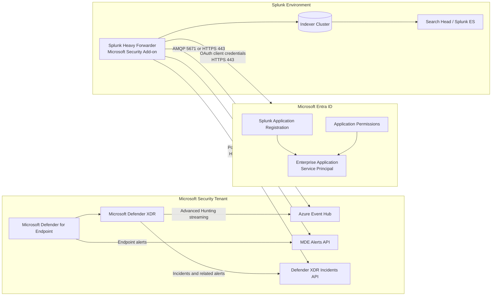
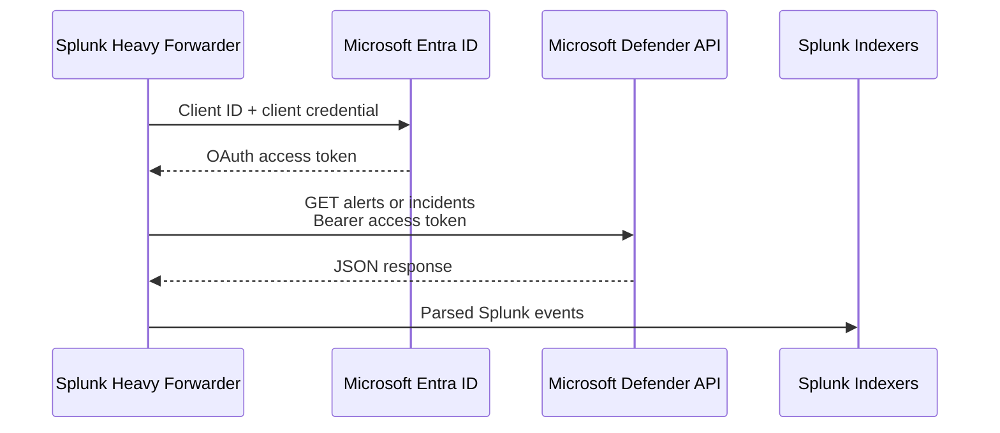
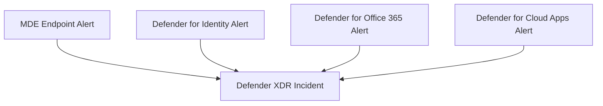
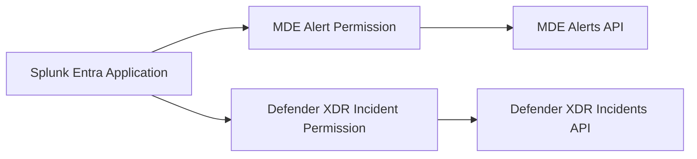
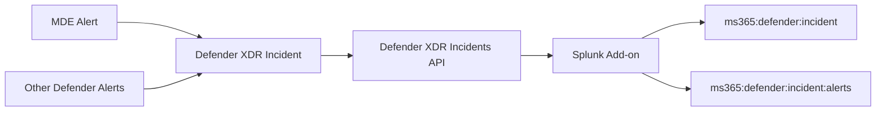
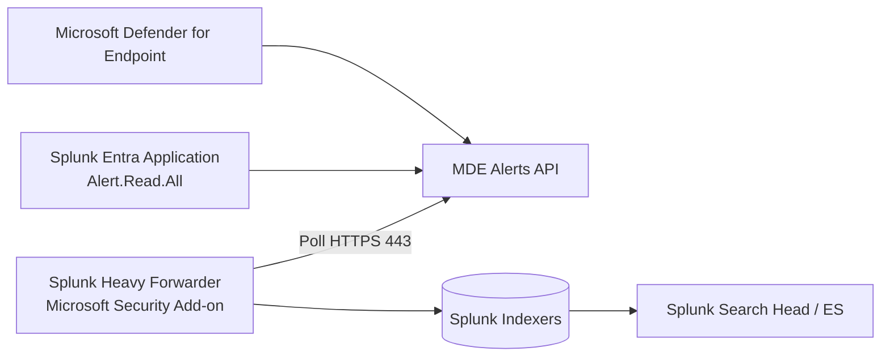
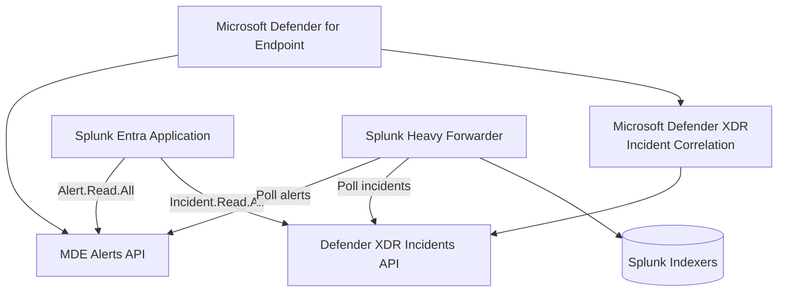
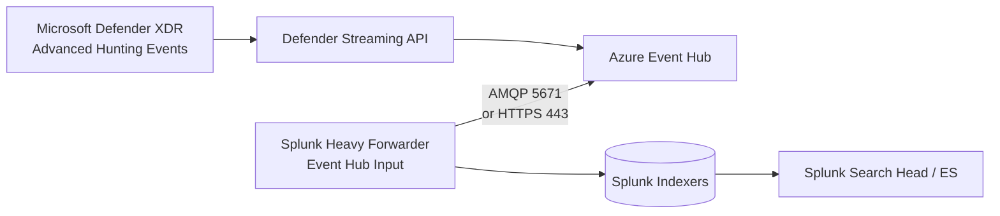
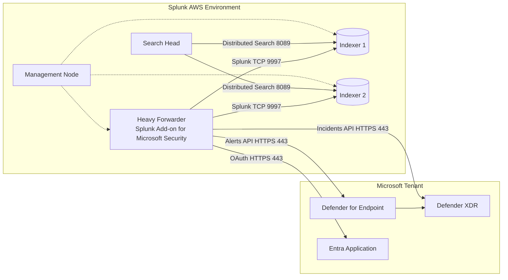

# Integrating Microsoft Defender for Endpoint with Splunk

## Executive Summary

The **Splunk Add-on for Microsoft Security** can ingest Microsoft Defender information through several distinct inputs:

1. **Microsoft Defender for Endpoint alerts**
2. **Microsoft Defender XDR incidents and associated alerts**
3. **Advanced Hunting events streamed through Azure Event Hubs**
4. Optional simulation and threat-intelligence data

For basic MDE security monitoring, the most useful starting point is:

* Enable **Microsoft Defender for Endpoint Alerts**
* Optionally enable **Microsoft Defender XDR Incidents**
* Avoid treating incident-associated alerts and direct MDE alerts as identical datasets
* Add Azure Event Hub only when detailed endpoint telemetry or Advanced Hunting event streams are required

The integration uses a **Microsoft Entra application registration** because Splunk runs as a background service. Splunk authenticates with the tenant ID, client ID, and a client credential, obtains an OAuth access token, and calls the appropriate Microsoft Defender API.

---

# 1. High-Level Architecture



The Splunk Add-on currently identifies itself as supporting Microsoft Defender XDR, Defender for Endpoint, Azure Event Hubs, and Microsoft Defender Threat Intelligence. It collects incidents and related information from Defender XDR and alerts directly from Defender for Endpoint.

---

# 2. Why Splunk Needs an Entra Application

Splunk is not an interactive human user. It must collect data continuously even when nobody is signed into Microsoft Defender.

The application registration provides Splunk with:

* A **tenant ID**
* An **application/client ID**
* A client secret or certificate
* API application permissions
* An identity represented in the tenant by a service principal

The authentication flow is:



Microsoft requires OAuth authentication for unattended Defender API access. The documented process is to create an Entra application, assign the appropriate application permissions, add a credential, obtain a token, and use that token to call the Defender API.

## Application Registration versus Enterprise Application

These names are often confused.

| Entra object               | Purpose                                                                       |
| -------------------------- | ----------------------------------------------------------------------------- |
| **App registration**       | Defines the application, client ID, credentials and requested API permissions |
| **Enterprise application** | The tenant-local service principal that represents the application at runtime |
| **API permission**         | Defines what the application may read or change                               |
| **Admin consent**          | Authorizes the application permissions for the organization                   |

You normally create the identity under:

```text
Microsoft Entra ID
  → App registrations
  → New registration
```

Once registered, an associated **Enterprise Application/service principal** is created in the tenant.

You configure credentials and API permissions on the app registration, while tenant administrators can manage consent and service-principal behavior through Enterprise Applications.

---

# 3. MDE Alerts versus Defender XDR Incidents

## Microsoft Defender for Endpoint alerts

An MDE alert is an endpoint-focused detection such as:

* Malware detected on a device
* Suspicious PowerShell execution
* Credential dumping behavior
* Command-and-control activity
* Suspicious process behavior
* Endpoint persistence
* Exploitation activity

The direct MDE Alerts API returns alert-level attributes including:

* Alert ID
* Device or machine information
* Detection source
* Severity
* Category
* Status
* Investigation state
* MITRE techniques
* Evidence
* Related user
* Threat family

The Splunk sourcetype is:

```text
ms:defender:atp:alerts
```

Splunk maps this sourcetype to its Alerts CIM data model.

## Microsoft Defender XDR incidents

A Defender XDR incident is a higher-level investigation container that groups related alerts.

An incident can correlate alerts from:

* Microsoft Defender for Endpoint
* Microsoft Defender for Office 365
* Microsoft Defender for Identity
* Microsoft Defender for Cloud Apps
* Microsoft Defender for Cloud
* Other integrated Microsoft security sources

The Splunk sourcetypes are:

```text
ms365:defender:incident
ms365:defender:incident:alerts
```

The incident record provides information such as:

* Incident ID
* Incident title
* Severity
* Status
* Classification
* Determination
* Assigned analyst
* Creation and update times
* Related alerts
* Related entities

The Defender XDR incident API returns each incident with an array of related alerts and entities.

## Relationship



An MDE alert is one detection. An incident can combine multiple related alerts into a complete attack story.

---

# 4. Why Separate Permissions Are Required

The two Splunk inputs call different APIs and access different logical resources.



Giving the application permission to read endpoint alerts does not automatically grant permission to read XDR incidents.

Likewise, incident permission does not necessarily authorize direct access to the endpoint-specific alerts API.

This separation supports least privilege:

* A tool that only needs endpoint alerts receives alert-read permission.
* A tool that only needs incidents receives incident-read permission.
* A response automation that changes incident status requires read/write permission.

---

# 5. Permission Matrix

The exact permission depends on whether the Splunk input is configured to use a **native Defender API** or the **Microsoft Graph Security API**.

## Native Defender API permissions

| Splunk input                          | Sourcetype                                | Microsoft API resource                     | Minimum collection permission                                            |
| ------------------------------------- | ----------------------------------------- | ------------------------------------------ | ------------------------------------------------------------------------ |
| MDE Alerts                            | `ms:defender:atp:alerts`                  | WindowsDefenderATP / Defender for Endpoint | `Alert.Read.All` where supported by the selected endpoint/add-on version |
| Defender XDR Incidents                | `ms365:defender:incident`                 | Microsoft Threat Protection / Defender XDR | `Incident.Read.All`                                                      |
| Incident-associated alerts            | `ms365:defender:incident:alerts`          | Microsoft Threat Protection / Defender XDR | `Incident.Read.All`                                                      |
| Advanced Hunting alert action         | `m365:defender:incident:advanced_hunting` | Microsoft Threat Protection                | `AdvancedHunting.Read.All`                                               |
| Update incidents through alert action | Incident sourcetypes                      | Microsoft Threat Protection                | `Incident.ReadWrite.All`                                                 |

Splunk’s permission guide specifies `Alert.Read.All` for direct alert collection and `Incident.Read.All` for incidents and associated alerts. It specifies read/write permissions only for alert actions that modify incidents.

### Microsoft documentation inconsistency to be aware of

Current Microsoft pages are not completely consistent for the legacy/direct MDE Alerts endpoint:

* Microsoft’s MDE application examples show `Alert.Read.All`.
* The current “List alerts” API page lists `Alert.ReadWrite.All` for application access.

Therefore, use this order:

1. Begin with `Alert.Read.All`, matching the Splunk Add-on permission guide and least-privilege design.
2. Verify that the access token contains the required role.
3. Test the MDE Alerts input.
4. Grant `Alert.ReadWrite.All` only when the selected Microsoft endpoint rejects read-only access or when Splunk must update alerts.

Do not grant write access merely because it is available.

## Microsoft Graph permissions

When the add-on is configured for Microsoft Graph endpoints, the equivalent permissions are different:

| Data                      | Microsoft Graph application permission |
| ------------------------- | -------------------------------------- |
| Security alerts           | `SecurityAlert.Read.All`               |
| Security incidents        | `SecurityIncident.Read.All`            |
| Update security alerts    | `SecurityAlert.ReadWrite.All`          |
| Update security incidents | `SecurityIncident.ReadWrite.All`       |
| Threat hunting            | `ThreatHunting.Read.All`               |

Splunk explicitly distinguishes native Defender permissions from Graph permissions in its configuration guide.

## Recommended least-privilege set

For read-only MDE alerts and incidents through native Defender APIs:

```text
WindowsDefenderATP:
  Alert.Read.All

Microsoft Threat Protection:
  Incident.Read.All
```

For Graph-based collection:

```text
Microsoft Graph:
  SecurityAlert.Read.All
  SecurityIncident.Read.All
```

Do not add all four sets unless your chosen inputs actually use both API families.

---

# 6. Do You Need Both Alert Inputs?

The add-on can produce alerts from two paths:

```text
ms:defender:atp:alerts
ms365:defender:incident:alerts
```

They are not completely identical.

## Direct MDE alert path


Use this when you need:

* Endpoint-specific alerts
* MDE investigation details
* Device-related context
* Detection source information
* Direct endpoint alert lifecycle fields

## Incident-associated alert path



Use this when you need:

* Incident-to-alert relationships
* Cross-product correlation
* Incident ownership
* Incident status and classification
* Alerts grouped under the same investigation

## Duplicate-event consideration

When an incident is updated, Splunk can ingest a new incident event and repeat its related alert records even when the alert itself did not materially change. Splunk explicitly warns that `ms365:defender:incident:alerts` can contain probable duplicate alert events after incident updates.

Therefore:

* Use `alertId` or the appropriate unique alert identifier for deduplication.
* Do not calculate alert counts using raw `count`.
* Prefer `dc(alertId)` or `stats latest(*) by alertId`.
* Do not assume that every incident-alert event represents a newly generated alert.

Example:

```spl
index=microsoft_security
sourcetype=ms365:defender:incident:alerts
| stats latest(_time) AS last_updated
        latest(*) AS *
        by alertId
```

---

# 7. Recommended Ingestion Patterns

## Pattern A — Basic MDE monitoring



Enable:

```text
Microsoft Defender for Endpoint Alerts
```

Resulting sourcetype:

```text
ms:defender:atp:alerts
```

This is the simplest pattern when the requirement is specifically MDE alert ingestion.

## Pattern B — MDE alerts plus XDR incidents



Resulting sourcetypes:

```text
ms:defender:atp:alerts
ms365:defender:incident
ms365:defender:incident:alerts
```

This is usually the best SOC pattern because it provides both endpoint alert detail and incident-level correlation.

## Pattern C — Advanced Hunting streaming



Resulting sourcetype:

```text
ms:defender:eventhub
```

Use this when you need detailed telemetry such as:

* Device process events
* Device network events
* Device logon events
* File events
* Registry events
* Email events
* Identity events
* Cloud application events

This path provides much more event volume than incidents or alerts.

The Event Hub input requires the application or identity to have the **Azure Event Hubs Data Receiver** role on the Event Hub. Splunk’s input remains continuously connected, and its interval appears as zero.

---

# 8. Recommended Architecture for Your Splunk Deployment



Install and configure the modular inputs on the **Heavy Forwarder**, not separately on both indexers.

Install the add-on’s search-time knowledge on the Search Head when required for:

* Field aliases
* CIM mappings
* Tags
* Event types
* Dashboards

The indexers require the relevant parsing components only when the add-on documentation or your deployment model calls for index-time processing.

---

# 9. Configuration Procedure

## Step 1 — Install the Splunk Add-on

Install the Splunk Add-on for Microsoft Security on the data-collection tier.

For your environment:

```text
Primary input location:
  Heavy Forwarder

Search-time knowledge:
  Search Head
```

Do not run the same polling input on multiple Heavy Forwarders unless the add-on explicitly supports coordinated checkpointing. Otherwise, duplicate collection may occur.

---

## Step 2 — Create the Entra application

In Microsoft Entra:

```text
Microsoft Entra ID
  → App registrations
  → New registration
```

Recommended values:

| Setting                | Recommendation                                          |
| ---------------------- | ------------------------------------------------------- |
| Name                   | `Splunk-Microsoft-Security-Collector`                   |
| Supported account type | Single tenant                                           |
| Redirect URI           | Not normally required for client-credentials collection |

Record:

* Directory/tenant ID
* Application/client ID

---

## Step 3 — Add API permissions

### For MDE alerts

```text
API permissions
  → Add a permission
  → APIs my organization uses
  → Search: WindowsDefenderATP
  → Application permissions
  → Alert.Read.All
```

Microsoft notes that `WindowsDefenderATP` may not appear initially and may need to be typed into the API search box.

### For Defender XDR incidents

```text
API permissions
  → Add a permission
  → APIs my organization uses
  → Search: Microsoft Threat Protection
  → Application permissions
  → Incident.Read.All
```

`Microsoft Threat Protection` is the former API name for Microsoft Defender XDR and may need to be typed into the search field before it appears.

### Grant admin consent

After adding each application permission:

```text
Grant admin consent for the organization
```

Application permissions do not become operational merely because they were added to the app registration. Tenant-wide admin consent must also be granted.

---

## Step 4 — Create the client credential

Under:

```text
Certificates & secrets
```

Choose one:

* Client certificate — preferred for stronger production security
* Client secret — simpler but requires expiration management

For a client secret:

1. Create the secret.
2. Copy the **secret value**, not the secret identifier.
3. Store it securely.
4. Record the expiration date.
5. Establish a rotation process.

The secret value is displayed only once.

---

## Step 5 — Configure outbound connectivity

The Heavy Forwarder needs outbound HTTPS access to:

```text
login.microsoftonline.com
api.securitycenter.microsoft.com
api.security.microsoft.com
```

Depending on configuration and environment, it may instead use:

```text
graph.microsoft.com
```

For GCC High or DoD environments, government endpoints differ. Splunk’s configuration guide lists separate endpoints for commercial, GCC, GCC High and DoD environments.

Required basic connection:

| Source          | Destination                    |    Port | Purpose             |
| --------------- | ------------------------------ | ------: | ------------------- |
| Heavy Forwarder | Microsoft Entra token endpoint | TCP 443 | OAuth token         |
| Heavy Forwarder | Defender for Endpoint API      | TCP 443 | MDE alerts          |
| Heavy Forwarder | Defender XDR API               | TCP 443 | Incidents           |
| Heavy Forwarder | Microsoft Graph, when selected | TCP 443 | Graph security APIs |

Event Hub may additionally require TCP 5671 for AMQP, depending on the chosen transport.

---

## Step 6 — Add the Microsoft account in Splunk

On the Heavy Forwarder:

```text
Splunk Add-on for Microsoft Security
  → Configuration
  → Account
  → Add
```

Enter:

| Field         | Value                           |
| ------------- | ------------------------------- |
| Account name  | Descriptive Splunk account name |
| Client ID     | Entra application/client ID     |
| Client secret | Application secret value        |
| Tenant ID     | Microsoft directory/tenant ID   |

Splunk documents these exact account values for the add-on configuration.

---

## Step 7 — Configure the MDE Alerts input

Navigate to:

```text
Splunk Add-on for Microsoft Security
  → Inputs
  → Create New Input
  → Microsoft Defender for Endpoint Alerts
```

Configure:

| Field             | Recommendation                                             |
| ----------------- | ---------------------------------------------------------- |
| Name              | `mde_alerts`                                               |
| Interval          | Start with 300 seconds                                     |
| Index             | `microsoft_security`                                       |
| Azure App Account | Previously created account                                 |
| Tenant ID         | Leave blank unless overriding the account                  |
| Location          | Select the correct Microsoft environment                   |
| Start date        | Set deliberately to avoid unnecessary historical ingestion |

Result:

```text
sourcetype=ms:defender:atp:alerts
```

Splunk notes that leaving the start date blank causes the input to use a default date 30 days in the past.

---

## Step 8 — Configure the Defender XDR Incidents input

Navigate to:

```text
Inputs
  → Create New Input
  → Microsoft 365 Defender Incidents
```

Configure:

| Field             | Recommendation                            |
| ----------------- | ----------------------------------------- |
| Name              | `defender_xdr_incidents`                  |
| Interval          | Start with 300 seconds                    |
| Index             | `microsoft_security`                      |
| Azure App Account | Previously created account                |
| Environment       | Correct commercial/government environment |
| Start date        | Set explicitly                            |

Results:

```text
sourcetype=ms365:defender:incident
sourcetype=ms365:defender:incident:alerts
```

---

# 10. Validation Searches

## Confirm all expected sourcetypes

```spl
index=microsoft_security
sourcetype IN (
    "ms:defender:atp:alerts",
    "ms365:defender:incident",
    "ms365:defender:incident:alerts"
)
| stats count
        earliest(_time) AS earliest
        latest(_time) AS latest
        by sourcetype
| convert ctime(earliest) ctime(latest)
```

Splunk recommends validating collection by searching for the configured Microsoft Security sourcetypes in the selected index.

## Review recent MDE alerts

```spl
index=microsoft_security sourcetype=ms:defender:atp:alerts
| table _time id title severity status
        category detectionSource
        machineId computerDnsName
        incidentId investigationId
| sort - _time
```

## Review Defender XDR incidents

```spl
index=microsoft_security sourcetype=ms365:defender:incident
| table _time incidentId incidentName
        severity status classification
        determination assignedTo
        createdTime lastUpdateTime
| sort - _time
```

## Count unique incident-associated alerts

```spl
index=microsoft_security
sourcetype=ms365:defender:incident:alerts
| stats latest(_time) AS last_seen
        latest(title) AS title
        latest(severity) AS severity
        latest(status) AS status
        values(incidentId) AS incident_ids
        count AS collected_versions
        by alertId
| sort - last_seen
```

---

# 11. Troubleshooting

## Authentication succeeds but API returns 403

Check:

* Correct API permission family was selected.
* Admin consent was granted.
* Token audience matches the API.
* Token contains the expected `roles` claim.
* Correct commercial or government endpoint is selected.
* Client secret value, not secret ID, was entered.

Microsoft notes that some MDE APIs continue to require a token issued for the legacy `api.securitycenter.microsoft.com` resource. A token with the wrong audience can return `403 Forbidden` even if the visible API endpoint uses another hostname.

## No incident data

Confirm:

```text
Incident.Read.All
```

was granted under:

```text
Microsoft Threat Protection
```

not only under WindowsDefenderATP.

## Alerts work, but incidents fail

This usually means:

* `Alert.Read.All` exists, but
* `Incident.Read.All` is missing or lacks admin consent.

## Incidents work, but direct MDE alerts fail

This usually means:

* `Incident.Read.All` exists, but
* The WindowsDefenderATP alert permission is absent, incorrect or using an incompatible token audience.

## Duplicate alert records

Do not immediately conclude that the input is malfunctioning. Incident updates can cause related alerts to be collected again under:

```text
ms365:defender:incident:alerts
```

Deduplicate by the alert’s stable identifier.

---

# 12. Final Recommended Configuration

For a security operations implementation, use:

```text
Input 1:
  Microsoft Defender for Endpoint Alerts
  Permission: Alert.Read.All
  Sourcetype: ms:defender:atp:alerts

Input 2:
  Microsoft 365 Defender Incidents
  Permission: Incident.Read.All
  Sourcetypes:
    ms365:defender:incident
    ms365:defender:incident:alerts
```

Add this only when detailed event telemetry is required:

```text
Input 3:
  Microsoft Defender Event Hub
  Azure role: Azure Event Hubs Data Receiver
  Sourcetype: ms:defender:eventhub
```

The practical distinction is:

```text
MDE Alerts
  = Endpoint detections

Defender XDR Incidents
  = Correlated investigation cases containing alerts

Advanced Hunting through Event Hub
  = Detailed endpoint, identity, email and cloud telemetry
```

Use read-only permissions for collection. Add read/write permissions only when Splunk alert actions must update Microsoft incidents or alerts.
