# Splunk Enterprise on AWS — Security Operations Architecture Reference

> **Scope:** Self-managed Splunk Enterprise deployed on AWS, ingesting primarily from
> (1) AWS security services via Amazon Security Lake and direct pipelines, and
> (2) Microsoft Defender for Endpoint / Defender XDR.
>
> **How this document is organized:** Part I explains how Splunk works. Part II covers getting
> data in. Parts III–IV show what a POC and a production deployment look like. Parts V–VI cover
> scaling across AWS Organizations and federated search. Part VII is the consolidated design
> rules. Reference tables (ports, component matrix) are in the appendices.

---

# Part I — How Splunk Works

## 1.1 The four jobs of Splunk

Everything in a Splunk deployment exists to do one of four jobs. Every component in this
document maps to exactly one of them.

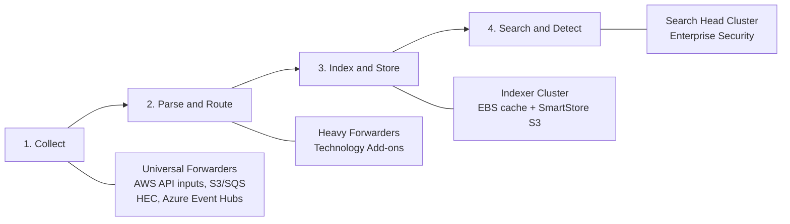

1. **Collect** — retrieve logs from AWS, MDE, servers, network devices, and applications.
2. **Parse and route** — identify event boundaries, timestamps, source types, destinations.
3. **Index and store** — convert raw events into searchable index buckets.
4. **Search and detect** — run SPL searches, dashboards, alerts, ES detections, investigations.

A distributed deployment separates these jobs so collection, storage, and search **scale
independently**: forwarders send data, indexers store and search it, search heads coordinate
user searches across the indexers. ([Splunk Docs][1])

## 1.2 The components, by job

### Collection tier
| Component | Function | Deployment guidance |
|---|---|---|
| **Universal Forwarder (UF)** | Lightweight agent for local files, Linux logs, Windows Event Logs | Install on EC2 instances needing host-level collection |
| **Heavy Forwarder (HF)** | Full Splunk instance running modular inputs, add-ons, parsing, filtering, routing | Use for AWS API inputs, S3/SQS, CloudWatch, Azure Event Hubs, syslog, HEC |
| **HTTP Event Collector (HEC)** | Token-authenticated HTTPS endpoint for apps and Firehose | Place behind an internal NLB |

### Indexing tier
| Component | Function | Deployment guidance |
|---|---|---|
| **Indexer (peer node)** | Indexes events, creates buckets, replicates, serves search work | Deploy as a cluster across three AZs |
| **Cluster Manager (CM)** | Coordinates replication and recovery, distributes indexer config, tells search heads where data lives | Exactly one active per cluster; it does **not** index external data |
| **SmartStore** | Uses S3 for index bucket storage; indexers keep a local hot cache | The right default for large AWS deployments and long retention |

The cluster needs **at least as many indexers as the replication factor**. ([Splunk Docs][2])

### Search tier
| Component | Function | Deployment guidance |
|---|---|---|
| **Search Head / SHC** | Accepts SPL, distributes work to indexers, merges results; SHC replicates dashboards, knowledge objects, scheduled searches | Minimum **three members** for HA ([Splunk Docs][3]) |
| **SHC Captain** | Coordinates scheduled searches and cluster activity | Dynamically elected — not a component you deploy |
| **SHC Deployer** | Pushes apps/config bundles to the SHC | Separate instance; one per SHC |
| **Enterprise Security (ES)** | The SIEM app: detections, risk, findings, investigations | Installed on the SHC |

### Management tier
| Component | Function |
|---|---|
| **Deployment Server** | Distributes apps/config to UFs by server class |
| **License Manager** | Tracks license allocation and ingest volume |
| **Monitoring Console** | Health of indexing, search, forwarders, license, clusters |

## 1.3 How an event flows end to end

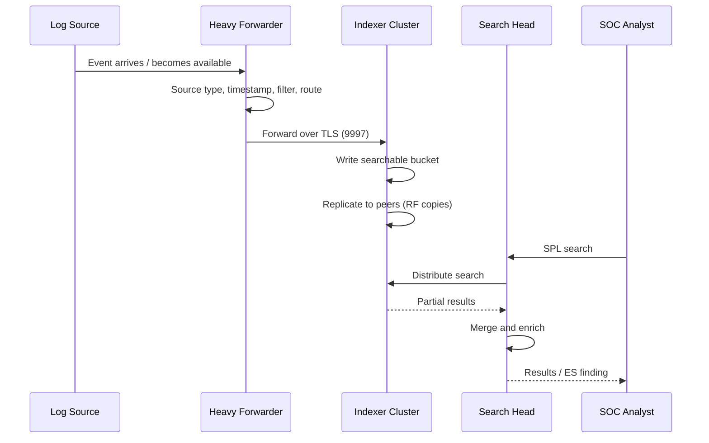

The key mechanic: **search work runs where the data lives.** The search head does not pull
raw data centrally — it distributes the search to indexers, which scan their local buckets and
return matches or aggregates. This is why indexer count drives both ingest *and* search capacity.

---

# Part II — Getting Data In: AWS and Microsoft Sources

## 2.1 The routing decision

The single most important ingestion rule: **for each source, pick one authoritative path.**
Duplicate pipelines (e.g., CloudTrail via Security Lake *and* a direct add-on input) double
license consumption and create conflicting timestamps in investigations.

| Source | Preferred path | Why / notes |
|---|---|---|
| CloudTrail, VPC Flow, Route 53 Resolver, WAFv2, EKS audit, Security Hub findings | **Security Lake → subscriber SQS → HF (Splunk Add-on for AWS)** | These are Security Lake **native sources** — AWS normalizes them to OCSF/Parquet ([AWS Documentation][4]) |
| AWS Network Firewall logs | **CloudWatch Logs → AWS Add-on**, or Firehose/S3 → SQS → HF | NFW is **not** a native Security Lake source; use the direct pipeline ([AWS Documentation][5]) |
| AWS Network Firewall metrics | CloudWatch metrics API → AWS Add-on | Dropped packets, firewall health |
| MDE / Defender XDR incidents & alerts | Splunk Add-on for Microsoft Security (API) | Lower-volume security records |
| MDE Advanced Hunting telemetry | **Defender XDR Streaming API → Azure Event Hubs → Splunk Add-on for Microsoft Cloud Services** | High-volume endpoint telemetry ([Microsoft Learn][6]) |
| EC2 OS and application logs | Universal Forwarder → indexers (or HEC/Firehose per app architecture) | Direct, near real-time |
| GuardDuty findings | Via Security Hub/Security Lake **or** EventBridge — choose one | Avoid duplicates |

## 2.2 Security Lake in this architecture

Security Lake is the normalized AWS source of record: it collects its native sources
org-wide, converts them to **OCSF v1.x + Apache Parquet**, and exposes them to subscribers.
Splunk consumes it as a **data-access subscriber**: Security Lake sends an SQS notification
per new S3 object; the HF assumes the subscriber role and reads the object. ([AWS Documentation][12])

Two clarifications that the muddled version of this document buried:

- **The HF "reads from" Security Lake — it never writes back.** Any diagram arrow from
  Splunk toward Security Lake represents the collector assuming the subscriber IAM role to
  GET objects, nothing more.
- **Sources not on the native list keep their direct pipelines.** Network Firewall, MDE, and
  OS logs do not pass through Security Lake (custom-source transformation is possible but is
  a separate engineering effort — see the transformation-library discussion in your Security
  Lake notes).

## 2.3 Combined source-to-Splunk flow

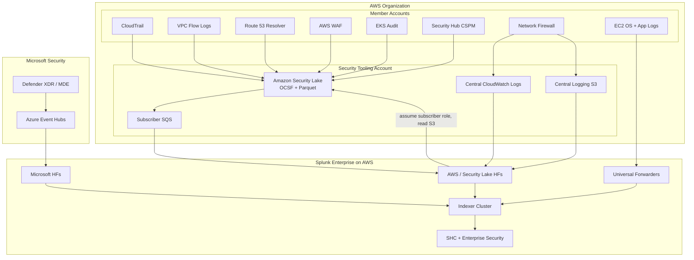

## 2.4 Schema note: OCSF vs. CIM

Security Lake data arrives in **OCSF**; Enterprise Security detections largely depend on
**Splunk CIM** data models. Plan for the OCSF-CIM Add-on (or equivalent field mappings) so
OCSF events populate CIM data models and ES detections fire correctly. ([Splunk Docs][17])

---

# Part III — Proof-of-Concept Architecture

## 3.1 What a POC must prove (and what it must not claim)

A POC exists to validate **integration and volume assumptions**, not availability:

- AWS authentication and cross-account subscriber access work
- Security Lake S3/SQS ingestion works end to end
- Network Firewall logs parse correctly
- MDE Event Hub ingestion works
- OCSF and CIM field mappings populate ES correctly
- Basic cross-source correlation succeeds
- Measured ingest volume and storage projections are realistic

It should **not** be presented as highly available — see the limitations below.

## 3.2 POC topology

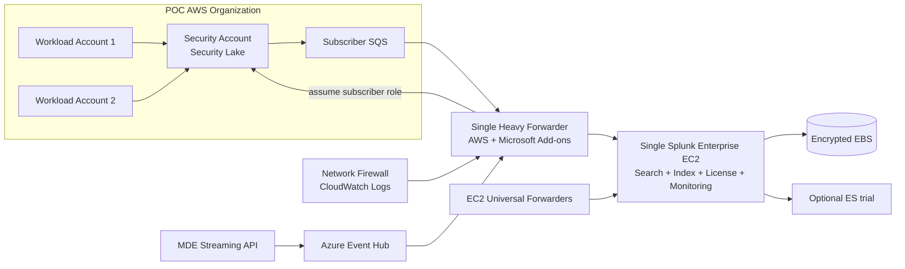

| Component | Qty | Purpose |
|---|---:|---|
| Splunk Enterprise standalone | 1 | Search, indexing, licensing, monitoring in one instance |
| Heavy Forwarder | 1 | AWS, Security Lake, and Microsoft inputs |
| Security Lake subscriber | 1 per Region (or rollup Region) | S3/SQS access |
| Universal Forwarder | 2–5 test servers | Host log validation |
| Encrypted EBS | sized to POC volume | Hot/warm storage |
| Enterprise Security | optional | Validate SIEM use cases |

## 3.3 POC limitations — state these explicitly

No search-head availability; no indexer replication (single-node data risk); a collector
failure pauses all cloud ingestion; maintenance causes outages; and a single node cannot
validate production search concurrency. Every one of these is fixed by the production
design in Part IV — that is the point of the contrast.

---

# Part IV — Production Architecture

## 4.1 The four-tier model

Production separates the platform into tiers that scale and fail independently, spread
across **three Availability Zones**, matching Splunk's validated AWS HA architecture
(indexers + SHC across 3 AZs, load balancer in front of search, SmartStore on S3).
([Splunk Docs][7])

1. **Access & search tier** — 3+ search heads in an SHC, ES installed, behind an internal ALB
2. **Collection & input tier** — HF pairs per source family, internal NLB for HEC/syslog
3. **Indexing & storage tier** — 6+ indexer cluster, local NVMe/EBS cache, SmartStore S3
4. **Management tier** — CM, SHC Deployer, Deployment Server, License Manager, Monitoring Console

## 4.2 Production topology

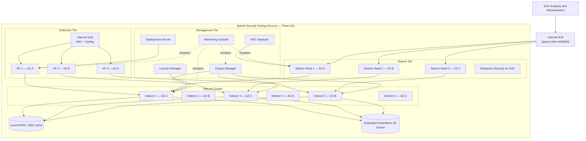

*(Forwarder→indexer and search-head→indexer arrows are representative; in practice every HF
load-balances across all indexers and every SH searches all peers.)*

## 4.3 Replication factor and search factor

Two settings define the cluster's failure tolerance:

- **Replication Factor (RF)** — number of copies of each bucket's raw data. RF=3 means three
  copies; the cluster generally tolerates RF−1 peer failures without losing all copies, and
  requires at least RF peers. ([Splunk Docs][8])
- **Search Factor (SF)** — how many of those copies also carry the searchable index files
  (higher SF = faster recovery of searchability after a peer failure, at more disk cost).
  SF=2 is Splunk's documented cluster default. ([Splunk Docs][9])

```text
Starting model:  RF = 3, SF = 2
```

Tune from the required failure model, ingest rate, search workload, and storage architecture —
not from the default.

## 4.4 SmartStore and Security Lake are different S3 systems — never merge them

This confusion appears in almost every AWS+Splunk design review, so it gets its own section.

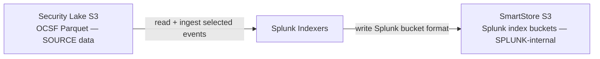

| | Security Lake S3 | SmartStore S3 |
|---|---|---|
| Owner | AWS security data lake (delegated admin) | Splunk platform |
| Contents | OCSF-normalized Parquet source events | Splunk index buckets + metadata |
| Access model | Security Lake subscriber permissions | Splunk indexers only |
| Role | Upstream source (and long-term source retention) | Remote index storage behind indexer cache |

SmartStore requires **consistent index configuration across all peers** and must never be
modified or queried as if it contained ordinary log files. ([Splunk Docs][10])
Keep **three separate buckets**: Security Lake, centralized raw-log archive, SmartStore —
different formats, lifecycles, and access models.

---

# Part V — Scaling Across AWS Organizations

## 5.1 One organization: delegated administrator pattern

Within one AWS Organization, the management account designates a **Security Lake delegated
administrator** (the security tooling account), which enables sources for member accounts,
auto-onboards new accounts, and grants subscriber access. ([AWS Documentation][11])
A **rollup Region** aggregates contributing Regions so Splunk needs one subscriber per rollup
rather than per Region. ([AWS Documentation][12])

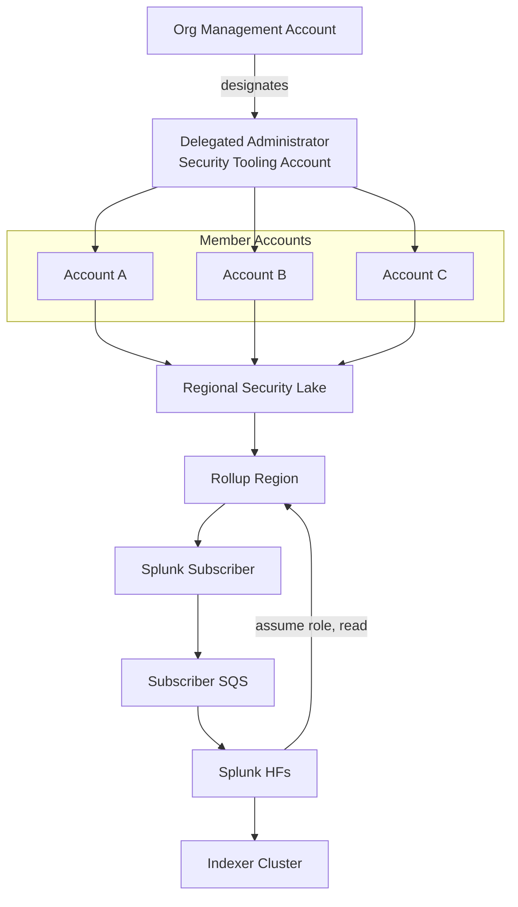

## 5.2 Multiple organizations: the boundary rule

> **A Security Lake delegated administrator manages one AWS Organization — not the whole
> enterprise.** Three Organizations means three independent Security Lakes.

That forces a choice between two patterns.

### Pattern A — one central Splunk ingests all organizations

Best when a single SOC is authorized to hold and analyze all organizations' logs.

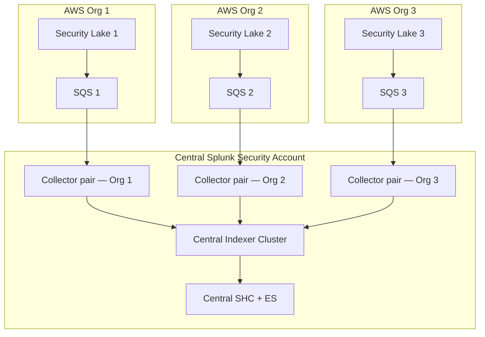

Each organization independently creates its own subscriber, external ID, subscriber IAM role,
SQS endpoint, source selection, and rollup configuration; the collectors keep separate account
definitions and credentials per organization.

**Tag organizational context at ingestion.** Every event should carry fields like:

```text
aws_account_id, aws_region, aws_org_id, security_lake_id,
mission_owner, environment, data_classification, source_category
```

This enables role-based index access, per-org dashboards and reporting, cost allocation,
separate retention, and cross-org investigation. A workable index strategy:

```text
aws_security_org1 | aws_security_org2 | aws_security_org3
mde | network_firewall | splunk_internal
```

At very large scale, separate indexes **by data type** and enforce organization boundaries
via metadata + Splunk roles — not hundreds of tiny per-team indexes.

### Pattern B — independent Splunk per organization, federated on top

Use when organizations require data sovereignty, independent administration, or limited
cross-boundary connectivity.

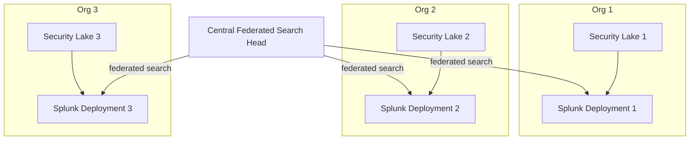

Trade-off: preserves organizational control and avoids central duplication, but cross-org
searches are slower and depend on every remote provider being reachable and healthy.

---

# Part VI — Federated Search

## 6.1 How Splunk-to-Splunk federation works

One Splunk deployment queries another **without ingesting the remote data**. The connection
is an authenticated REST call over TLS to the remote provider's management port (**TCP 8089**),
using a dedicated service account with a deliberately limited role. ([Splunk Docs][13])

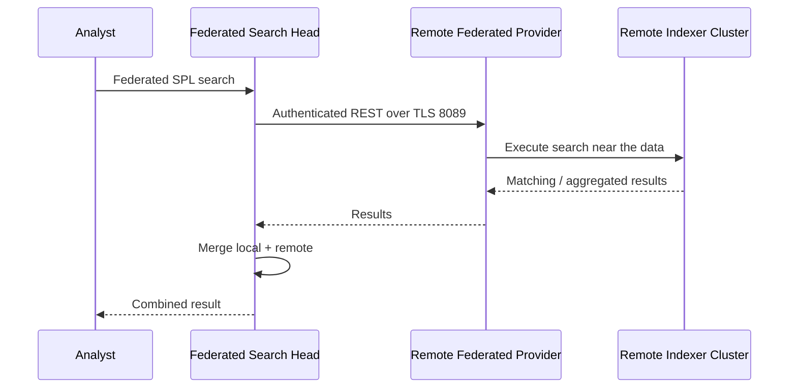

**What it does:** leaves data at the remote deployment; pushes search instructions out;
executes remotely; returns results; gives central analysts multi-deployment reach.

**What it does not do:** replicate remote indexes; provide DR for the remote site; make
remote data available when the provider is down; eliminate remote compute cost; or make
every ES detection federation-compatible automatically.

## 6.2 Standard vs. transparent mode

| | Standard mode | Transparent mode |
|---|---|---|
| How it looks | User explicitly searches a federated index per provider | Existing searches reference indexes without knowing local vs. remote |
| Best when | Remote environment should be visibly distinct; different permissions per provider; index names overlap across orgs | Migrating data/searches between deployments; dashboards must not change; knowledge objects are carefully aligned |
| Caveat | — | Not supported for every Enterprise/Cloud combination — validate before selecting ([Splunk Docs][14]) |

## 6.3 Network path for private federation

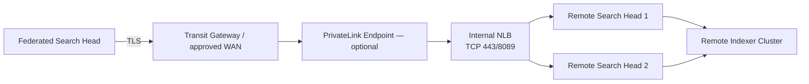

NLB + PrivateLink is the right fit for simple TCP/TLS pass-through to the Splunk management
service across accounts or organizations. Scope the federation service account to only the
indexes the central SOC is authorized to search.

## 6.4 Naming collision: two unrelated "federated" features

| | Splunk-to-Splunk Federated Search | Federated Search for Amazon S3 / Security Lake ("Federated Analytics") |
|---|---|---|
| Path | Search head → remote Splunk (8089) → remote indexers | Splunk **Cloud** → Glue Data Catalog → Parquet in S3 |
| Data location | Remote Splunk indexes | Security Lake S3, searched in place |
| Applies to | Self-managed Splunk Enterprise (this architecture) | Splunk Cloud Platform feature ([Splunk Docs][15]) |

**GovCloud/DoD note:** Splunk documents Federated Analytics as **unavailable for FedRAMP
Moderate, FedRAMP High, and DoD IL5** Splunk Cloud deployments. A self-managed design should
therefore plan on the **S3/SQS subscriber pipeline** for Security Lake unless Splunk confirms
a supported alternative for the target environment. ([Splunk Docs][15])

---

# Part VII — Consolidated Design Rules

1. **Security Lake is the normalized AWS source of record** — but keep direct pipelines for
   Network Firewall, MDE, OS logs, and anything else off the native-source list.
2. **SQS-driven collection, not S3 polling.** Security Lake notifies data-access subscribers
   per new object; polling wastes API calls and adds latency. ([AWS Documentation][12])
3. **One authoritative path per source.** No simultaneous Security Lake + direct ingestion of
   the same events without a documented latency or operational requirement.
4. **Collection add-ons never run on the production SHC.** Modular inputs live on dedicated
   HFs so a collection failure cannot consume search-head resources.
5. **Three AZs for indexers and search.** ≥3 search heads; enough indexers for RF plus
   indexing and search headroom. Start at RF=3 / SF=2 and tune from the failure model.
6. **Three separate S3 buckets** — Security Lake, raw-log archive, SmartStore. Different
   formats, lifecycles, access models.
7. **Per-organization subscribers.** One Security Lake subscriber + rollup Region per AWS
   Organization; centralize into one Splunk only where data-sharing policy permits.
8. **Federation is for sovereignty, not scale.** Use Splunk-to-Splunk federation when an org
   must keep its own deployment; do not use it as a substitute for central ingestion when
   ES detections must run frequently against all events.
9. **Map OCSF to CIM.** ES depends on CIM data models; use the OCSF-CIM Add-on or equivalent
   mappings for Security Lake data. ([Splunk Docs][17])
10. **Treat Splunk itself as a security workload.** Private subnets, VPC endpoints, KMS,
    instance roles, Secrets Manager, TLS forwarding, restricted management ports, SSM-based
    administration, and monitoring of Splunk's own `_internal` and audit indexes.

---

# Appendix A — Port Reference

| Port | Purpose |
|---:|---|
| TCP 443 | Recommended user-facing HTTPS / load-balancer entry |
| TCP 8000 | Splunk Web default |
| TCP 8089 | Management API **and** Splunk-to-Splunk federated search |
| TCP 8088 | HTTP Event Collector |
| TCP 9997 | Splunk-to-Splunk event forwarding (forwarder → indexer) |
| TCP 8080 / 9887 | Indexer cluster replication communication |
| TCP 8081 / 9887 / 8181 | SHC communication (configuration-dependent) |

Splunk documents 8089 (management/REST), 8000 (Web), 9997 (forwarding), 8088 (HEC); cluster
communication requires the additional internal ports. ([Splunk Docs][16])

# Appendix B — Quick component-to-tier matrix

| Tier | Components |
|---|---|
| Collection | UF, HF, HEC (+ internal NLB) |
| Indexing & storage | Indexer peers, Cluster Manager, SmartStore S3, local cache |
| Search | SHC members, Captain (elected), Deployer, Enterprise Security, internal ALB |
| Management | Deployment Server, License Manager, Monitoring Console |

---

[1]: https://help.splunk.com/en/splunk-enterprise/administer/distributed-deployment-manual/9.3/overview-of-splunk-enterprise-distributed-deployments/components-and-the-data-pipeline "Components and the data pipeline - Splunk Enterprise"
[2]: https://help.splunk.com/en/splunk-enterprise/administer/manage-indexers-and-indexer-clusters/10.4/overview-of-indexer-clusters-and-index-replication/the-basics-of-indexer-cluster-architecture "The basics of indexer cluster architecture | Splunk Enterprise"
[3]: https://help.splunk.com/en/splunk-enterprise/administer/distributed-search/9.3/overview-of-search-head-clustering/search-head-clustering-architecture "Search head clustering architecture - Splunk Enterprise"
[4]: https://docs.aws.amazon.com/security-lake/latest/userguide/internal-sources.html "Collecting data from AWS services in Security Lake - Amazon Security Lake"
[5]: https://docs.aws.amazon.com/prescriptive-guidance/latest/patterns/view-aws-network-firewall-logs-and-metrics-by-using-splunk.html "View AWS Network Firewall logs and metrics by using Splunk - AWS Prescriptive Guidance"
[6]: https://learn.microsoft.com/en-us/defender-xdr/configure-siem-defender "Integrate your SIEM tools with Microsoft Defender XDR - Microsoft Learn"
[7]: https://help.splunk.com/en/splunk-enterprise/splunk-validated-architectures/splunk-platform-indexing-and-search/aws-byol-high-availability "AWS BYOL high availability | Splunk Validated Architectures"
[8]: https://help.splunk.com/en/splunk-enterprise/administer/manage-indexers-and-indexer-clusters/10.4/how-indexer-clusters-work/replication-factor "Replication factor | Splunk Enterprise"
[9]: https://help.splunk.com/en/splunk-enterprise/administer/manage-indexers-and-indexer-clusters/10.4/how-indexer-clusters-work/search-factor "Search factor | Splunk Enterprise"
[10]: https://help.splunk.com/en/splunk-enterprise/administer/manage-indexers-and-indexer-clusters/10.2/deploy-smartstore/smartstore-system-requirements "SmartStore system requirements - Splunk Enterprise"
[11]: https://docs.aws.amazon.com/security-lake/latest/userguide/multi-account-management.html "Managing multiple accounts with AWS Organizations in Security Lake"
[12]: https://docs.aws.amazon.com/security-lake/latest/userguide/subscriber-data-access.html "Managing data access for Security Lake subscribers"
[13]: https://help.splunk.com/en/splunk-enterprise/search/federated-search/10.4/run-federated-searches-across-other-splunk-deployments/define-a-splunk-platform-federated-provider/steps "Define a Splunk platform federated provider | Splunk Docs"
[14]: https://help.splunk.com/en/splunk-enterprise-security-8/user-guide/8.5/introduction/use-federated-searches-in-transparent-mode-with-splunk-enterprise-security "Use federated searches in transparent mode with Splunk Enterprise Security"
[15]: https://help.splunk.com/en/splunk-cloud-platform/search/federated-search/9.3.2408/ingest-and-search-amazon-security-lake-datasets/about-federated-analytics "About Federated Analytics - Splunk Cloud Platform"
[16]: https://help.splunk.com/en/splunk-enterprise/administer/inherit-a-splunk-deployment/9.3/inherited-deployment-tasks/components-and-their-relationship-with-the-network "Components and their relationship with the network - Splunk Enterprise"
[17]: https://help.splunk.com/en/data-management/process-data-at-the-edge/use-edge-processors-for-splunk-cloud-platform/process-data-using-pipelines/convert-data-to-ocsf-format-using-an-edge-processor/working-with-ocsf-formatted-data-in-the-splunk-platform-and-splunk-enterprise-security "Working with OCSF-formatted data in the Splunk platform and Splunk Enterprise Security"
