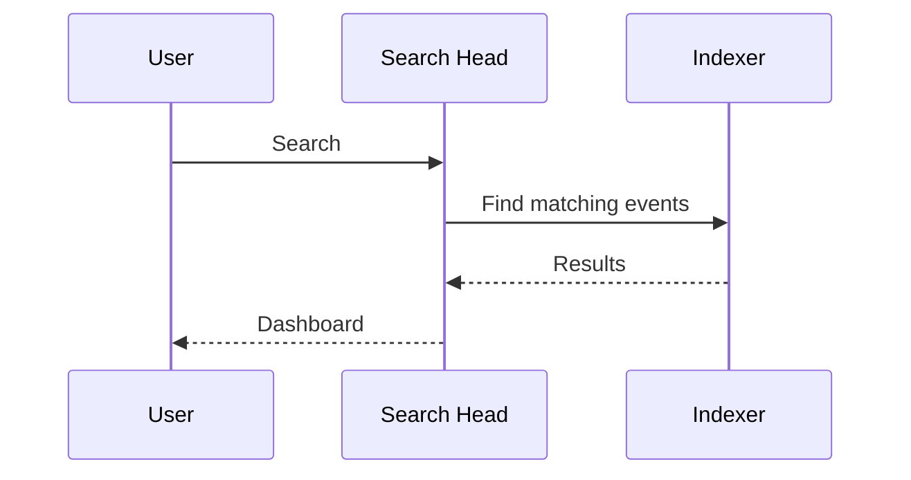

# Volume 1 - Splunk Fundamentals

## Part A - Executive Guide (80/20)

**Version:** 1.0

**Audience**

* AWS Engineers
* Network Engineers
* Security Engineers
* Cloud Architects
* SOC Engineers
* New Splunk Administrators

**Estimated Reading Time**
45-60 Minutes

---

# Executive Summary

Splunk is **not** simply a log server.

Splunk is a **distributed data platform** that collects, parses, indexes, searches, and analyzes machine-generated data from virtually any source.

Think of Splunk as **Google for machine data**.

Instead of searching websites, Splunk searches:

* AWS logs
* Linux logs
* Windows Event Logs
* Firewall logs
* CloudTrail
* CloudWatch
* Security Lake
* Microsoft Defender
* Network devices
* Applications
* Kubernetes

The lifecycle of every event in Splunk is surprisingly simple:

```text
Generate
      ↓
Collect
      ↓
Parse
      ↓
Index
      ↓
Search
      ↓
Visualize
      ↓
Alert
```

Nearly every Splunk architecture can be understood through this lifecycle.

---

# Key Questions Answered

By the end of this guide you should confidently answer:

## Fundamentals

* What is Splunk?
* Why do organizations use Splunk?
* Why not use a database?

## Data Collection

* What is an Event?
* What is an Input?
* What is a Forwarder?
* Why are there multiple Inputs?

## Architecture

* What is a Universal Forwarder?
* What is a Heavy Forwarder?
* What is an Indexer?
* What is a Search Head?

## Data

* What is an Index?
* What is a Sourcetype?
* What is Host?
* What is Source?

## Searching

* How does searching work?
* What happens after I press Search?

---

# Chapter 1

# Why Splunk Exists

Imagine an enterprise with:

* 2,000 EC2 instances
* 150 AWS accounts
* 50 firewalls
* 300 applications
* Microsoft Defender
* AWS Security Lake
* GuardDuty
* CloudTrail
* VPC Flow Logs

Every second thousands of events are generated.

Without Splunk:

```text
Firewall Logs

Server Logs

CloudTrail

CloudWatch

Applications

Network Firewall

All stored separately
```

Finding one security incident may require searching dozens of systems.

Splunk solves this by centralizing machine data.

---

# Splunk in One Sentence

> **Splunk collects machine data and makes it searchable.**

Everything else is built on top of this idea.

---

# Chapter 2

# Splunk Architecture in One Diagram


This single diagram explains almost the entire platform.

---

# Chapter 3

# The Seven Core Components

You only need to understand seven components.

| Component           | Primary Responsibility       |
| ------------------- | ---------------------------- |
| Input               | Collect data                 |
| Universal Forwarder | Ship data                    |
| Heavy Forwarder     | Parse, filter and route data |
| Indexer             | Store data                   |
| Search Head         | Search data                  |
| Deployment Server   | Manage forwarders            |
| Cluster Manager     | Manage Indexers              |

Everything else extends these components.

---

# Chapter 4

# Splunk Data Flow

Every event follows the same path.


The names change.

The workflow never changes.

---

# Chapter 5

# What is an Event?

Everything Splunk stores is an Event.

Examples

CloudTrail

```json
{
 "eventName":"CreateUser",
 "user":"Admin"
}
```

Linux

```
sshd Accepted password
```

Firewall

```
Permit TCP 443
```

Apache

```
GET /index.html
```

Different formats.

Same concept.

Everything becomes an Event.

---

# Chapter 6

# What is an Input?

This is probably the most misunderstood concept.

An Input is simply:

> **A mechanism that tells Splunk how to collect data.**

Examples

| Data Source       | Input              |
| ----------------- | ------------------ |
| Linux Log File    | File Monitor       |
| Windows Event Log | WinEvent Input     |
| Syslog            | TCP/UDP Input      |
| CloudWatch        | CloudWatch Input   |
| CloudTrail        | CloudTrail Input   |
| Security Lake     | SQS-Based S3 Input |
| Kinesis           | Kinesis Input      |

Without Inputs, Splunk receives nothing.

---

# Chapter 7

# Universal Forwarder vs Heavy Forwarder

Think of these as delivery services.

## Universal Forwarder

Purpose

Move data.

Responsibilities

* Read log files
* Monitor directories
* Send events

Does NOT

* Parse
* Filter
* Route

Very lightweight.

---

## Heavy Forwarder

Purpose

Understand data before forwarding.

Responsibilities

* Parse
* Filter
* Route
* Mask sensitive data
* Run AWS Add-on

Think of it as an intelligent gateway.

---

# Comparison

| Feature               | UF  | HF  |
| --------------------- | --- | --- |
| Lightweight           | Yes | No  |
| Reads Logs            | Yes | Yes |
| Parses Events         | No  | Yes |
| AWS Add-on            | No  | Yes |
| Data Filtering        | No  | Yes |
| Multiple Destinations | No  | Yes |

---

# Chapter 8

# What is an Indexer?

The Indexer is where data lives.

Responsibilities

* Parse events
* Compress events
* Build indexes
* Store events
* Return search results

Think of it as Google's search database.

---

# Chapter 9

# What is a Search Head?

Users never search the Indexer directly.

Instead

```text
User

↓

Search Head

↓

Indexer

↓

Search Head

↓

User
```

Responsibilities

* Search
* Dashboards
* Reports
* Alerts
* Visualizations

Think of it as Google's search page.

---

# Chapter 10

# Splunk Metadata

Every event receives metadata.

These four fields are fundamental.

| Metadata   | Meaning                    |
| ---------- | -------------------------- |
| Host       | Where event originated     |
| Source     | Original file/object       |
| Sourcetype | How Splunk interprets data |
| Index      | Where data is stored       |

Example

```text
Host

ip-10-0-1-25

Source

AWSLogs/.../CloudTrail.gz

Sourcetype

aws:cloudtrail

Index

aws_security
```

Almost every Splunk search uses one or more of these fields.

---

# Chapter 11

# Searching

When a user searches

```spl
index=aws_security sourcetype=aws:cloudtrail
```

This happens.



Notice

The Search Head stores no data.

The Indexer stores the data.

---

# Chapter 12

# Real AWS Example

CloudTrail logs stored in S3.


Heavy Forwarder

* Polls SQS
* Downloads CloudTrail
* Parses events
* Sends to Indexers

SOC searches

```spl
eventName=CreateUser
```

Splunk returns results within seconds.

---

# Chapter 13

# Small vs Enterprise Deployment

## Small

```text
One Server

Everything
```

Perfect for labs.

---

## Medium

```text
Forwarder

↓

Indexer

↓

Search Head
```

Most organizations.

---

## Enterprise

```text
Many Forwarders

↓

Heavy Forwarders

↓

Indexer Cluster

↓

Search Head Cluster
```

Large enterprises.

---

# Key Takeaways

* Splunk is a distributed search platform for machine data.
* Every log, metric, trace, or event becomes a searchable event.
* An Input defines how data enters Splunk.
* Universal Forwarders collect and forward data with minimal processing.
* Heavy Forwarders parse, filter, enrich, and route data before forwarding.
* Indexers store events and execute searches.
* Search Heads provide the user interface and coordinate distributed searches.
* Every event is tagged with **Host**, **Source**, **Sourcetype**, and **Index**, which form the foundation of searching and reporting.
* Nearly every Splunk deployment follows the same lifecycle: **Collect → Parse → Index → Search → Visualize → Alert**.

---

